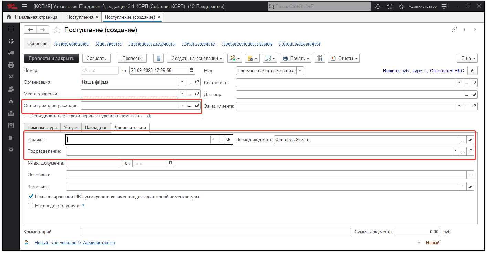

# Фактические расходы

Во всех документах, которые влияют на бюджеты есть реквизиты: бюджет, период бюджета, подразделение, статья затрат.

Бюджет и период бюджета проставляются автоматически. В зависимости от даты документа и организации ищется бюджет, который соответствует данному документу, а также период бюджета. Подразделение и статью затрат необходимо установить самостоятельно.

Данные по расходам (что было приобретено) попадают в описание расходов.