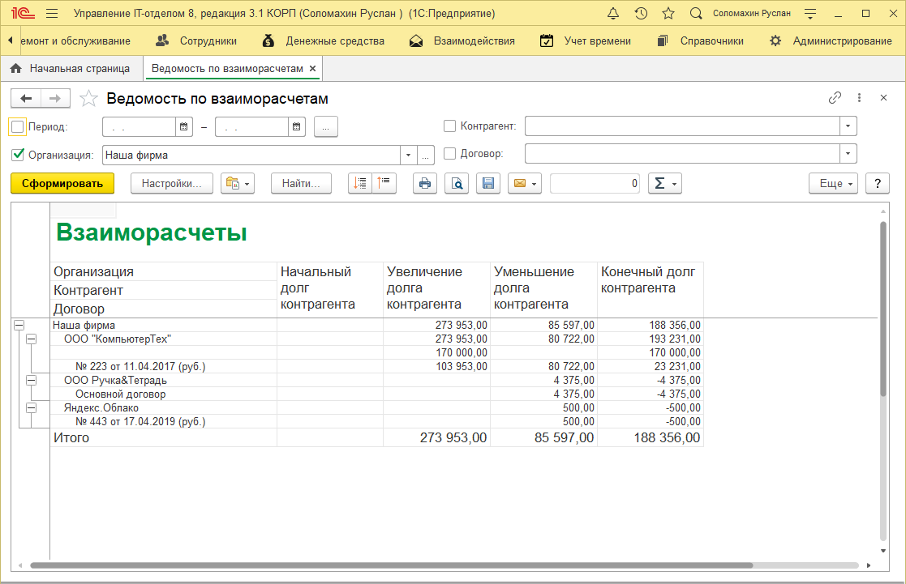

# Взаиморасчеты с контрагентами

Взаиморасчеты с контрагентами это отчет, позволяющий быстро и наглядно получить информацию о состоянии финансовых обязательств между Вашей организацией и контрагентами. Вы можете сделать отбор по периоду, организации и контрагенту.

