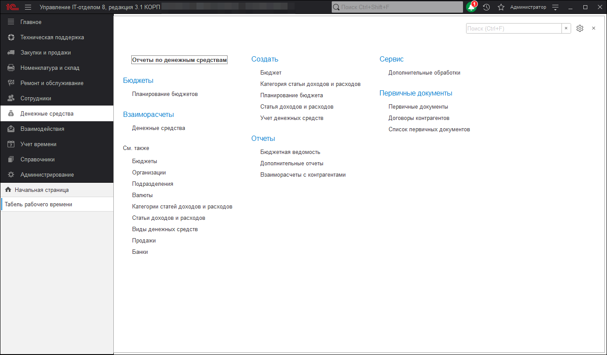

# Денежные средства

Чтобы оперативно контролировать информацию о наличии денежных и отслеживать динамику их расхода, в [конфигурации](https://softonit.ru/catalog/products/it/#detail) предусмотрен блок "Денежные средства". В данном разделе будет описано руководство использования подсистемы. 

**Список ролей для работы с подсистемой "Денежные средства".**
* [x] Добавление и изменение планов бюджетов;
* [x] Чтение денежных документов; 
* [x] Добавление и изменение оплат;   
* [x] Добавление и изменение банков;   
* [x] Добавление и изменение курсов валют;   
* [x] Чтение курсов валют.   

