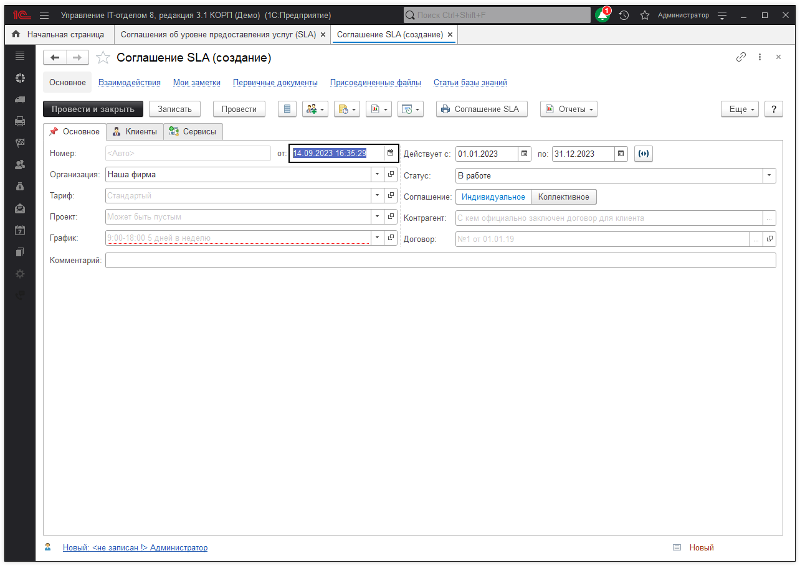
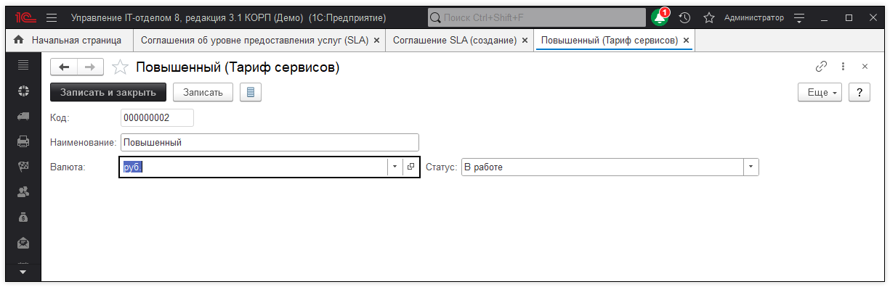
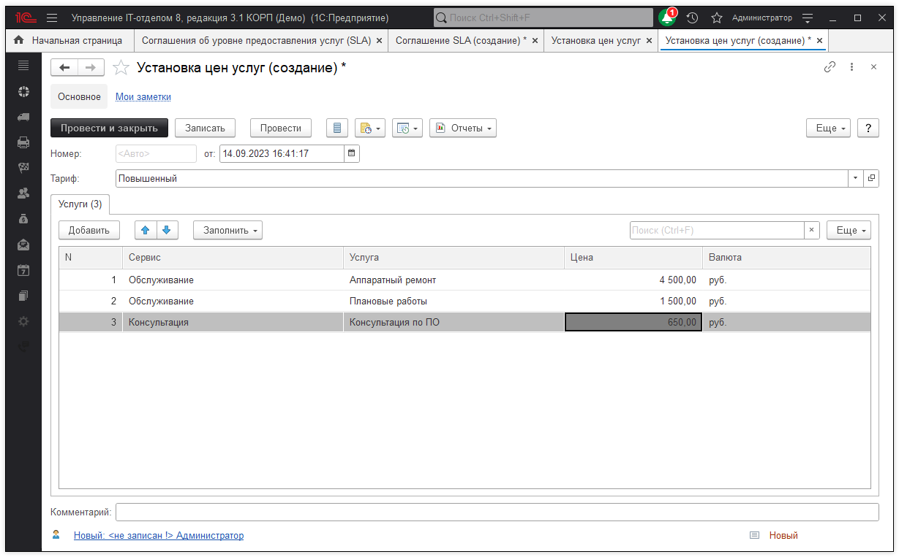
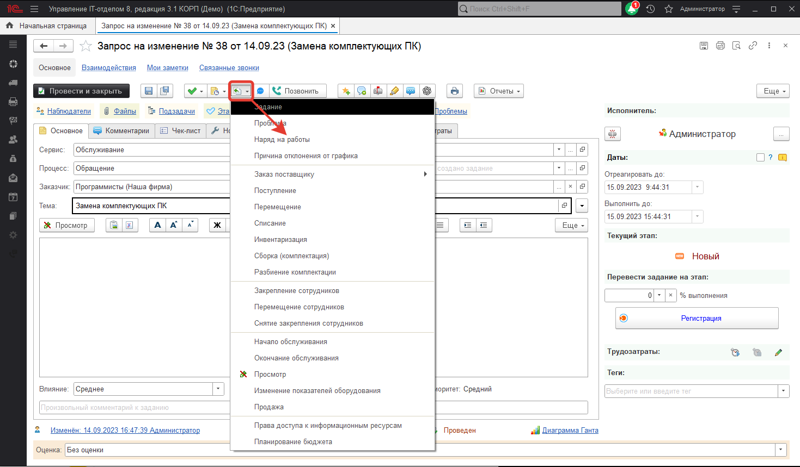
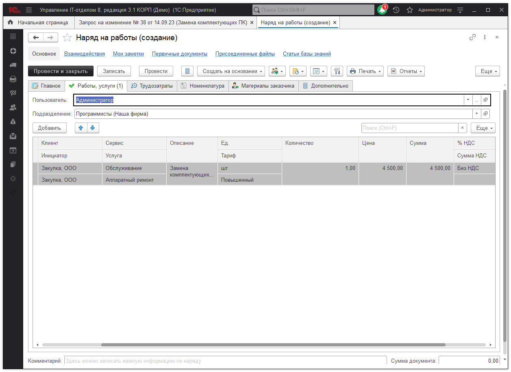

# Начисление выручки на основе тарифов SLA

Благодаря тому, что в конфигурации предусмотрена подсистема **"Денежные средства"**, появляется возможность контролировать начисления выручки (доходов) на основании тарифов указанных в соглашениях SLA. Для отражения доходов от оказанных услуг в рамках SLA необходимо первым делом оформить сам SLA, то есть указать сервисы и услуги, установить тарифы, цены и так далее. Перейдем в раздел **"Техническая поддержка"** и откроем документ "Соглашения SLA", в форме списка данного документа, нажмем кнопку "Создать" для создания нового соглашения.

Для дальнейшей корректной работы данного документа необходимо заполнить все реквизиты.

* **Организация** - указывается наша организация;  
* **Тариф** - указывается тариф, по которому будет рассчитываться сумма;  
* **Действует с: по:** - в данном реквизите выбирается интервал действия соглашения;   
* **Комментарий** - произвольное примечание(комментарий) к соглашению;   
* **Статус** - определяет состояние SLA соглашения, может быть "В работе", "Проектируется", "Не используется", интуитивно понятно за что отвечает каждое состояние;   
* **Контрагент** - указывается контрагент с кем заключено соглашение;  
* **Договор** - отражает договор, по которому осуществляется сотрудничество с контрагентом;   
* **График** - указывается график рабочего времени, по которому будут оказываться услуги отраженные в SLA.  

В данном случае реквизит "Тариф" очень важен, так как по нему будет вычисляться основной доход от оказанных услуг. На основании тарифа указываются цены услуг. Поэтому перейдем к настройке в раздел "Техническая поддержка" - "Тарифы" и создадим новый тариф, например, "Повышенный".

Далее перейдем к указанию цен на услуги в разделе **"Техническая поддержка" - "Установка цен услуг"**. При создании цен выбирается тариф, к которому будут относится указанные цены. Указываем "Повышенный" и переходим к добавлению услуг в табличную часть "Услуги".

После того, как созданы и настроены **"Тарифы"** и **"Цены на услуги"**, можно продолжить заполнение соглашение SLA и перейти к использованию данного SLA в рамках работы с клиентом при его обращениях. На основании обращений клиента создаются задания, где указаны соответствующие сервисы и услуги. По выполнению задания необходимо на его основании создать документ "Наряд на работы".

На основании задания будет создан документ, где будут указаны сервис и услуга, тариф и цена за оказание услуги.

Завершающим этапом всего, будет непосредственное начисление выручки на основании тарифа SLA.  
Для этого в ранее созданном документе **"Наряд на работы"** жмем кнопку **"Создать на основании**" и выбираем документ "Учет денежных средств", который позволит отразить факт дохода от выполненных работ.

