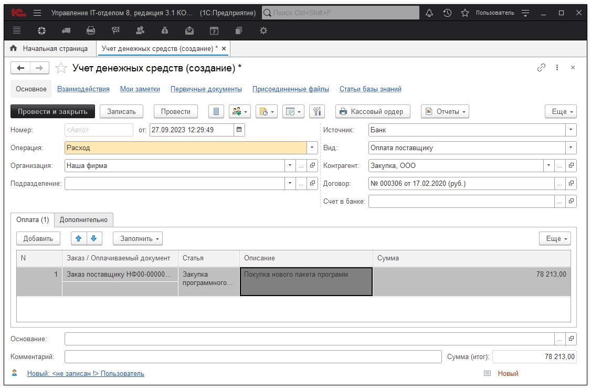

# Учет денежных средств

Учет денежных средств используется для отражения факта движения финансов при покупке или продаже техники, оплате услуг и т.д.

**Документ "Учет денежных средств" может содержать следующие реквизиты:**

* **Вид движения Д/C** - указывается один из вариантов (расход или приход);   
* **Организация** - указывается организация, у которой ведется учет денежных средств;   
* **Подразделение** - может быть указано подразделение организации;    
* **Статья** - указывается статья в рамках, которой производится вид движения денежных средств;   
* **Вид Д/C** - может быть указан один из вариантов (банк или наличными);   
* **Вид операции** - операция в рамках, которой происходит движение денежных средств;   
* **Контрагент** - с которым происходят денежные взаимоотношения;   
* **Договор** - указывает договор в рамках, которого происходит взаимоотношение с контрагентом;   
* **Банковский счет** - указывается банковский счет контрагента.   