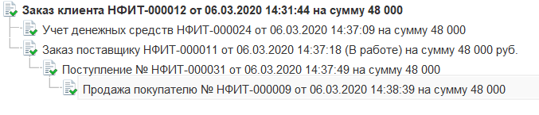
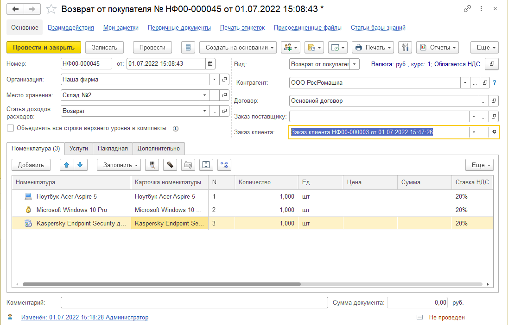
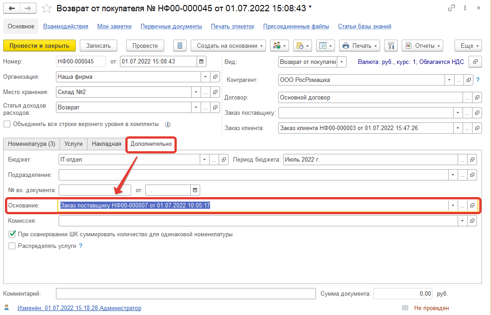
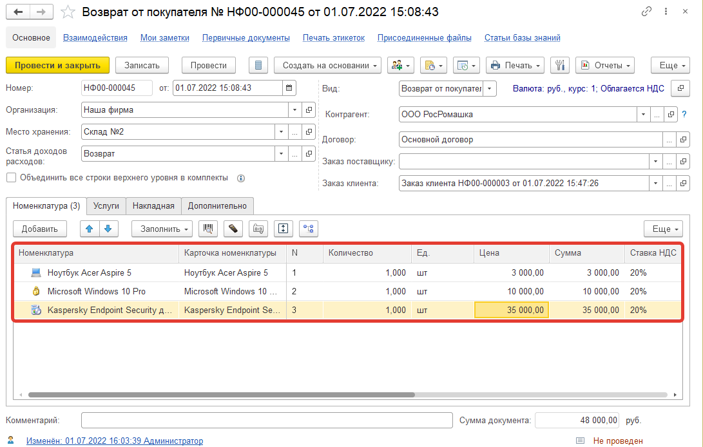
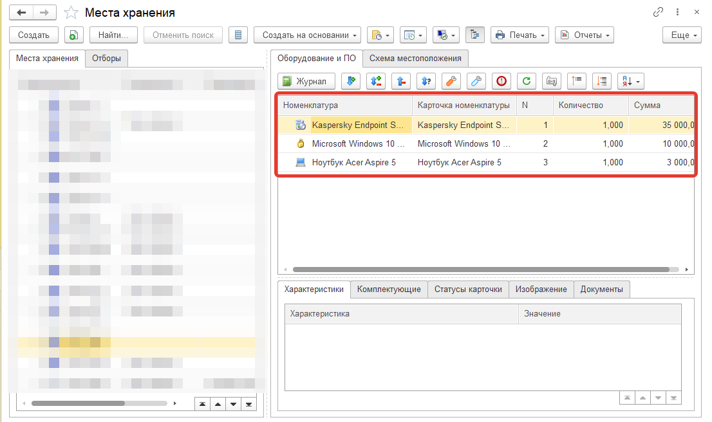
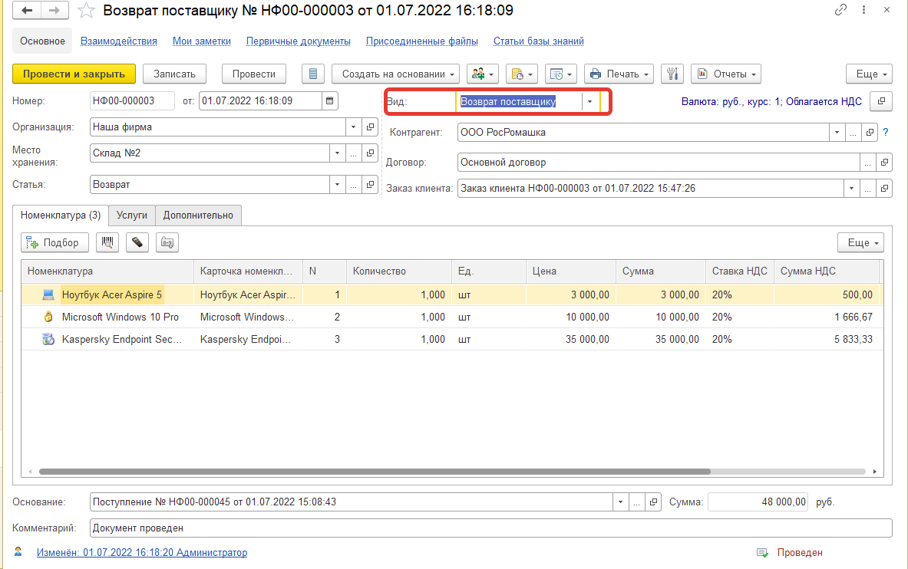

# Возвраты клиентов

IT аутсорсинговые компании предоставляют список IT-услуги, в который также входит продажа оборудования клиентам. И ни для кого не секрет, что зачастую бывают случаи, когда клиент по той или иной причине решает оформить возврат приобретенной техники. Давайте разберем, как отразить факт возврата, используя конфигурацию «Управление IT-отделом 8». В качестве сквозного примера представим, что клиент заказывал у нас ноутбук Acer Aspire и по какой-то причине он решил оформить возврат. Для начала давайте вспомним список документов, которые были использованы при оформлении заказа клиента.

Из данной связи видно, что ноутбук мы заказывали у нашего контрагента, так как у нас не было в наличии, заказываемой клиентом техники. После того, как ноутбук пришел на наши остатки, осуществили продажу клиенту. Вернуть номенклатуру может как наш клиент нам, так и мы контрагенту у которого её заказали, так же предусмотрен механизм возврата денежных средств. Теперь приступим непосредственно к оформлению возврата. Перейдем в раздел «Номенклатура и склад» -> документ «Поступление», открыв форму документа, видим реквизит «Вид» и устанавливаем значение «Возврат от покупателя».
Возврат от покупателя

В реквизите «Контрагент» указываем клиента, по которому был осуществлен заказ, следовательно, в реквизите **«Заказ клиента»** выбираем заказ данного контрагента. После чего необходимо на закладке **«Дополнительно»** в реквизите «Основание» указать документ «Заказ поставщику», по которому фиксировали факт заказа ноутбука у нашего поставщика.

Следующим шагом идет заполнение номенклатуры. На закладке «Номенклатура» нажимаем кнопку **«Заполнить» -> «Добавить по заказу поставщику»**, таким образом заполнится накладная. После этого, чтобы добавить номенклатуру, перейдем на закладку «Накладная» и нажмем кнопку **«Заполнить» -> «Заполнить по накладной»**. В результате получаем заполненную номенклатурой табличную часть.

Проводим документ и видим приход на наших остатках.

Теперь необходимо отразить факт возврата номенклатуры поставщику. Для этого на основании документа «Поступление» с видом «Возврат от покупателя» создаем документ **«Продажа»**. В реквизите **«Вид»** указываем значение **«Возврат поставщику»**.

В результате получаем движение по документу «Возврат поставщику», следующего вида:
* Взаиморасчеты с контрагентами -;
* Заказы клиента -;
* Оплата документов+;
* Остатки-.

