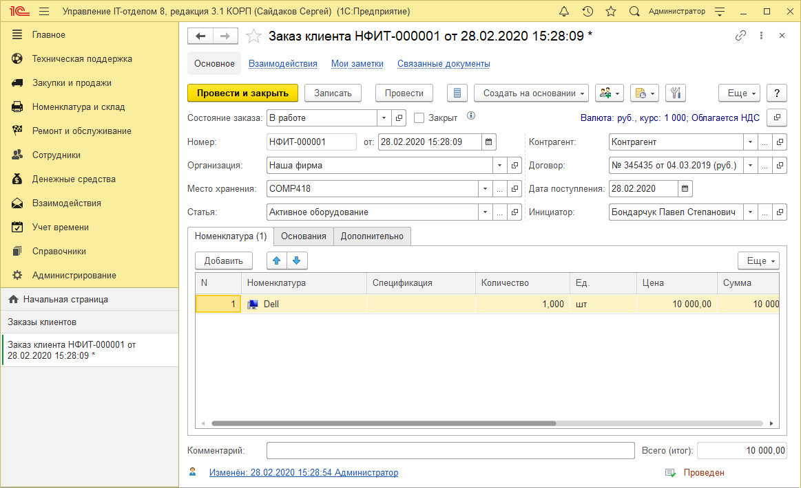

# Заказ клиента

Заказ клиента - это запрос клиента на поставку ему товаров или оказание услуг. Возможность формирования в системе заказов клиентам определяется функциональной опцией Использовать складской учет в разделе **Администрирование > Настройки параметров учета > Функциональность > Использовать складской учет.**

## Описание:

* **Состояние заказа и флаг закрыт.** Более подробно о них можете прочитать в главе список заказов;  
* **Организация** - организация, которая принимает заказ;  
* **Контрагент** - клиент, который заказывает;   
* **Договор** - договор между организацией и контрагентом, который заказывает;  
* **Дата поступления** - предварительная дата поступления на склад (не обязательно);  
* **Место хранения** - место хранения номенклатуры;  
* **Статья затрат** - если ведется учет бюджетов, то проставляется на какую статью расходов приобретено;  
* **Инициатор** - инициатор заказа клиента.  

### Табличная часть Дополнительно:

*  **№ вх. документа** - номер документа основания;   
*  **от** - дата документа основания;  
*  **Бюджет** - бюджет по документу;   
*  **Период бюджета** - период бюджета по документу;  
*  **Банковский счет** - банковский счет контрагента;  
*  **Ответственный** - автор документа.  
