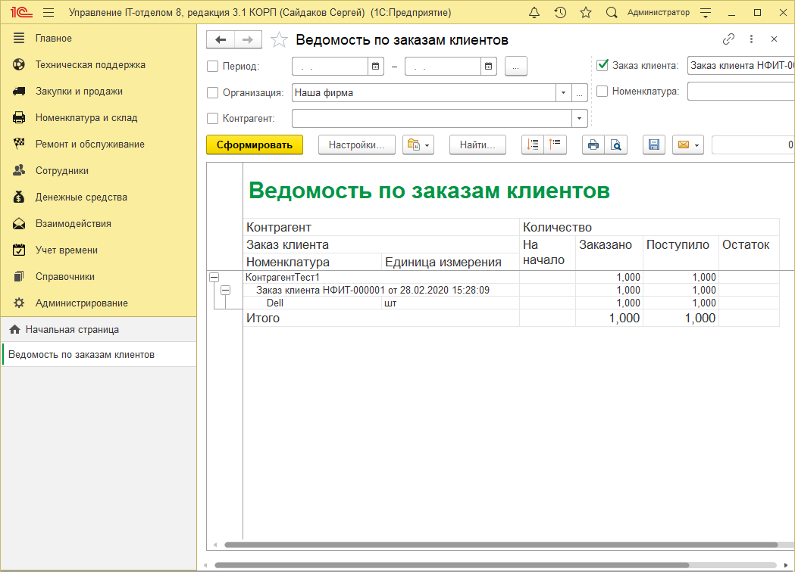
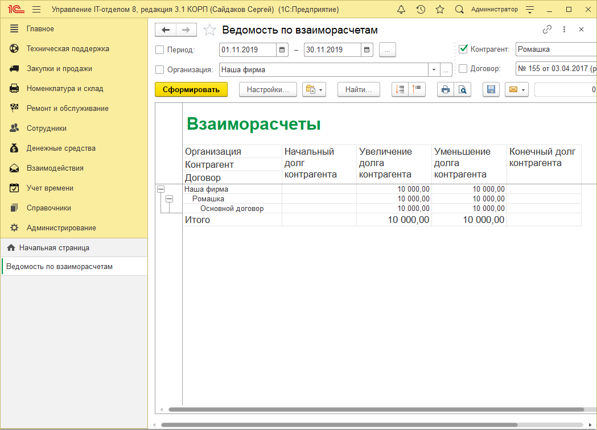

Проверка заказов клиентов и просмотр статусов
Для проверки статуса (Заказано, Оплачено, Доставлено) используйте отчет "Ведомость по заказам клиентов"

В нем видно, что было заказано, что поступило на склад.

Для просмотра что оплачено, а что нет, воспользуйтесь отчетом "Взаиморасчеты с контрагентами":

Положительный остаток - мы должны, отрицательный - нам.