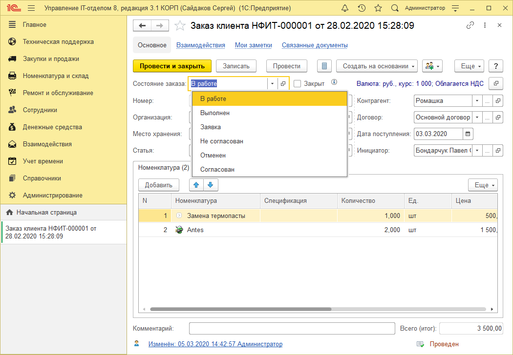
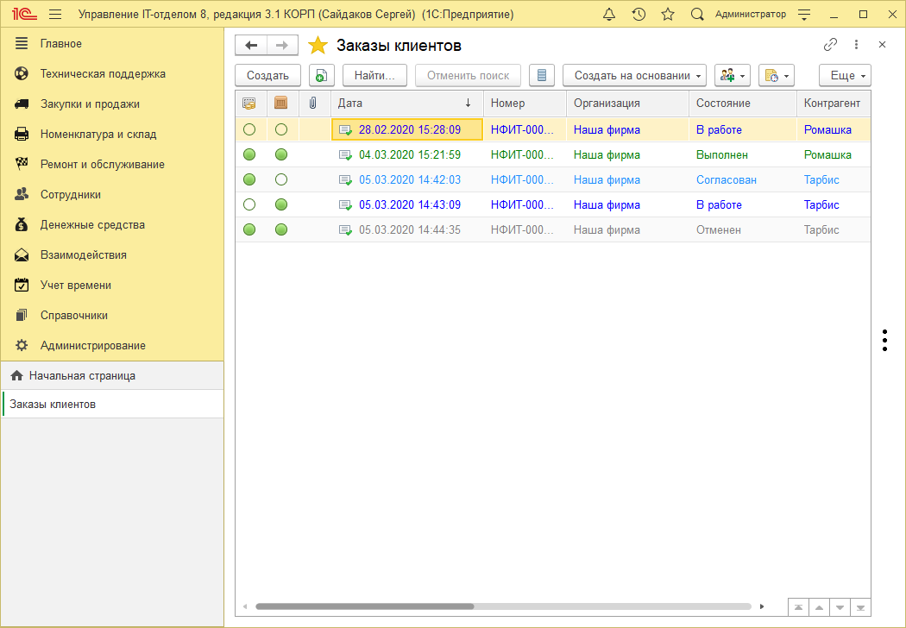
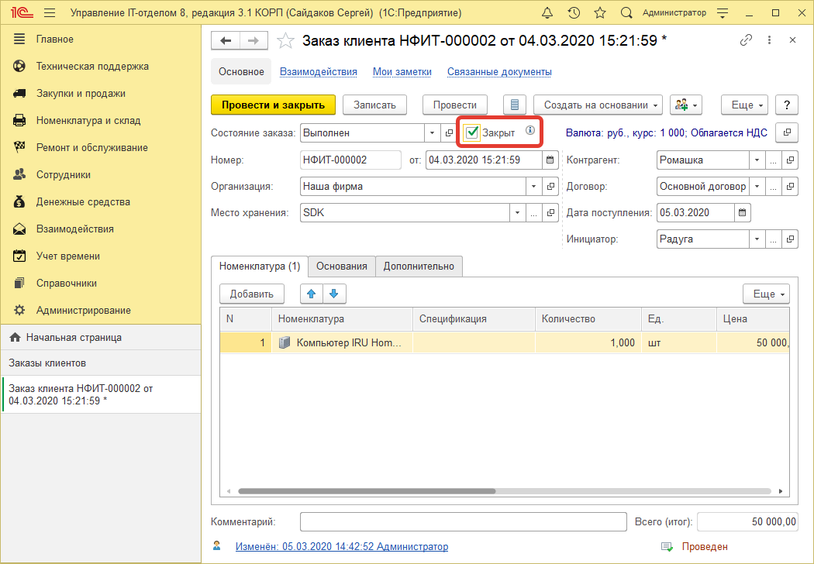
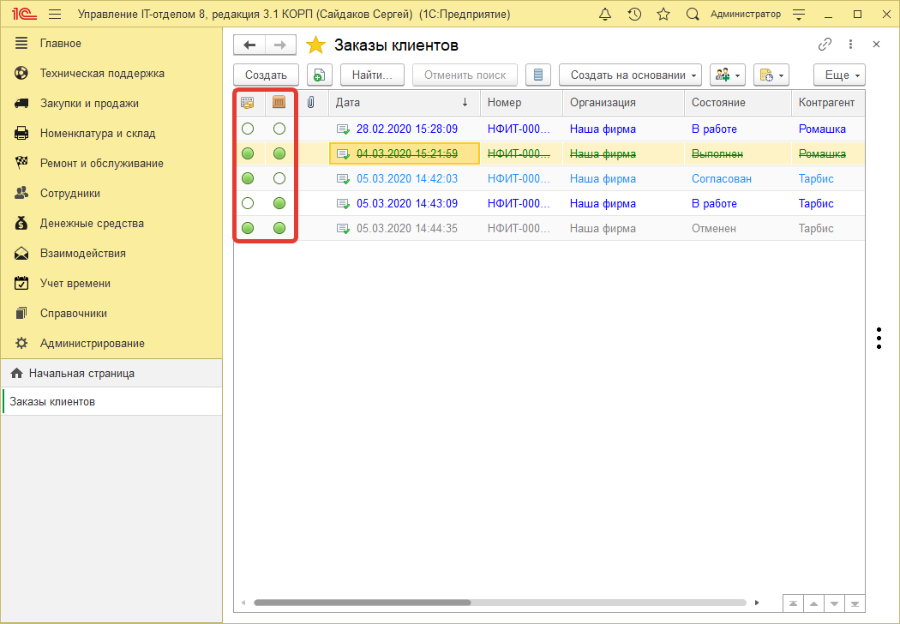
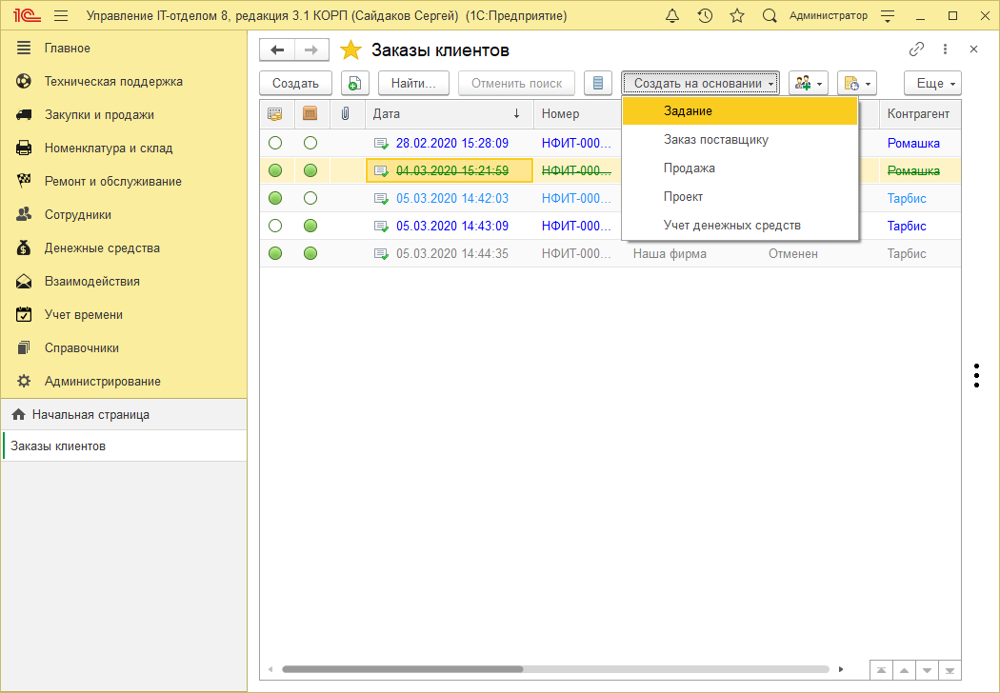

# Список заказов клиентов
Форма списка документа "Заказ клиента", позволяет пользователю видеть состояние документов, а так же прочую, важную информацию (была ли оплата по документу, либо отгрузка товара заказчику), что существенно упрощает работу с блоком "Заказы клиентов".

Каждый заказ может иметь своё состояние:

* В работе
* Выполнен
* Заявка
* Не согласован
* Отменен
* Согласован

У каждого состояния заказа есть своё цветовое оформление.

Зачеркнутые строки в списке означают, что установлена галочка "Закрыт". ***Зеленые - выполнено, серые - отменено, синие - в работе***. Цвета можно настроить в справочнике **"Состояние заказов клиентов"**.

В списке можно увидеть бело-зеленые круги. В первом столбце с кругами идут оплаты, во втором отгрузка клиенту. Полностью зеленый кружок означает, что шаг выполнен, полностью белый - не выполнен. Частично закрашен - частично выполнен. Эти круги заполняются автоматически, когда на основании документов по заказам вводятся оплаты и продажи.

!!!
Важно! Нужно именно вводить на основании документа "Заказ клиента" другие документы, иначе программа не поймет, что необходимо отметить, что выполнена оплата или оборудование пришло на склад.
!!!
Причем документы, которые вводятся на основании заполняются автоматически.

Если круг окрашен в списке заказов в зеленый полностью - это означает, что данный этап полностью выполнен (оплата или доставка заказа). Если частично, то соответственно менее, или более 50%. Если белый, то данный пункт не выполнен.

В списке заказов есть быстрые отборы, которые находятся вверху списка (по контрагенту, по организации и т.п.) и отборы по периоду.

