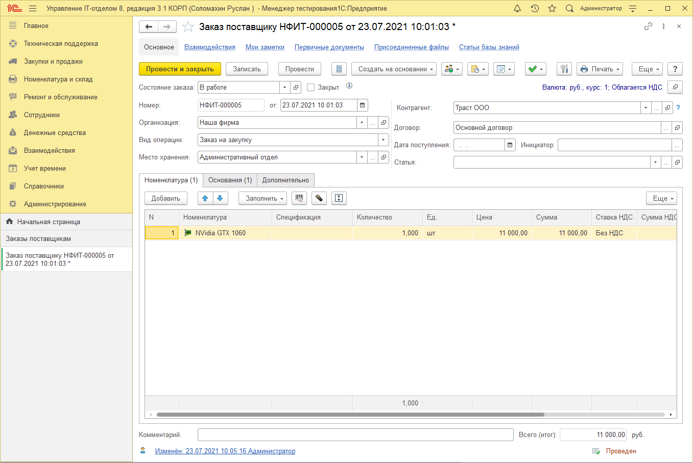
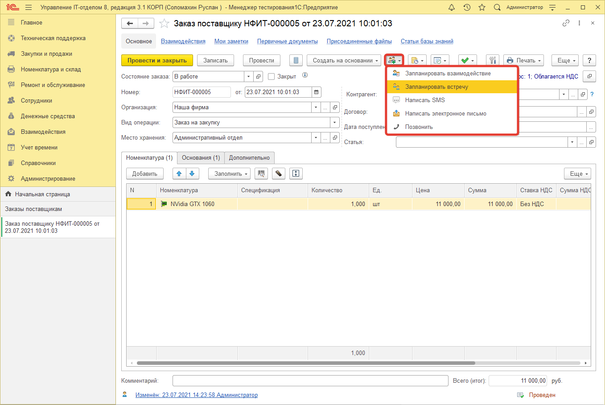
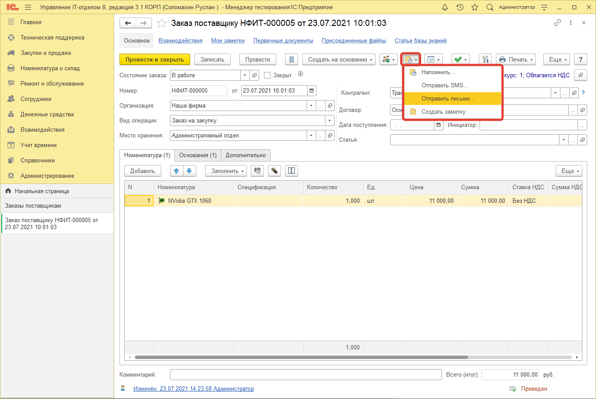
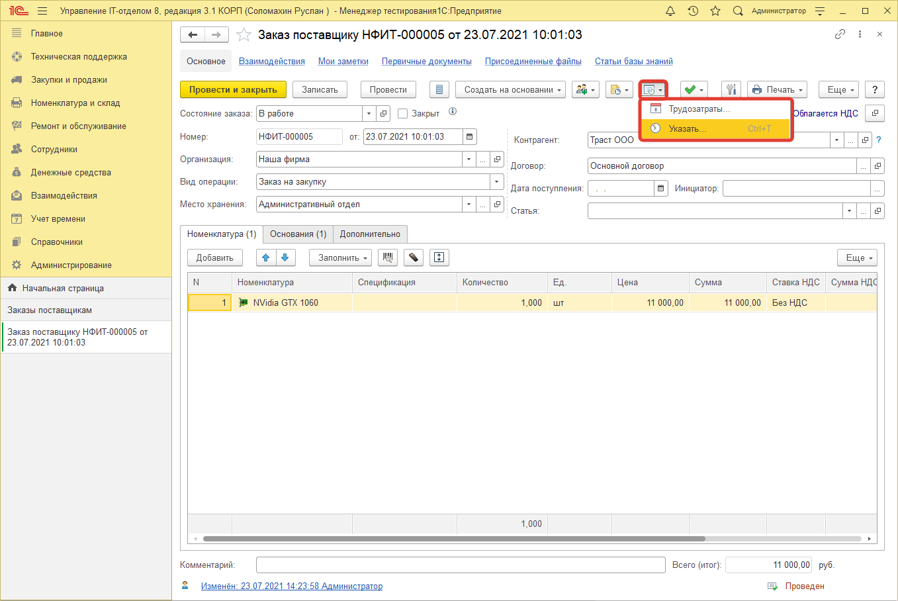
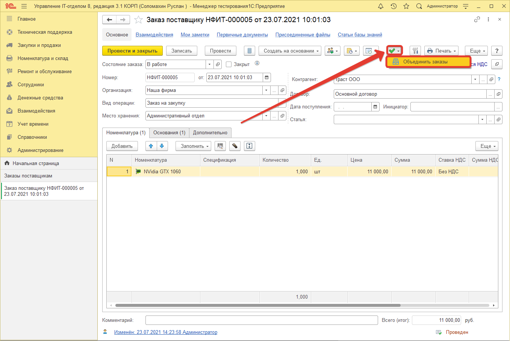
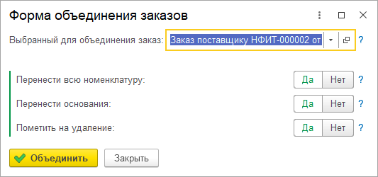
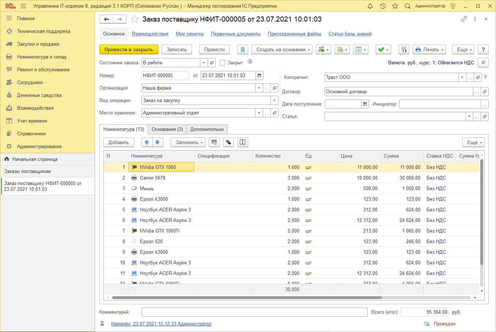

# Заказ поставщику

**Документ "Заказ поставщику"** - это документ, позволяющий отражать хозяйственную деятельность предприятия в рамках закупки нового оборудования или прочих номенклатурных позиций. Именно с его помощью можно организовать учет закупок организации. Данный документ может создаваться как самостоятельно, так и вводиться на основании других складских документов. Заказ поставщику играет большую роль в цепочке логической целостности ведения складского учета в нашей конфигурации, поэтому его использование просто необходимо. Ниже рассмотрим значения основных реквизитов и закладок данного документа. 

## Описание:

* **Состояние заказа и флаг закрыт.** Более подробно о них можете прочитать в главе список заказов.  
* **Организация** - наша организация, куда приобретаем.   
* **Контрагент** - поставщик, у которого заказываем.   
* **Договор** - договор между нашей организацией и контрагентом, у которого заказываем.   
* **Вид операции (Тендер/Заказ на закупку)** - что это предварительный сбор данных (тендер) или уже заказ поставщику по которому работаем (заказ поставщику). Если установлен "Тендер", то документ не дает движений.  
* **Дата поступления** - предварительная дата поступления на склад (не обязательно).  
* **Место хранения** - куда заказано.  
* **Статья затрат** - если ведется учет бюджетов, то проставляется на какую статью расходов приобретено.   
* **Инициатор** - инициатор заказа поставщику.  
* **В табличную часть "Номенклатура"** добавляется список заказываемой у поставщика номенклатуры.  

### На закладке дополнительно:

* **№ и дата вх. документа** - необходим для бухгалтерии в случае сверки.   
* **Бюджет, подразделение, период бюджетов** - реквизиты, которые проставляются автоматически по дате документа. Необходимы для соотнесения расходов на закупку с подсистемой бюджетирование.  
* **Ответственный** - ответственный за закупку. В случае если закупкой занимается несколько человек.   

Документ "Заказ поставщику" владеет большим набором функциональных возможностей, которые располагаются в командной панели формы документа. Помимо создания других складских документов на основании, также прямо из документа можно воспользоваться функционалом взаимодействий и запланировать встречу или осуществить необходимый звонок.

Следующей функциональной возможностью является создание напоминаний, заметок или отправка смс и электронного письма. Это полезно, когда заказ поставщику, например, отложен и о нем необходимо напомнить позже. Также бывают ситуации, когда нужно уточнить какую-либо информацию у поставщика, а благодаря этой возможности можно отправить письмо на почту контрагента.

По заказу поставщику также можно вести учет трудозатрат, которые были потрачены на покупку того или иного оборудования. Подробнее об учете трудозатрат можно ознакомиться в главе обучения "[Учет трудозатрат](https://softonit.ru/FAQ/courses/?COURSE_ID=1&CHAPTER_ID=0426)". Для того, чтобы зафиксировать время по заказу, необходимо нажать на соответствующую кнопку трудозатрат и выбрать вариант "Указать...". Вариант выбора "Трудозатраты" открывает страницу, на которой отображается список всех указанных ранее трудозатрат по текущему заказу поставщику.

Следующая функциональная возможность - это **объединение нескольких заказов** поставщику в один единый. Это полезно, когда Вы осуществляете разовую ежемесячную закупку и в течении месяца накапливаете заказы, а после в конце месяца закупаете необходимую номенклатуру. Для объединения заказов необходимо, либо создать новый заказ поставщику, либо открыть имеющийся (актуальный) заказ. Это нужно для того, чтобы именно в этот заказ перенести всю необходимую информацию из других документов. Далее в командной панели кнопок, открытого ранее заказа нажать на кнопку в виде зеленой галочки и выбрать команду **"Объединить заказы"**.

После нажатия на кнопку объединения, перед Вами откроется новое функциональное окно, в котором необходимо выбрать один из заказов, который Вы хотите перенести в текущий, а также указать ряд необходимых настроек переноса.

Форма содержит следующий набор реквизитов:
 
**Выбранный для объединения заказ** - в данном реквизите указывается заказ поставщику, данные которого хотим объединить с текущим заказом. Данный реквизит является обязательным к заполнению и в нем нельзя указать тот же заказ, что открыт на текущий момент.  
**Перенести всю номенклатуру** - флажок, который отвечает за настройку переноса номенклатурных позиций из выбранного заказа поставщику. По умолчанию установлено значение "Да".  
**Перенести основания** - флажок, отвечающий за настройку переноса документов - оснований из выбранного заказа. По умолчанию установлено значение "Да".  
**Пометить на удаление** - флажок, который отвечает за пометку на удаление, а также перевод состояния выбранного заказа в статус "отменен". Другими словами, выбранный заказ будет помечен на удаление, а также его статус будет иметь значение "отменен". По умолчанию установлено значение "Да".  

После нажатия на кнопку "Объединить" будет осуществлено объединение выбранного заказа поставщику и текущего открытого. Все указанные данные будут перенесены в соответствующий заказ поставщику. При этом у Вас нет ограничений в количестве объединений, то есть в один и тот же заказ Вы можете переносить данные любого количества заказов. Единственное ограничение, заключается в том, что объединять можно только по одному документу. Ниже приведен результат объединения.

Как можно заметить на закладке "Номенклатура" были добавлены номенклатурные позиции из выбранного для объединения заказа поставщику, а также были перенесены его документы - основания на соответствующую закладку. А также выбранный заказ был помечен на удаление и теперь имеет статус "Отменен".
