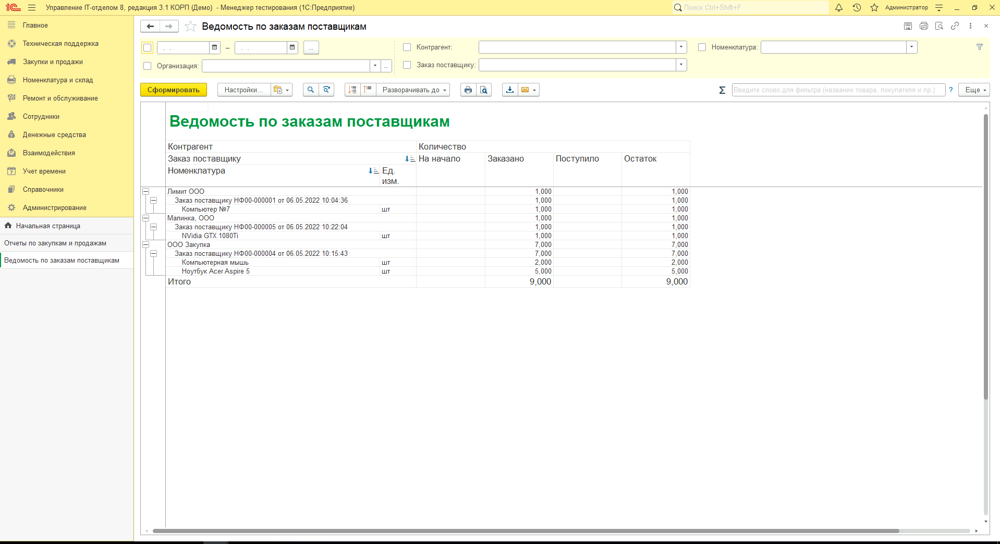
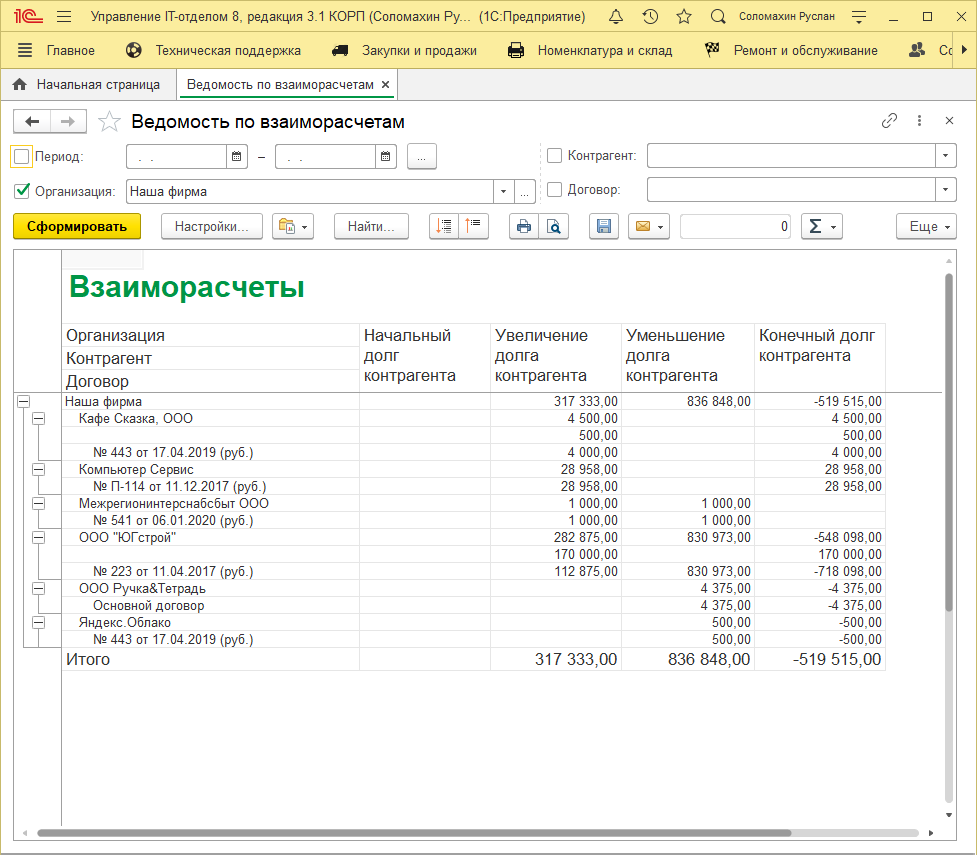

# Проверка закупки: заказано/оплачено/доставлено

Для проверки цепочки *(Заказано > Оплачено > Доставлено)* используйте отчет "Ведомость по заказам поставщикам"

В нем видно, что было заказано, что поступило на склад.

Для просмотра что оплачено, а что нет, воспользуйтесь отчетом "Взаиморасчеты с контрагентами":

Положительный остаток - мы должны, отрицательный - нам.
