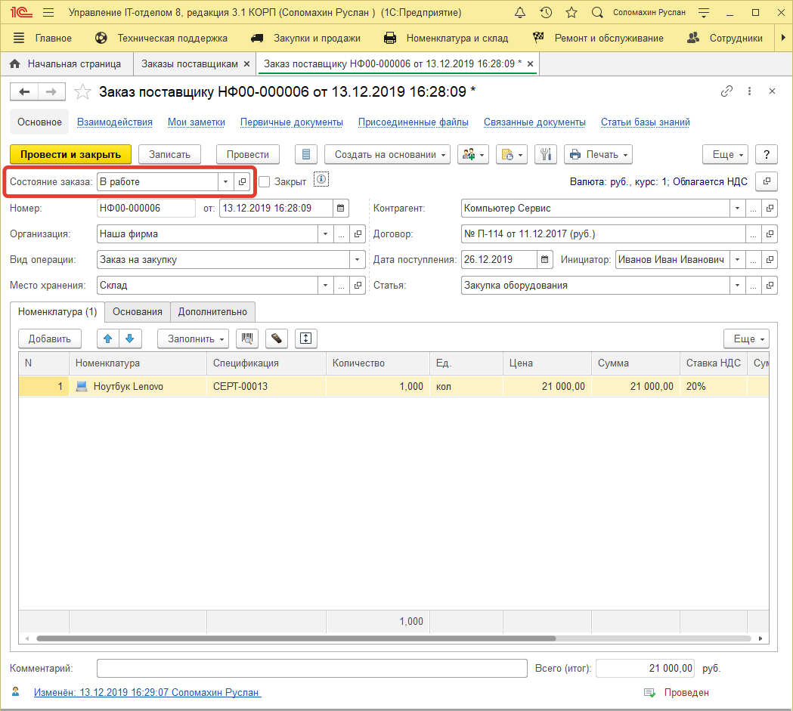
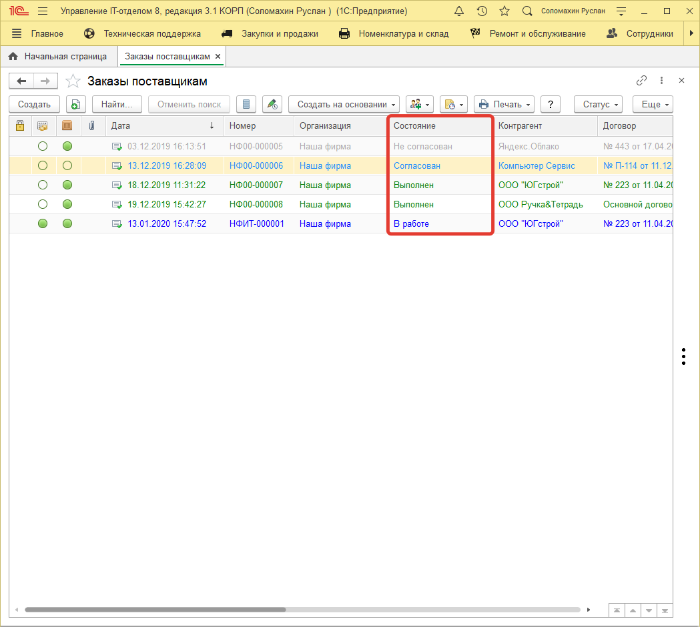
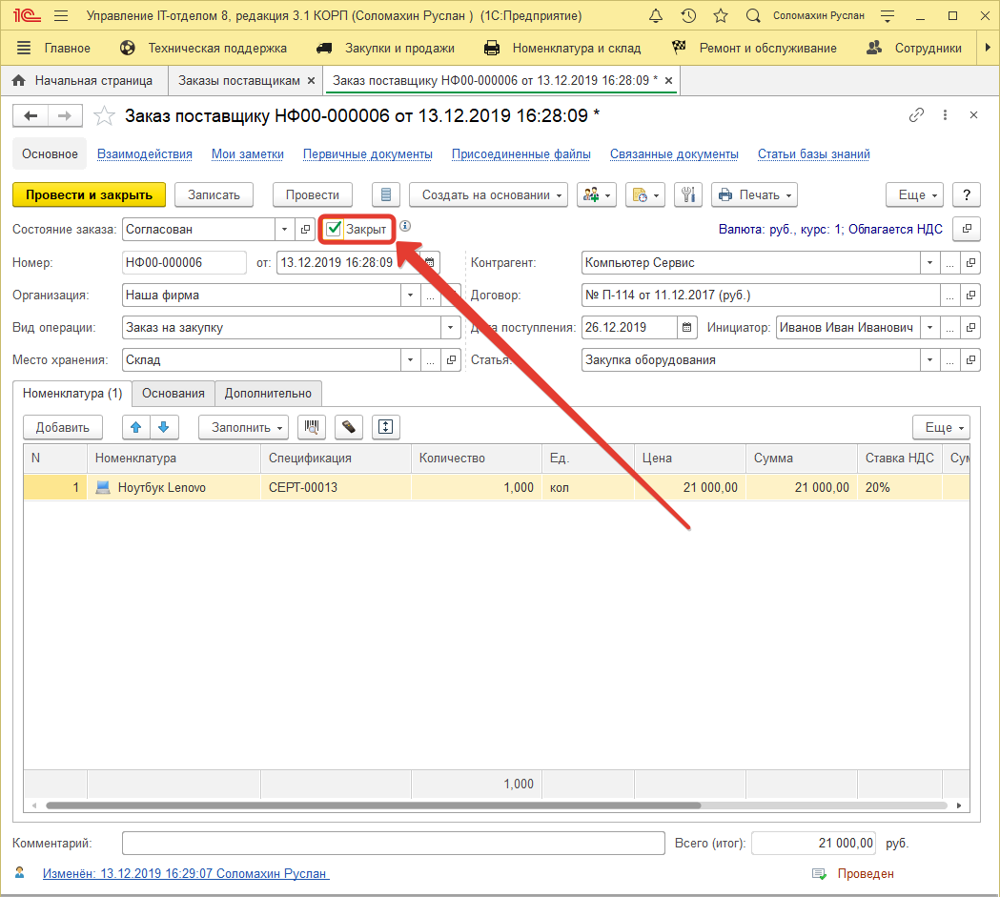
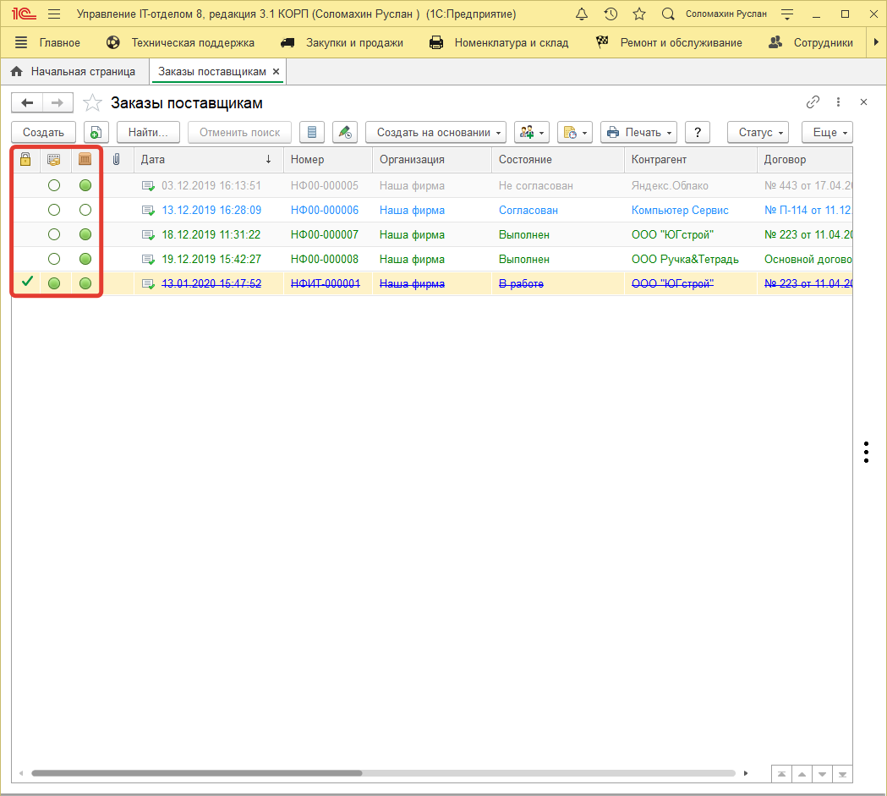
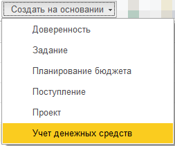

# Список заказов

Основной целью ведения блока по заказам поставщикам является, прежде всего, ничего не забыть. Люди, которые этим занимаются вынуждены в голове держать 1000 дел и при этом все помнить.

Конкретно:

1. Что заказано?
2. Что оплачено?
3. Что доставлено?

Наша конфигурация позволяет все это контролировать. Каждый заказ находится в определенном состоянии:

* В работе
* Выполнен
* Заявка
* Не согласован
* Отменен
* Согласован

"Состояние заказа" соответствует цветовому оформлению документа "заказ поставщику".

Зачеркнутые строки в списке означают, что установлена галочка "Закрыт". ***Зеленые - выполнено, серые - отменено, синие - в работе***. Цвета можно настроить в справочнике **"Состояние заказов поставщикам"**.

В списке можно увидеть бело-зеленые круги. В первом столбце с кругами идут оплаты, во втором доставка в нашу организацию. Полностью зеленый кружок означает, что шаг выполнен, полностью белый - не выполнен. Частично закрашен - частично выполнен. Эти круги заполняются автоматически, когда на основании документов по заказам вводятся оплаты и поступления.

!!!
Важно! Нужно именно вводить на основании документа "Заказ поставщику" другие документы, иначе программа не поймет, что необходимо отметить, что выполнена оплата или оборудование пришло на склад.
!!!
Причем документы, которые вводятся на основании заполняются автоматически.

Если круг окрашен в списке заказов в зеленый полностью - это означает, что данный этап полностью выполнен (оплата или доставка заказа). Если частично, то соответственно менее, или более 50%. Если белый, то данный пункт не выполнен.

Например, последний заказ на рисунке указывает на то, что данный заказ еще в работе, он оплачен, но при этом поставщик отдал нам его не полностью и мы привезли его на склад (создан документ "Поступление").

В списке заказов есть быстрые отборы, которые находятся вверху списка (по контрагенту, по организации и т.п.) и отборы по периоду.

