# Учет первичных документов

> **Первичный документ** — это документ, который включает в себя исходную информацию полученную на этапе, завершенной человеческой деятельности.

Данный документ сдается в бухгалтерию или там же составляется в момент совершения хозяйственной операции или непосредственно после окончания и является первичным свидетельством, о произведенных фактах работ. Бухгалтерия требует первичные документы у сотрудников IT-отдела, которые в свою очередь не всегда могут контролировать их наличие. В связи с этим для облегчения контроля данного процесса и была создана подсистема "Первичные документы". Подсистема позволяет вести учет первичных документов (актов, накладных и т.д.), контролировать наличие оригиналов документов, оплату документов, передачу документов в архив, планировать создание документов в будущих периодах.

Перед началом работы необходимо проверить, что в «Настройках параметров учета» в разделе «Функциональность», установлена галочка «Использовать первичные документы».

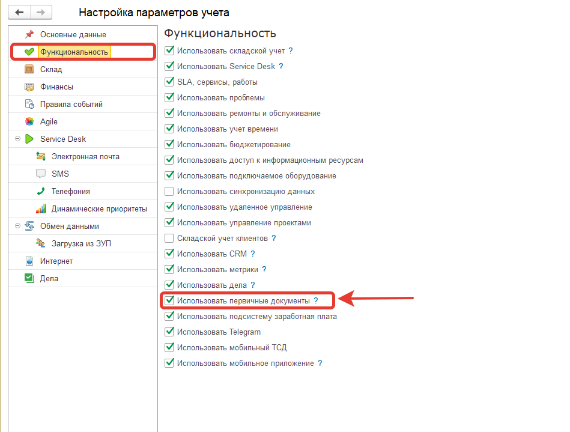

Для автоматического создания периодических первичных документов нужно убедиться, что включено регламентное задание «Создание периодических первичных документов».

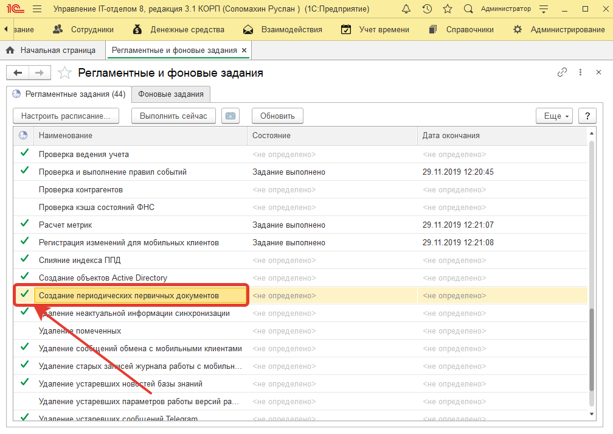

А также важно проверить, что установлено расписание регламентного задания, например, «Каждый день; c 6:00:00 один раз в день».

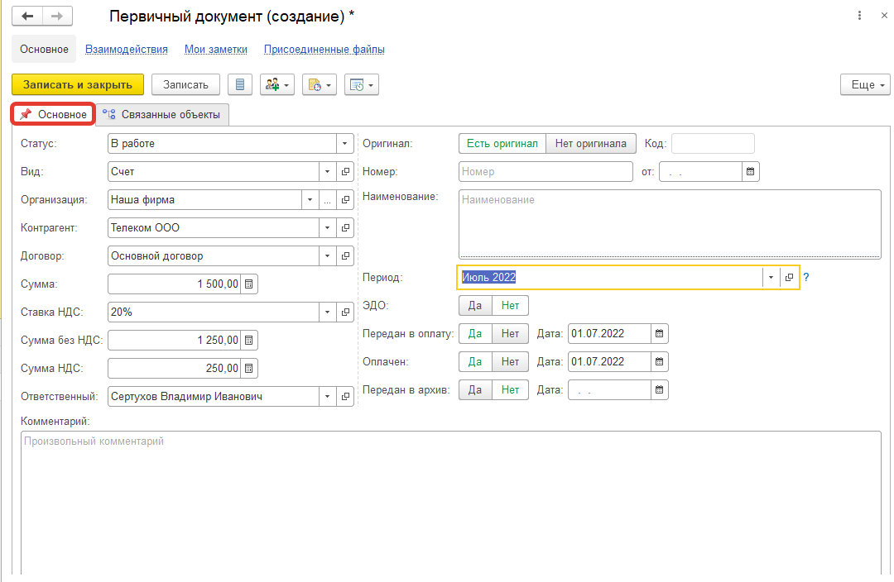

В форме первичного документа на вкладке «Основное», есть следующие реквизиты:  

**Статус:** состояние, в котором находится «Первичный документ». Может принимать следующие значения:  
- ***Запланирован*** (означает, что планируется работа поданному объекту);  
- ***В работе*** (ведется активная работа и ожидаем оплаты или договора от поставщика);  
- ***Архив*** (все работы по документу выполнены, и он передан в бухгалтерию);  
- ***Отменен*** (документ отменен по определенным причинам).  

**Вид:** указывается вид документа (например, акт, договор, дополнительное соглашение, накладная, соглашение о конфиденциальности, спецификация, счет, счет-фактура, УПД). Значения для данного реквизита могут быть дополнены.  
**Организация:** указывается наша организация.   
**Контрагент:** указывается контрагент с кем составлен первичный документ.  
**Договор:** договор, по которому ведется работа с контрагентом (по данному реквизиту заполняются: сумма, ставка НДС, сумма без НДС, сумма НДС. Мы рекомендуем их заполнение).   
**Ответственный:** сотрудник, который создал первичный документ в конфигурации.   
**Произвольный комментарий:** позволяет описать, что, это за документ и зачем он нужен.  
**Оригинал:** очень важный реквизит. Имеет две позиции: есть оригинал (значит, что поставщик передал оригинал документа и можно его отдать в бухгалтерию) и нет оригинала (говорит о том, что оригинал от поставщика не получен).  
**Номер и дата:** номер и дата первичного документа.  
**Наименование:** произвольное поле, которое позволит кратко описать документ.  
**Период:** период, к которому относится документ (месяц, квартал, год). Рекомендуем создавать периоды именно в таком варианте.  

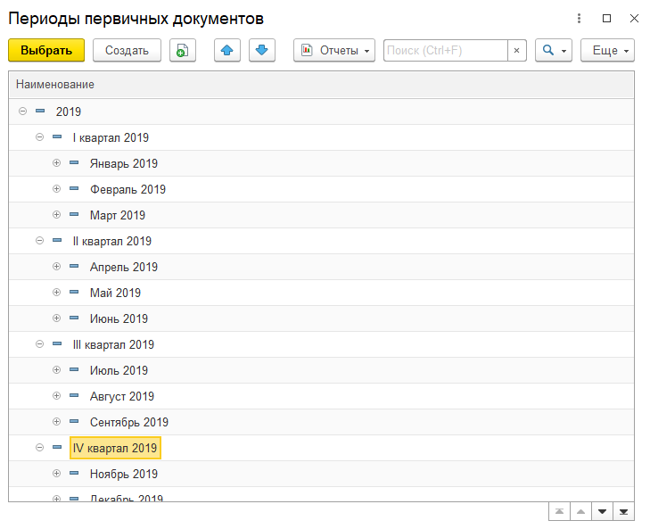

**Реквизиты: "Передан в оплату", "Оплачен", "Передан в архив"** имеют две позиции «да» и «нет», соответственно интуитивно понятно, что, к примеру, счет передан в оплату и оплачен, но не передан в архив. Дата будет заполнена автоматически, текущей датой при изменении реквизита.

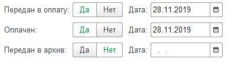

В форме списка «Первичные документы» можно будет контролировать состояние данного документа. Передан ли в оплату? Оплачен? 

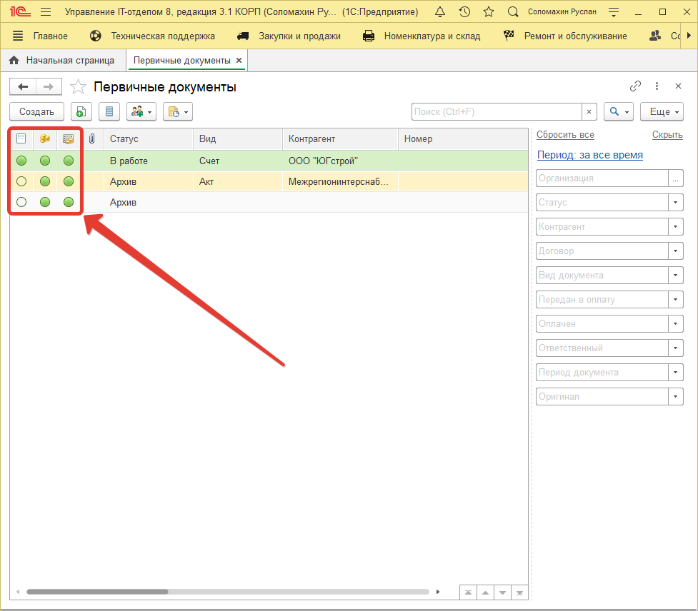

Вкладка **«Связанные объекты»** позволяется установить связь между первичным документом и объектом информационной базы, например, договор или заказ поставщику и т.д. Другими словами, первичный документ будет связан с основным договором (как показано на скриншоте). Заполнение «Связанные объекты» не является обязательным, но рекомендуемо, так как облегчит мониторинг ситуации по первичному документу.

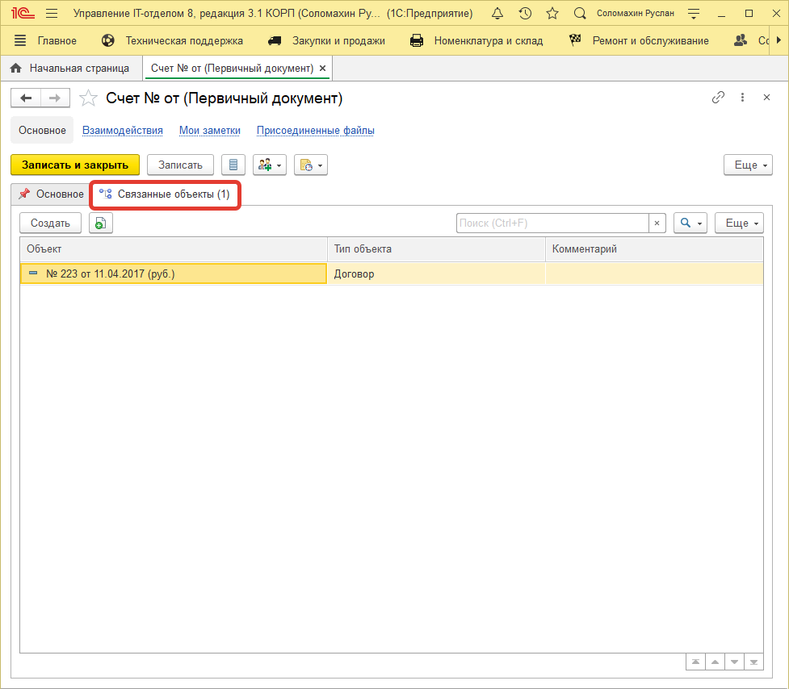

В подсистеме «Первичные документы», можно создавать документы автоматически. Например, имеется договор с поставщиком, в котором оплата производится с некой периодичностью. 

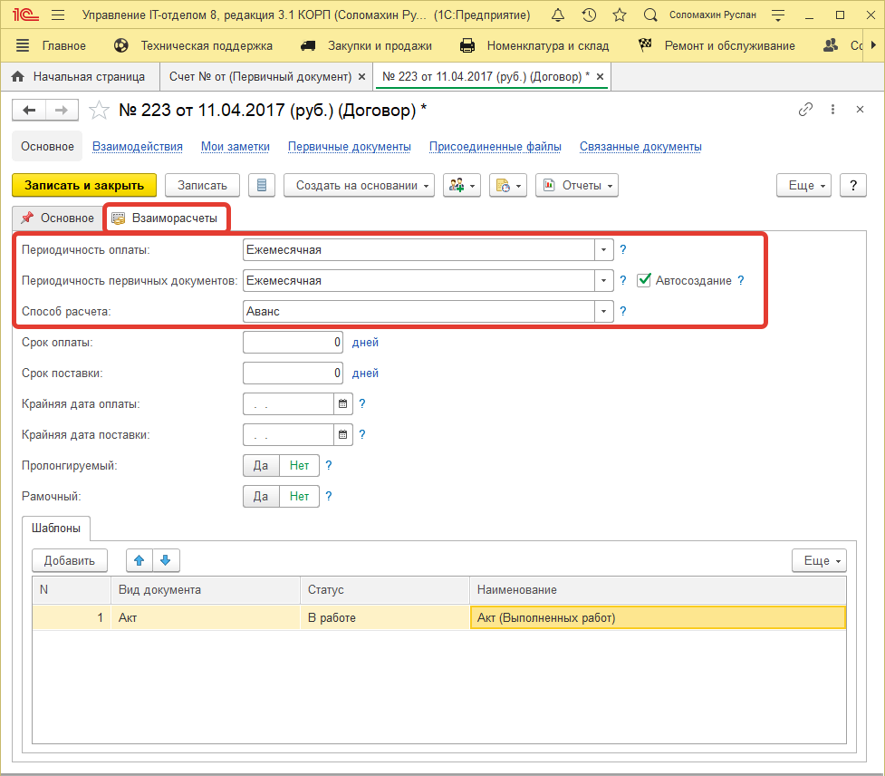

Указав «Периодичность первичных документов», появляется флажок «Автосоздание». Этот флажок позволит в начале каждого периода, регламентным заданием создавать первичные документы, согласно указанным шаблонам.

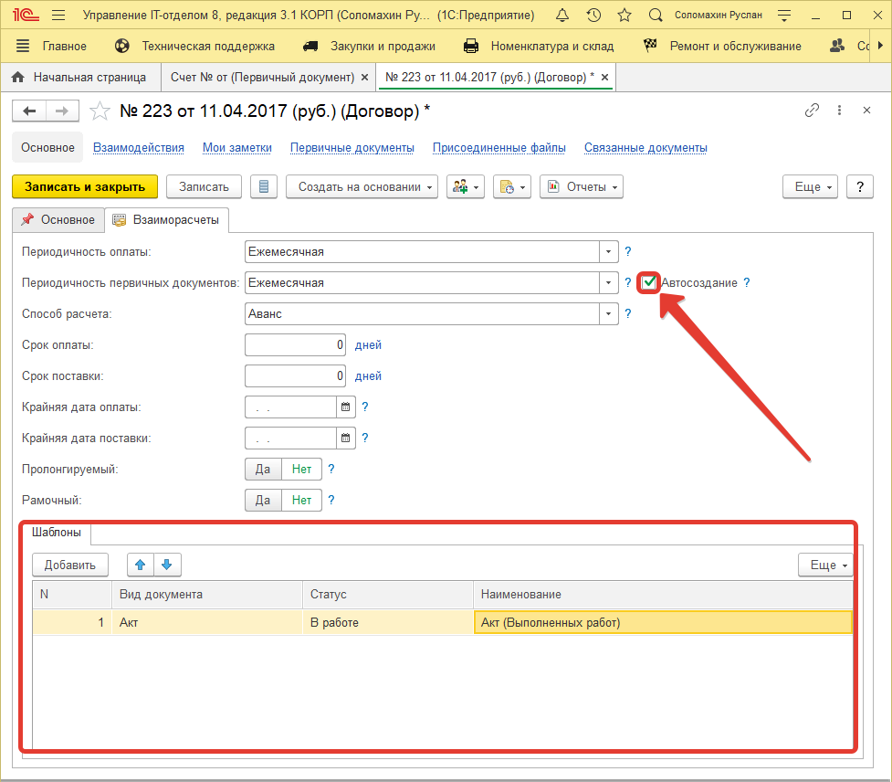

Первичные документы, также можно выводить с помощью отчета «Список первичных документов». Настроив вывод по определенным отборам, наглядно сможем проконтролировать, например, наличие оригинала.

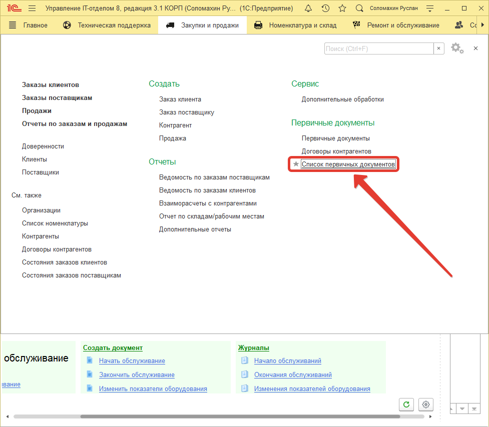
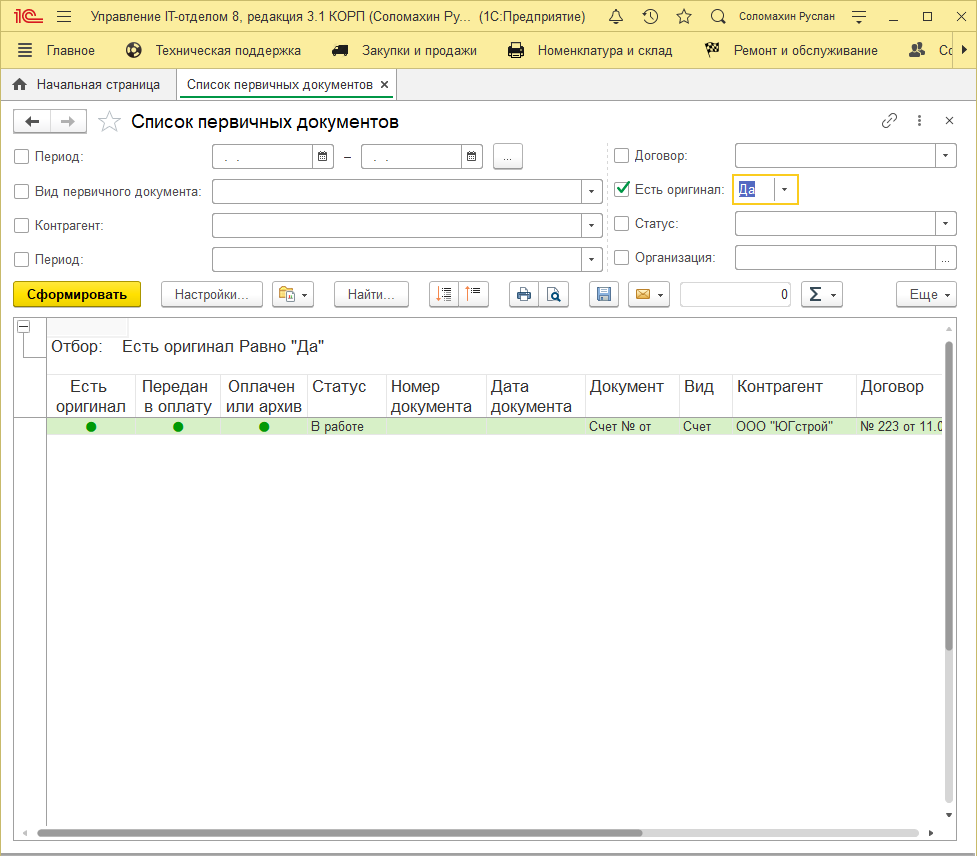

**Список ролей для работы с подсистемой "Первичные документы".**
* [x] Добавление изменение первичных документов;
* [x] Чтение первичных документов.
