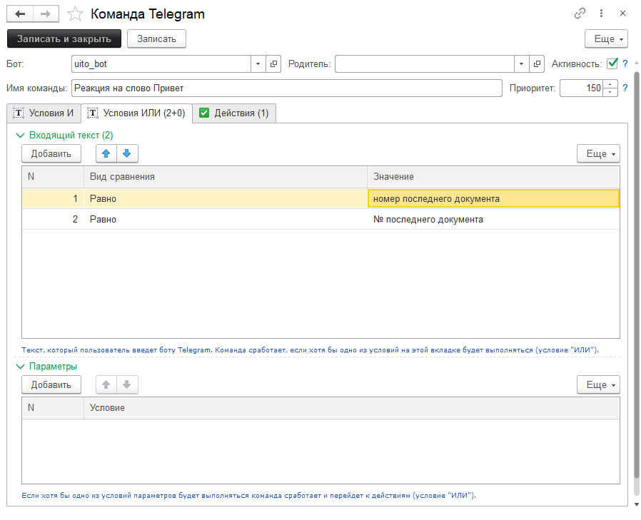
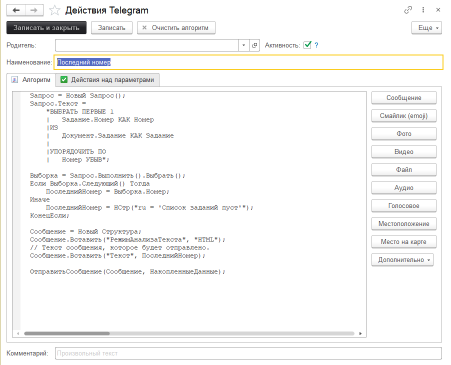
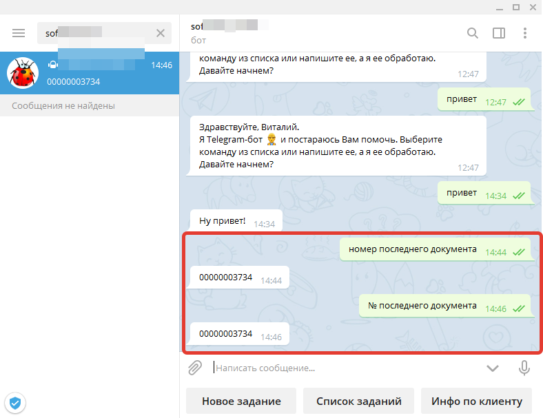

# Добавление собственных команд и действий для Telegram-бота

## Постановка задачи

Пусть пользователь в Telegram отправит боту команду *"номер последнего документа"* или *"№ последнего документа"*, а в ответ на эту команду, 1С вернет номер документа **Задание**, который был добавлен самым последним. Если документов, нет то необходимо просигнализировать об этом.  

## Решение

Для начала необходимо добавить команду. Именно команда определяет какое действие необходимо выполнить. Так как у нас команда может быть введена несколькими способами, то нам надо воспользоваться вкладкой *"Условия ИЛИ"*.

Условие ИЛИ сработает, когда одно из условий будет выполнено. Теперь перейдем к действиям. При написании алгоритма можно воспользоваться кнопками справа для быстрой вставки кода нужных команд:

Ну и получившийся результат:

## Выводы
Понятно, что это элементарный пример, но наша задача передать суть работы команд и действий. А этот пример как нельзя кстати все это описывает.
Подробная документация: [перейти](https://softonit.ru/FAQ/courses/?COURSE_ID=11&INDEX=Y)  