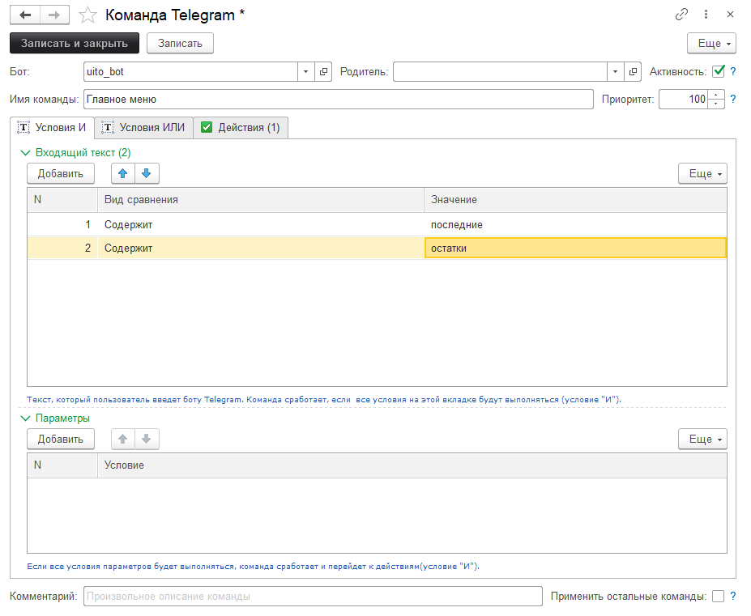
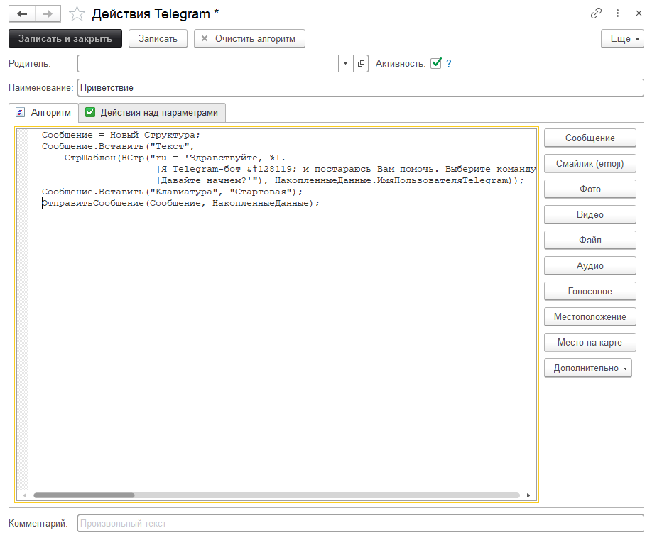

# Описание работы подсистемы конфигурации с ботом Telegram

## Справочники

### Справочник "Telegram боты"

Справочник предназначен для хранения списка ботов в конфигурации. Т.е. те боты, с которыми мы работаем.   
***Имя бота и токен*** - это системные реквизиты, которые нам становятся известны при [создании бота](https://softonit.ru/FAQ/courses/?COURSE_ID=1&LESSON_ID=679).   
***Активность*** - включает или выключает работу с ботом в конфигурации.    
***Способ взаимодействия с ботом***. Конфигурация может взаимодействовать с ботом двумя способами через Web hook (новые сообщения сами отправляются серверу 1С. Э тот способ не всегда возможно использовать) и используя **Периодический запрос** (периодический опрос сервера Telegram на предмет новых сообщений). Во избежание сложных настроек и вопросов "почему мы не можем настроить", мы рекомендуем вам использовать периодический запрос.      
***Ограниченный доступ*** - флаг, который определяет что делать с новыми пользователями, которые "стучатся" боту и пишут ему сообщения. Если галочка снята, то любой пользователь, который напишет боту автоматически может работать с ботом и полностью использовать все его команды без ограничений. Если флаг установлен, то после того, как пользователь напишет боту, бот запишет в справочники Пользователи Telegram этого пользователя с отключенной галочкой доступ, пользователя уведомит о том, что пока администраторы в 1С не подтвердят, вашу учетную запись, вы не сможете работать с ботом. Мы рекомендуем вам по умолчанию установить галочку. Чтобы отсечь не нужные контакты и обезопасить себя.  

Для тех, кто хочет использовать **web hook.**  
***Адрес*** - HTTPS-адрес, на который бот будет отправлять обновления без секретного ключа.    
***Ключ*** - секретный ключ, по которому будут идентифицироваться сообщения Telegram.    
***Самоподписанный сертификат*** - если вы используете самоподписанный сертификат, то необходимо установить этот флаг.    
***Имя сертификата*** - PEM-файл самоподписанного сертификата.     
После того, как все для web hook настроено, необходимо нажать "Отправить настройки", чтобы бот понял, что вы переходите на webhook модель взаимодействия.   

!!!
Важно! Нельзя одновременно использовать периодический запрос и web hook. Так же обратите внимание, что если Telegram запрещен в вашей стране, то вы не сможете использовать этот способ взаимодействия.   
!!!

Если все верно настроено, нажмите на кнопку **"Обновить статус"**. И вы узнаете какой статус у бота на данный момент.   

### Справочник "Пользователи Telegram"   

Справочник хранит профили пользователей, которые взаимодействуют с ботами Telegram. Реквизиты этого справочника стандартные для профиля.  
***Наименование*** - наименование профиля.   
***Имя профиля*** - имя профиля в Telegram.   
***Фамилия, Имя*** - информация из профиля Telegram.   

!!!
(!) Активность- обратите внимание, что если галочка снята, то пользователь не сможет взаимодействовать с ботом. По умолчанию для новых пользователей для ботов с огранчиенным доступом (см. выше) эта галочка снята.
!!!

***Язык*** - язык пользователя установленный в Telegram.  
***Пользователь*** - связь со стандартным справочником Пользователи. Позволяет соединить пользователя Telegram и пользователя информационной базы.  
***Табличная часть "Обозначения"*** - подстроки, как можно именовать пользователей. К Telegram не имеет никакого отношения. Позволяет в командах использовать сокращения имен пользователей для их идентификации.  

### Справочник "Прокси-серверы"

Этот справочник виден только тогда, когда установлена галочка "Использовать прокси-серверы для отправки и получения данных Telegram". Возможна работа с серверами прокси по протоколам HTTPS и SOCKS5. Работа с этим справочником необходима для стран в которых запрещен Telegram. Механизмы, которые используются в конфигурации позволяют эффективно вести оценку используемым прокси и использовать только те из них, которые стабильно работают. Ведется статистика использования каждого прокси и каждый из них имеет свою интегрированную оценку (время ответа сервера, успешных/не успешных запросов к прокси).   
Так же стоит иметь ввиду, что есть возможность из формы списка этого справочника открыть сайт с прокси и подобрать себе нужный прокси бесплатно.  

### Справочник "Команды"
***Этот справочник*** - сердце подсистемы. Именно он понимает нужно ли выполнять действия команды или нет. Суть справочника проста, если выполняются на закладках "Условия И" и/или "Условия ИЛИ" (или их комбинация), то будут выполнены все действия этой команды в табличной части "Действия".   

### Общая схема работы команд

Справочник содержит табличные части:  
***Табличная часть "Входящий текст" на закладке "Условия И"*** - табличная часть где проверяется входящий текст, который прислал боту Telegram пользователь. Команда сработает, если сработают все условия в этой табличной части одновременно. Т.е. если в табличной части будут две строки:
 

То что бы команда выполнилась необходимо чтобы введенный текст содержал обе эти подстроки:  
Т.е. выполнится команда если пользователь введет: *"Получить последние остатки"* или *"Какие последние остатки?"*. Т.е. одновременно в тексте присутствует слово "получить" и "остатки".  
***Табличная часть "Параметры"*** - на этой закладке означает что будут проверены все указанные параметры по условиям и необходимо одновременное выполнение всех условий с параметрами. Что такое параметры и зачем они нужны, мы рассмотрим ниже.   
***Табличная часть "Входящий текст"*** - Если одновременно есть строки и во входящем тексте "Условия И" и "Условия ИЛИ", то между этими условиями будет поставлено "И".     
***Применить остальные команды*** - флаг, который означает, что если команда будет выполнена, то больше никакие команды не нужно применять.     

**Пример для понимания как это все работает.** Пользователь написал нашему боту: "Сколько сейчас времени?".  
В "Условиях И" есть строка "содержит - сколько", в "Условиях ИЛИ" две строки: "равно - времени", "равно - время".  
Анализ текста будет произведен так (ВходящийТекст СОДЕРЖИТ "сколько") И (ВходящийТекст РАВНО "времени" ИЛИ ВходящийТекст РАВНО "время"). Если все верно для входящего текста, то будут выполнены команды.   

***Табличная часть "Действия"*** - действия, которые будут выполнены, если будут выполнены условия И/ИЛИ с их параметрами. 

### Справочник "Действия"

То, что будет выполнено, если условия в команде будут выполнены. Действия могут быть какими угодно. Что-то записать в информационную базу, что-то ответить пользователю, выполнить какую-то обработку данных и т.п.  
***Активность*** - выполнять действие или нет.  
***Алгоритм*** - код на языке 1С, который может что-то выполнить.  
***Табличная часть "Действия над параметрами"*** - что сделать над параметрами. Параметры рассмотрим ниже.

Пример действия приветствия пользователя.

Этот код вернет отправит пользователю текстовое сообщение и отобразит клавиатуру с наименованием "Стартовая". Справа есть панель с быстрыми действиями, которые могут быть выполнены. После того, как воспользуемся кнопкой справа, в текст алгоритма вставиться текст, который позволит что-то отправить пользователю. Вдаваться в подробности программирования в этой части мы не будем, но подчеркнем, что эта возможность есть и она "базовая", т.е. эта возможность доступна пользователям соответствующих редакций.
### Справочник "Условия"
Здесь мы можем задать условия параметров действий. Суть этого справочника в следующем. Для каждого чата есть какой-то контекст его выполнения. Пользователь, который пишет команды может использовать сразу несколько связанный между собой условий. Примером такого поведения является текущее местоположение в древовидном меню. В самом начале мы в главном меню. Щелкнули на кнопку "Инфо по клиенту", мы перешли на следующий уровень и там свое меню. И т.д. Или какие-то другие данные связанные между собой в цепочку.  
Пример: если мы захотим ввести новое задание, нам необходима тема, описание, файлы вложения и т.д. Без введенной темы, мы не можем ввести описание.  
**Параметры** - это переменные, которые хранятся для каждого пользователя подсистемы. Эти переменные можно задействовать при программировании своих команд и действий.  

***Табличная часть "Проверка параметров"*** - список проверяемых реквизитов.   

### Справочник "Emoji" 

Это справочник смайликов. По умолчанию они не хранятся в информационной базе. Их можно подгрузить. Смысл такой, что каждый такой смайлик по сути это символ в Unicode-кодировке. В справочнике можно увидеть какому изображению какой код соответствует.

### Справочник "Клавиатуры"

Это кнопки, которые добавляются либо внизу над вводимым текстом нового сообщения, либо в режиме "inline", т.е. прям в выводимом боту/ботом сообщении.
Элементы этого справочника могут быть либо заданы жестко, либо программно, либо вообще это скрытая клавиатура.

### Документы "Входящие сообщения"

То, что присылают нам пользователи. История об этих действиях сохраняется и мы всегда можем проанализировать когда, кто и что присылал боту. Установив константу "Срок хранения сообщений Telegram" в настройках можно задать сколько дней хранить эти сообщения.

### Документы "Исходящие сообщения"

То, что отправляет конфигурация боту Telegram. История об этих действиях сохраняется и мы всегда можем проанализировать когда, кто и что присылал боту. Установив константу "Срок хранения сообщений Telegram" в настройках можно задать сколько дней хранить эти сообщения.

