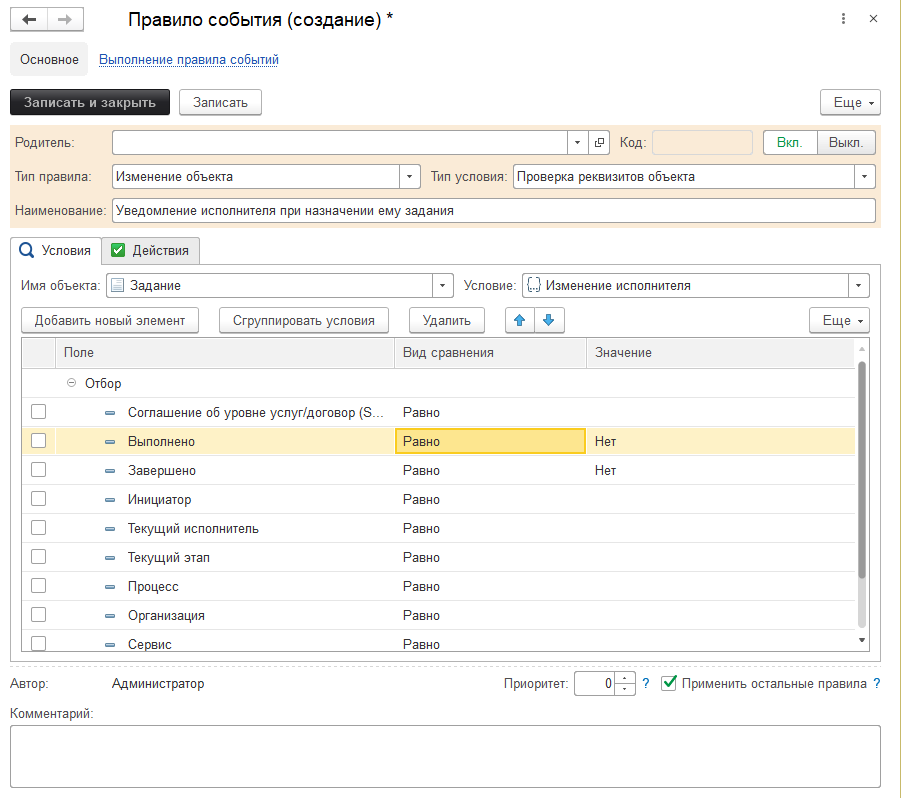
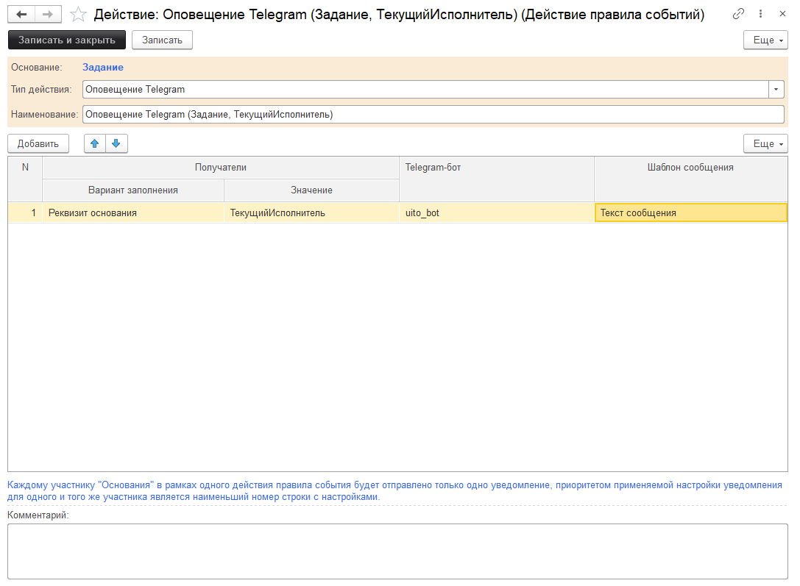
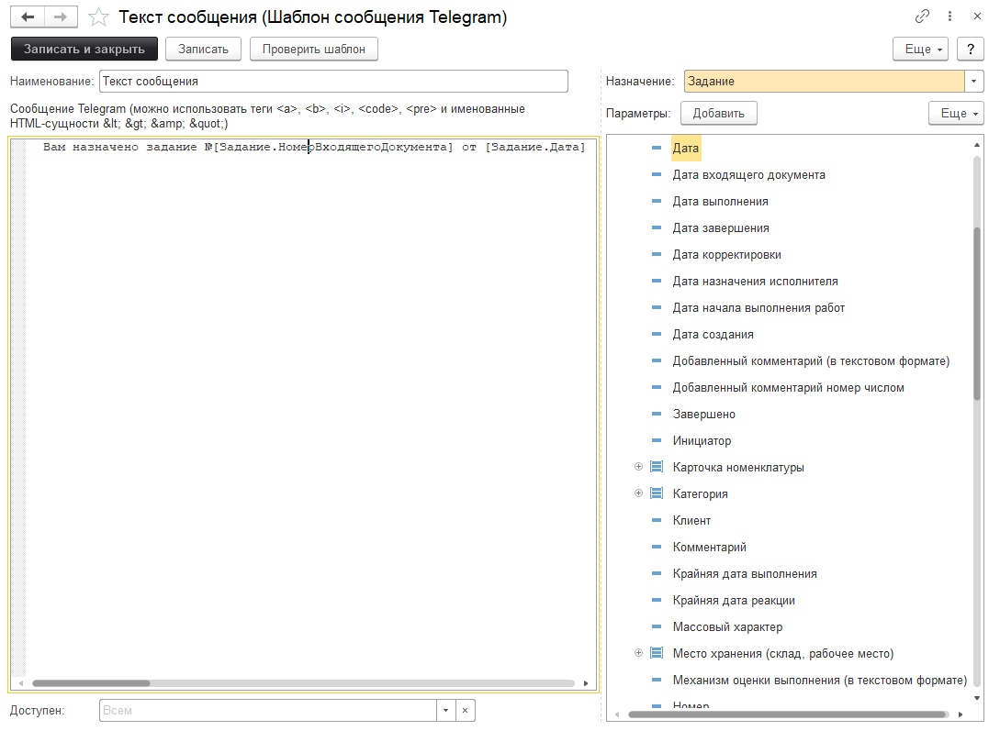

# Отправка уведомлений из конфигурации в Telegram через правила событий

Подсистема Telegram умеет взаимодействовать с другой подсистемой [Правила событий](https://softonit.ru/FAQ/courses/?COURSE_ID=1&CHAPTER_ID=0449).  
Правила событий - это мощный инструмент, который позволяет по каким-то условиям выполнять необходимые действия.  
Это может быть отправка уведомлений на e-mail, SMS-сообщение, заполнение реквизитов и т.д. В том числе и отправка уведомлений боту Telegram.  

## Задача

Добавить информирование текущего исполнителя задания при назначении ему на исполнение нового задания.

## Решение

Откроем правила событий. *Справочники > Правила событий* и создадим новое правило для документа Задание при изменении исполнителя:

Теперь добавим действие:

В действии создадим шаблон оповещения:

После этого можно пробовать менять исполнителя. В результате вам в Telegram придет уведомление о изменении исполнителя.