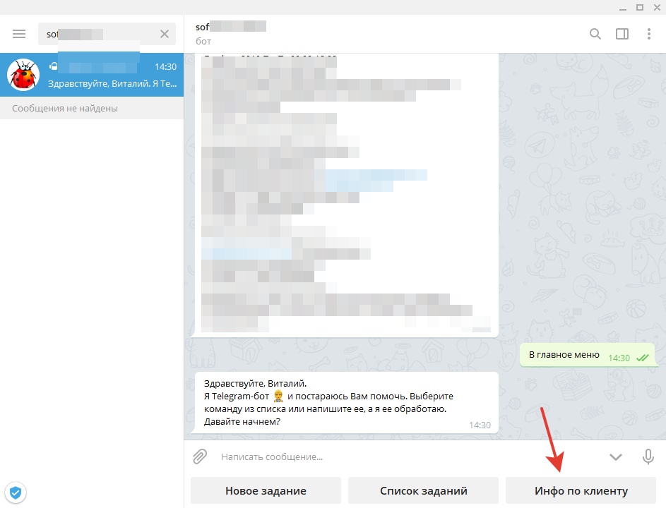
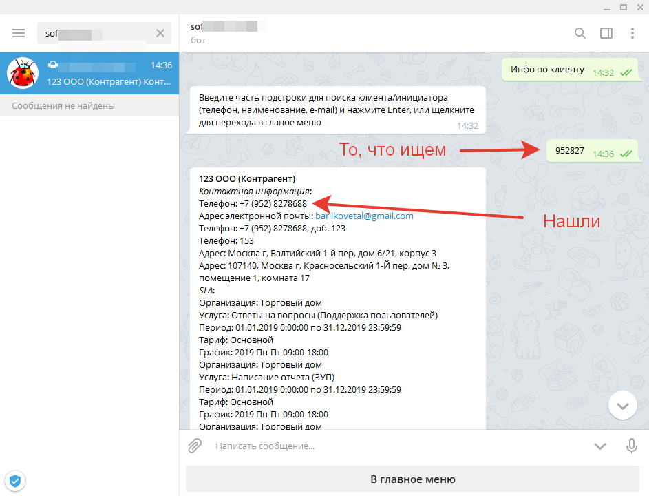

# Поиск информации о клиенте используя Telegram-бот

Очень часто возникает ситуация когда нам необходимо получить информации о клиенте его контактных данных и проверить является есть ли с ним заключенный SLA.
Telegram-бот может помочь нам в этом. 

**Начнем:**

После нажатия на кнопку и обработки этого сообщения в 1С. Нам будет предложено следующее:

`Введите часть подстроки для поиска клиента/инициатора (телефон, наименование, e-mail) и нажмите Enter, или щелкните для перехода в главное меню`

Мы можем ввести часть подстроки любой из контактной информации: телефона, e-mail или наименования клиента.
Причем для телефона не будет разницы в каком формате задана часть подстроки.

Далее, если надо как-то конкретизировать поиск, можно ввести еще подстроку и снова нам бот отобразит найденных клиентов.
После того, как мы нашли того кого искали, можно вернуться в главное меню.