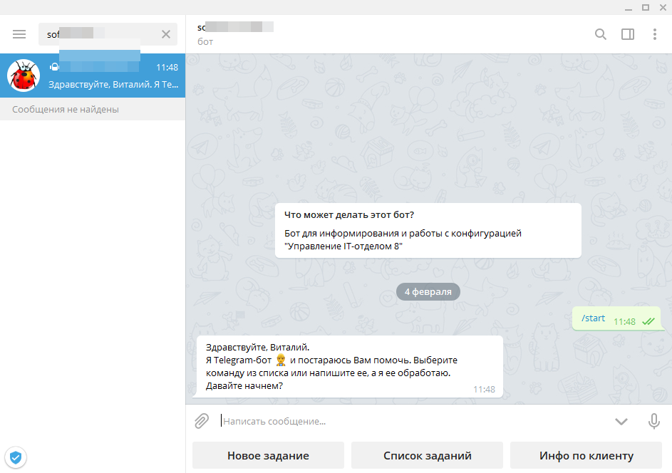

# Предопределенные команды Telegram-бота или интеграция по умолчанию

По умолчанию из коробки конфигурация "Управление IT-отделом 8" умеет взаимодействовать с ботом Telegram и выполнять следующие команды:

* Создавать новые задания в Service Desk.  
* Получить информацию о клиенте Service Desk используя подстроку поиска e-mail, телефона, наименования клиента.   
* Увидеть список своих заданий  
* Посмотреть  информацию о конкретном задании и его вложениях используя бота Telegram  

!!!
Важно! Обратите внимание, что команды отображаются для текущего пользователя информационной базы 1С, который должен быть связан с пользователем Telegram. Для того, чтобы связать пользователя информационной базы и пользователя Telegram, надо открыть настройки Telegram в 1С (Администрирование > Telegram-боты), открыть "Пользователи" и открыть каждого пользователя Telegram и в нем заполнить реквизит *"Пользователь ИБ"* указав нужного пользователя 1С.
!!!

Вот как выглядит стартовая страница бота:

Далее список доступных команд: