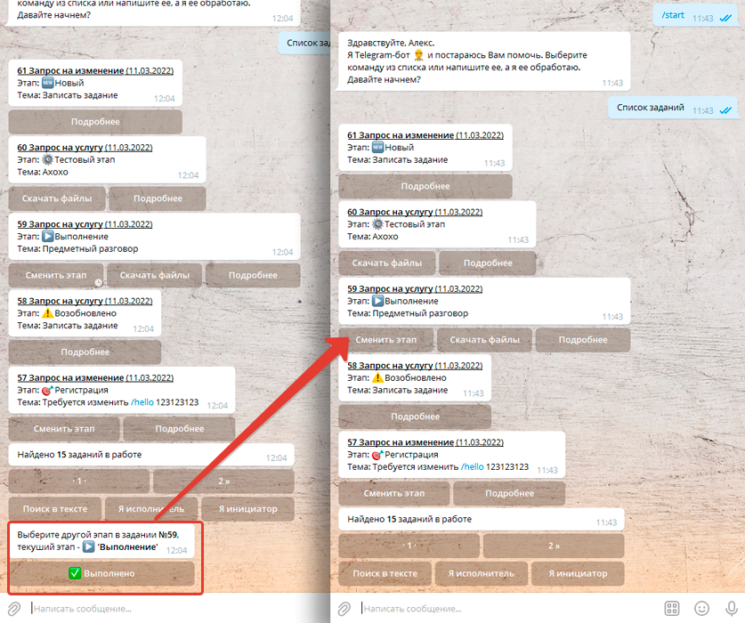

# Просмотр списка заданий используя бот Telegram

С помощью бота Telegram можно быстро просмотреть информацию о списке заданий. Причем если заданий много в Telegram все будет разбито на страницы:

Далее, мы можем осуществлять переходы по страницам - это навигация по задачам. Отобрать все задания где мы являемся исполнителем и мы являемся инициатором, а так же поискать задания по подстроке в текста заданий.

Под каждым заданием можно увидеть от одной до трех кнопок:  
* **«Сменить этап»** - появится если текущий пользователь является исполнителем задания, при нажатии будет выведен, список этапов на которые можно перевести задание.  
* **«Скачать файлы»** - если у задания есть прикреплённые файлы, то нажав данную кнопку мы скачаем эти файлы в ZIP архиве.  
* **«Подробнее»** - получим более подробную информацию о задании.  

!!!
Важно! Обратите внимание, что список заданий отображается для текущего пользователя информационной базы, который должен быть связан с пользователем Telegram. Для того, чтобы связать пользователя информационной базы и пользователя Telegram, надо открыть настройки Telegram в 1С (Администрирование > Telegram-боты), открыть "Пользователи" и открыть каждого пользователя Telegram и в нем заполнить реквизит "Пользователь ИБ"  указав нужного пользователя 1С.
!!!