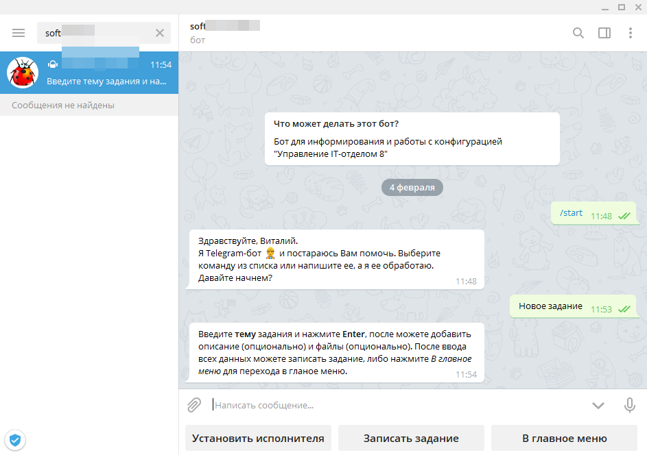
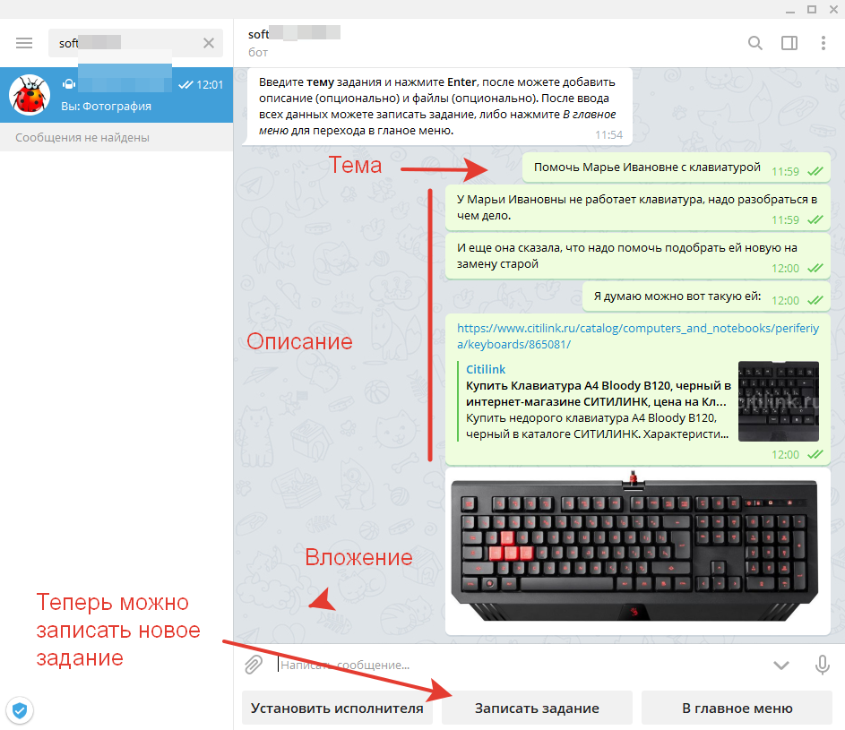
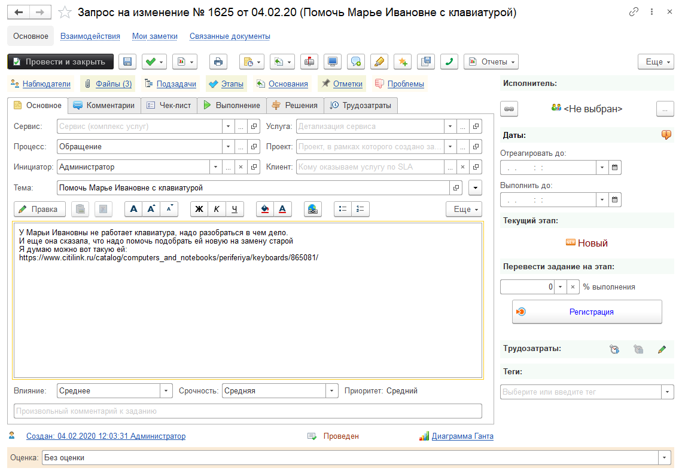
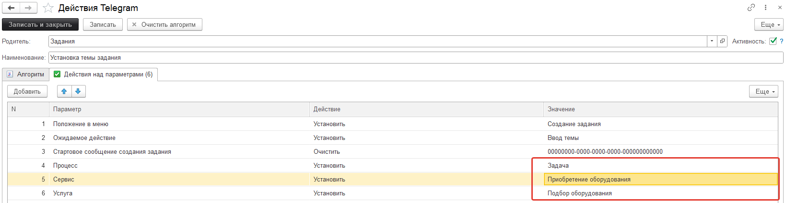

# Создание заданий используя бот Telegram

!!!
Важно! Обратите внимание, что список заданий отображается для текущего пользователя информационной базы, который должен быть связан с пользователем Telegram. Для того, чтобы связать пользователя информационной базы и пользователя Telegram, надо открыть настройки Telegram в 1С *(Администрирование > Telegram-боты)*, открыть *"Пользователи"* и открыть каждого пользователя Telegram и в нем заполнить реквизит *"Пользователь ИБ"*  указав нужного пользователя 1С.
!!!

Часто хочется добавить задание быстро, либо когда мы находится в месте, где у нас нет доступа к desktop-версии программы, или не хочется запускать мобильное приложение.  
Можно воспользоваться ботом Telegram и быстро добавить задание.  
Вводим /start или щелкаем в "Главное меню" и видим у бота такое же подменю из кнопок как на скриншоте выше.  
Нажимаем кнопку "Новое задание". После обработки 1С вашего сообщения вам придет сообщение:  

Нажатие на кнопку добавило текстовое сообщение "Новое задание", а ответ 1С говорит нам о том, что теперь можно ввести тему задания и нажать Enter, а затем можно вводить произвольный текст, который будет добавлен в описание создаваемого задания, добавить в чат файлы и изображения, которые будут присоединенными файлами (вложениями) нового задания. После того, как мы добавим всю информацию, мы должны либо нажать "Записать задание" и тогда будет создано новое задание с нашей темой, описанием и вложениями, либо нажать в главное меню и тогда задание не создастся.  

Добавим в нашем тесте данные новой задачи:

После того, как 1С обработает наше сообщение нам в чат придет сообщение вида:  
Задание 1625 создано.  
Выберите следующую команду из списка или напишите ее, а я ее обработаю.  

А в 1С будет создано новое задание: 

Администратор ИБ может самостоятельно установить часто используемые *«Процесс»*, *«Сервис»* и *«Услугу» заранее*. Выполнив *«Администрирование» -> «Настройки Telegram» -> «Действия»*. Открыв действие «Установка темы задания», во вкладыше «Действия над параметрами» указать нужные.  

На этом задание можно считать созданным. Дальше его можно выполнять.
