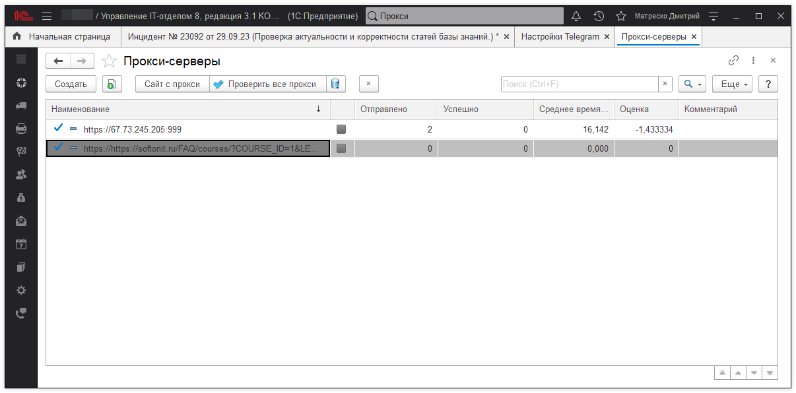
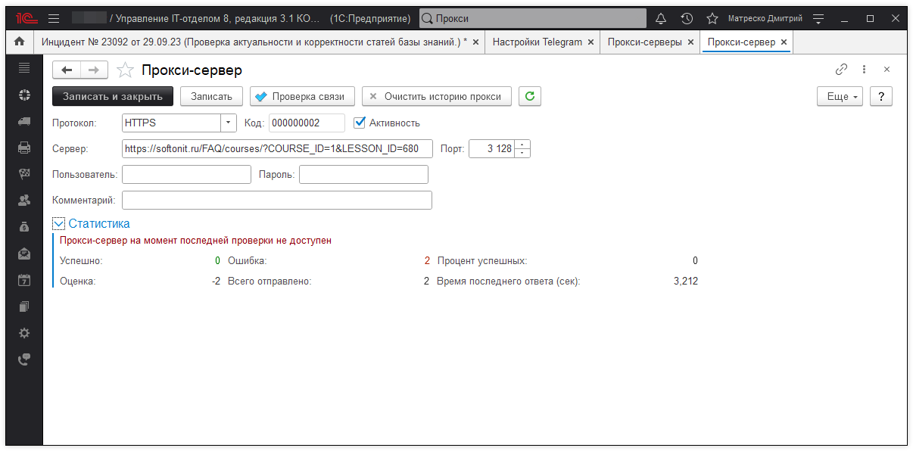
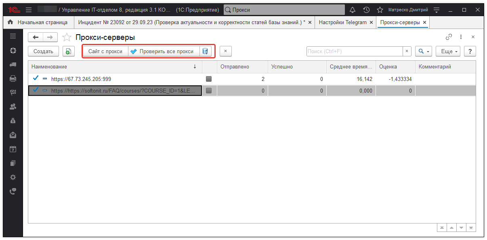

# Работа с прокси-серверами

Для работы в конфигурации "Управление IT-отделом 8" с предусмотренной интеграцией Telegram-бота, необходимо настроить прокси-сервера.В программе можно использовать, как платные прокси, так и бесплатные. Система бесплатных прокси-серверов как известна достаточно нестабильна, поэтому целесообразнее использование прокси на платной основе. Однако в конфигурации работа с платными и бесплатными прокси-серверами одинакова. Система выстраивает некий порядок из серверов, который определяет полноценную оценку прокси, по скорости ответа, по количеству успешных запросов и так далее. Таким образом на первых местах располагаются сервера с наилучшей оценкой и программа первым делом будет обращаться именно к ним, что гарантирует положительную отдачу от сервера. Рассмотрим настройку прокси в конфигурации, для этого перейдем в раздел *"Администрирование" - "Telegram-Боты" - "Прокси-серверы"*.

Чтобы добавить в список новый прокси-сервер необходимо нажать кнопку **"Создать"**, которая расположена на панели команд и перейти к заполнению соответствующих реквизитов сервера:

- **Протокол** - может принимать значение https\socks5;  
- **Активность** - флажок, который активирует прокси-сервер для использования системой;  
- **Сервер** - указывается адрес прокси-сервера;  
- **Порт** - указывается порт сервера;  
- **Пользователь** - указывается логин пользователя платного прокси;  
- **Пароль** - пароль пользователя платного прокси-сервера;  
- **Комментарий** - указывается произвольный текст.  
 
После заполнения всех реквизитов можем проверить связь с данным сервером с помощью одноименной кнопки "Проверка связи". Если проверка пройдет успешно, то получим соответствующее сообщение.

Если у Вас нет возможности использовать платные прокси-сервера, то в таком случае для удобства в программе предусмотрен функционал, который позволяет быстро найти бесплатные сервера. Этот механизм открывается на форме списка прокси-серверов с помощью кнопки "Сайт с прокси". Перед Вами будет доступен большой выбор прокси свободного использования, которые можно будет использовать в конфигурации. После добавления всех необходимых прокси-серверов их соединение можно проверить, нажав кнопку "Проверить все прокси". Если нужно быстро добавить большое количество прокси, то для этого нужно нажать кнопку в виде цилиндра "Автозагрузка прокси" и в программу будут добавлены десять бесплатных прокси-серверов.

