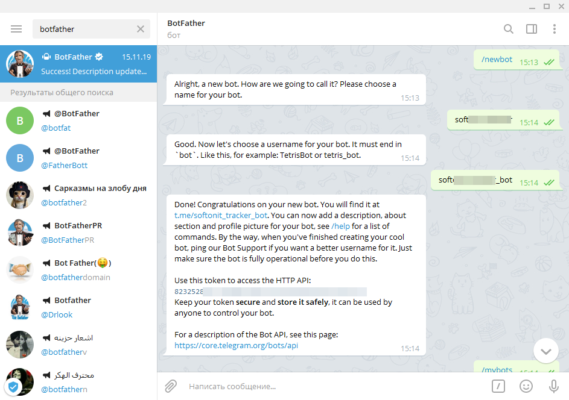
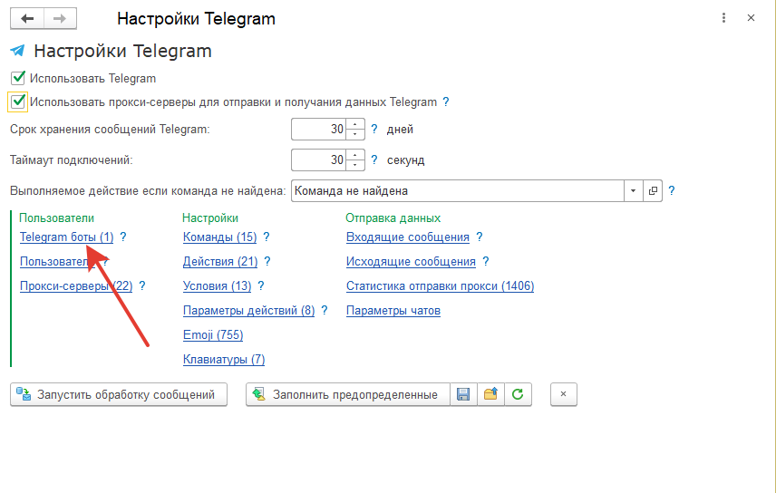
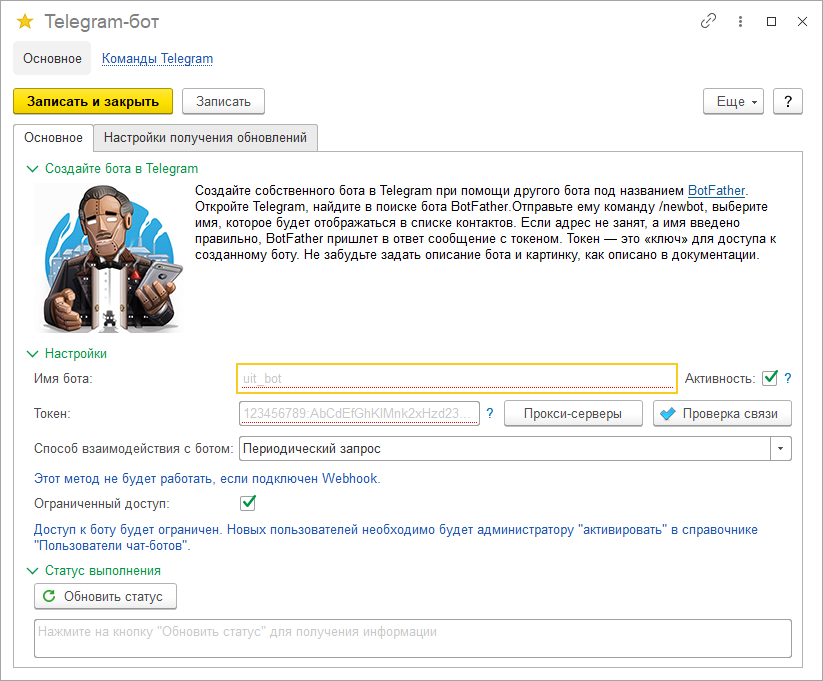
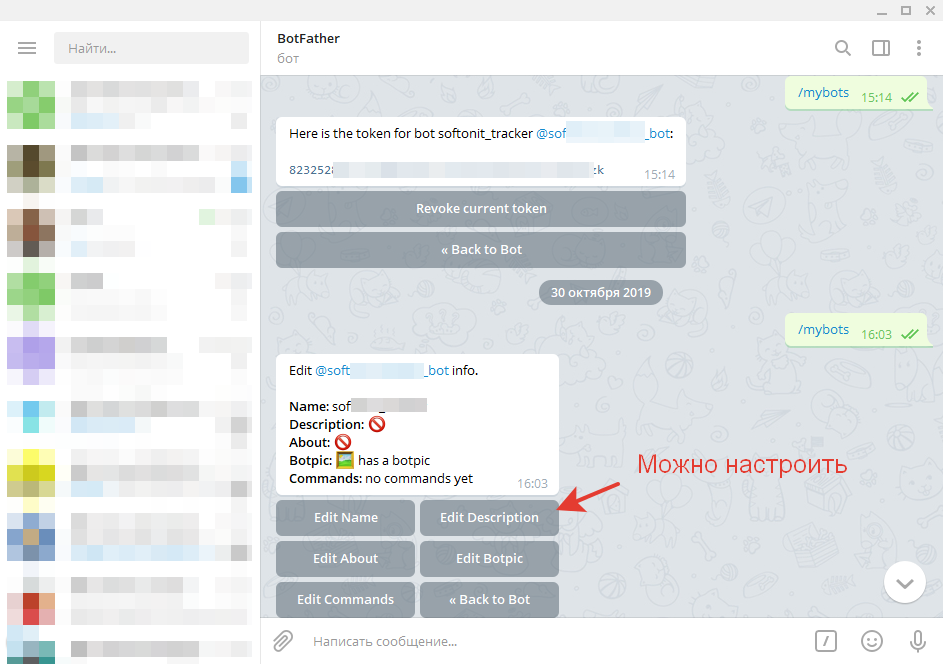
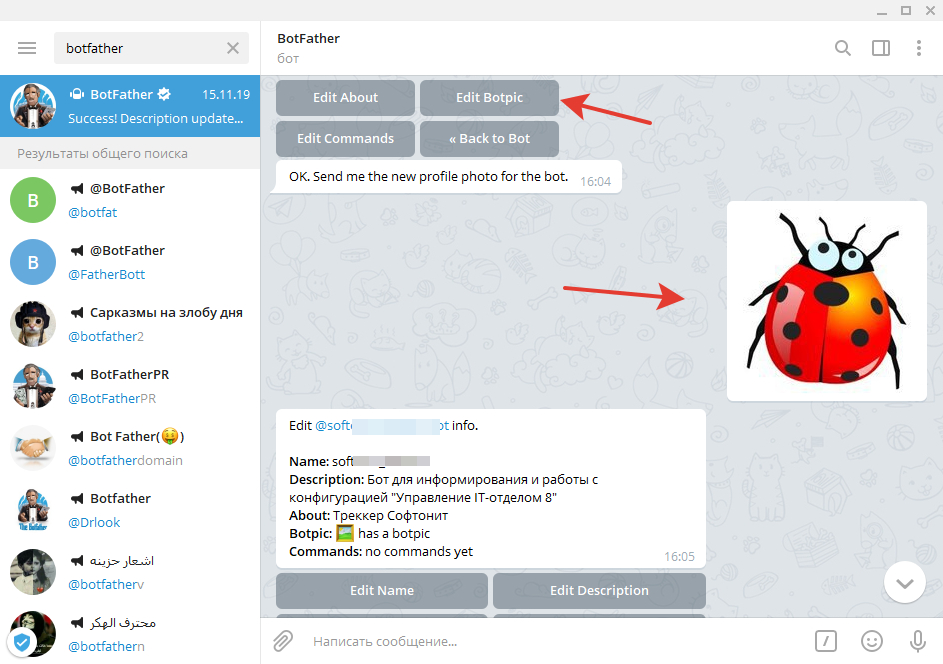

# Создание и настройка Telegram-бота

Для начала необходимо, установить мессенджер.  
Убедитесь, что Telegram не заблокирован в вашей стране и корректно работает на вашем устройстве. Если мессенджер заблокирован, то вы можете использовать на десктопе или мобильном телефоне прокси-сервера.  
1. Далее зарегистрируйтесь в сервисе (если вы еще этого не делали)   
2. В поиске найдите бота с именем **BotFather** - это "отец" всех ботов. Этот бот позволяет создавать других ботов и введите команду **/newbot**.

3. После этого мессенджер попросит вас придумать имя бота: можете ввести произвольное свое имя. Самое главное, чтобы оно заканчивалось на **"_bot"**. Например, *my_uito_bot*.
4. Далее, бот отобразит для доступа по HTTP специальный токен. На скриншоте выше он начинается как "8232528..." Это токен для доступа из конфигурации "Управление IT-отделом 8" к боту. Запомните его.
5. Открываем конфигурацию и переходим в *Администрирование > Настройки параметров учета > Функциональность*. Включаем галочку *"Использовать Telegram"*. Для того, чтобы в 1С появилась возможность работы с ботом.
6. Открываем *Администрирование > Telegram-боты*. Там щелкаем на гиперссылку Telegram-боты. Это список наших ботов. Бот может быть не один, но практически всегда нам достаточно будет и одного.

7. Открываем первого бота, который уже существует и вносим его токен и название.

8. После вставки токена и имени бота, нажимаем проверка связи. Если все хорошо, то вам будет выдано сообщение *"Проверка связи с ботом выполнена успешно"*.
9. Перейдем на закладку "Настройки получения обновлений", где можно настроить расписание работы бота. Установите время получения обновлений с серверов Telegram.
10. Если все введено на шаге 9, но у вас ошибка (например, Telegram заблокирован в вашей стране). Установите галочку в настройках Telegram *"Использовать прокси-серверы для отправки и получения данных Telegram"* и открыв появившийся справочник *"Прокси-серверы"* заполните список ваших прокси.
11.Возвращаемся к мессенджеру Telegram и до настроим бота. Введем ему описание и изображение.

Зададим изображение. OK. Send me the new profile photo for the bot. означает, что бот просит скинуть ему фото профиля будущего бота. Просто перетащите фото в BotFather:

После этого настройку бота можно считать выполненной как в 1С так и в самом мессенджере.