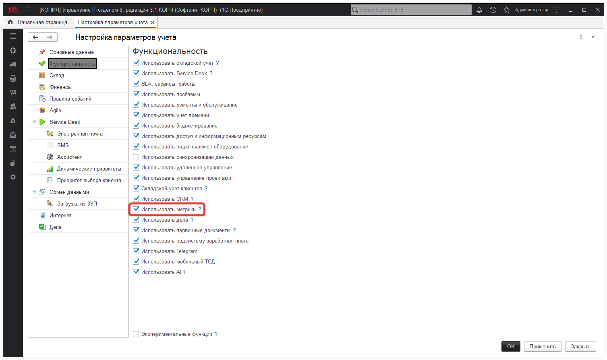

# Использование подсистемы KPI

**Требования:**
* *версия* программы **3.1.3.1** и выше;
* *редакция* программы **КОРП.**
* 
Подсистема **"Метрики и KPI"** (наряду с отчетами других подсистем) предназначена для сбора и анализа различных статистических показателей в разрезе периодов: например, количество выполненных или просроченных заданий, распределение новых заданий по дням недели, сервисам, способам создания или проектам и т.д. Программа поставляется с несколькими предустановленными метриками, но пользователь может как использовать (изменить "под себя" ) поставляемые, так и создать и использовать собственные метрики. Показатели метрик могут рассчитываться как автоматически (регламентным заданием), так и вноситься в программу вручную пользователем. Подсистема "Метрики и KPI" используется совместно с настраиваемым рабочим столом:

Список метрик, присутствующих в программе по умолчанию:
 
* **Количество выполненных заданий**  
* **Количество не распределенных заданий**  
* **Количество открытых заданий**  
* **Количество просроченных заданий**  
* **Общее количество заданий.**  

Прежде всего, для работы с метриками необходимо убедиться, что в программе включена соответствующая функциональная опция. Для этого необходимо перейти в раздел **"Администрирование - Настройка параметров учета - Функциональность"** и включить опцию **"Использовать метрики"** в случае, если она выключена:

Далее, для автоматического расчета показателей метрик необходимо убедиться, что включено и настроено расписание регламентного задания **"Расчет метрик"** (раздел ***"Администрирование - Регламентные и фоновые задания"***):

Для работы с подсистемой пользователю доступны следующие объекты (раздел "Техническая поддержка - Метрики"):

* **справочник "Метрики"** - предназначен для настройки используемых метрик;   
* **документ "Установка значений метрик"** - предназначен для установки как плановых, так и фактических (ручной ввод) показателей рассчитываемых метрик.

Поскольку используемые на рабочем столе (по умолчанию) показатели однотипные, рассмотрим работу подсистемы на примере получения количества просроченных заданий (заданий, в которых крайняя дата выполнения меньше фактической даты выполнения), при этом, приведенное ниже описание справедливо и для остальных предопределенных метрик.  
  
В справочнике "Метрики" откроем карточку метрики **"Количество просроченных заданий"**:

## Рассмотрим реквизиты карточки метрики:

**Группа метрики** - группа, в которую входит метрика;  
**Наименование** - наименование метрики;  
**Идентификатор** - служебный реквизит, заполнен только у предопределенных элементов, используется для обращения к метрике на встроенном языке 1С;   
**Единица измерени**я - значения могут быть выбраны из "Классификатора единиц измерения", по умолчанию используются "шт";    
**Значение по умолчанию** - значение, которое будет использоваться при заполнении документа "Установка значений метрик".   

Табличная часть **"Измерения"** может содержать дополнительные аналитики, в разрезе которых, в дальнейшем, возможно получение развернутой информации по метрике. Количество измерений одной метрики может быть не более **5**. Каждое измерение может быть описано следующими реквизитами:  

**Тип измерения** - тип аналитики (справочник либо документ) - ключевой реквизит аналитики, указывающий, значения какого типа могут использоваться в качестве аналитики;  
**Представление** - строка - заголовок колонки в документе "Установка значений метрик" текущей аналитики;   
**Подсказка** - строка - подсказка, отображающаяся при вводе аналитики в документе "Установка значений метрик";   
**По умолчанию** - значение аналитики по умолчанию, которое будет установлено для аналитики при заполнении документа "Установка значений метрик";   
**Обязательное** - признак, указывающий, что заполнение аналитики обязательно для данной метрики (только для документа "Установка значений метрик");  
**Назначение** - может принимать значения "Пользователь" или "Проект" и указывает, к какому пользователю (или проекту) отнести данную аналитику для дальнейшего анализа. Важно отметить, что для одной метрики, допускается заполнение реквизита "Назначение" только по одной аналитике на каждое "Назначение".   

Значения реквизитов строк "Измерения" метрики "Количество просроченных заданий" по измерениям:

### Исполнитель

* **Тип измерения:**   
* `Справочник**.ГруппыПользователей;Справочник.Пользователи;`
* **Представление** - "Исполнитель";  
* **Подсказка** - "Исполнитель задания";  
* **Назначение** - "Пользователь".  

### Клиент
 
* **Тип измерения:**   
`Справочник.КонтактныеЛица;Справочник.Контрагенты;Справочник.Организации;Справочник.Подразделения;Справочник.Пользователи;Справочник.Сотрудники;Справочник.ФизическиеЛица;`  
* **Представление** - "Клиент";   
* **Подсказка** - "Исполнитель задания".

### Соглашение SLA

* **Тип** измерения:   
`Документ.СоглашениеSLA`  
* **Представление** - "Соглашение SLA";  
* **Подсказка** - "Соглашение SLA".  

Условия, по которым будут отбираться объекты для автоматического расчета метрик, а также формулы самого расчета описываются соответствующими правилами событий. Для просмотра используемых правил необходимо перейти в раздел *"Справочники - Правила событий"* (подробнее о подсистеме "Правила событий" можно посмотреть тут) и открыть предопределенное правило **"Расчет метрик для документа Задание (запись документа)"**:

Рассмотрим действие правила. Для этого необходимо перейти на закладку *"Действия"* и открыть предопределенное действие правила событий: **"Расчет метрик (документ Задание)"**:

В карточке действия правила событий в списке метрик выберем метрику **"Количество просроченных заданий"** и рассмотрим формулы расчета (формулы могут быть заполнены только на *встроенном языке 1С*):

Для **любой** метрики, указанной в списке метрик, присутствуют следующие реквизиты для ввода формул расчета:

* **Формула** - формула расчета значения метрики;   
* **План/факт** - признак, где будет учитываться вычисленное значение метрики;   
* **Период регистрации** - формула расчета периода (даты), в котором будет учитываться значение метрики.   
* 
Остальные реквизиты для ввода формул расчета зависят от указанных в самой карточке метрики аналитик. В карточке метрики "Количество просроченных заданий" были указаны 4 измерения (аналитики), теперь в карточке действия правила можно указать, как данные аналитики могут быть вычислены.

Рассмотрим приведенные формулы подробнее. В общем случае, шаблоном формулы может выступать следующее выражение:

`Результат = Источник.<ИмяРеквизита>;`
где переменной Результат необходимо присвоить какое-либо значение, например, значение указанного реквизита Источника. В рассматриваемом случае, в качестве Источника выступает документ "Задание".

Для реквизита **"Формула"** указан следующий код:

`Результат = ?(Источник.ПометкаУдаления = Ложь И Источник.КрайняяДатаВыполнения <> Дата(1, 1, 1) И Источник.Выполнено = ЛОЖЬ И Источник.КрайняяДатаВыполнения < ТекущаяДатаСеанса(), 1, 0);`
Результатом выполнения данной формулы (т.е. значением для метрики в целом) будет "1" в случае, если документ "Задание" не помечен на удаление, в документе заполнен реквизит "Крайняя дата выполнения", задание еще не выполнено, и эта дата меньше текущей даты. В любом другом случае, результат выполнения данной формулы будет равен "0" и данный результат расчета не будет учитываться при анализе результатов значений данной метрики. Расчеты аналитик метрики производятся только в случае, если результатом вычисления формулы будет "1".  

Для реквизита **"План/факт"** указано значение *"Факт"*. Это означает, что полученное ранее значение метрики (в случае, если Результат = 1) будет отнесено к фактическому значению данной метрики.

Для реквизита "Период регистрации" указана следующая формула:

`Результат = Источник.ДатаСоздания;`

Это означает, что значение метрики должно быть отражено датой документа (`Источник.ДатаСоздания`), и, в дальнейшем, при анализе результатов, отнесено к соответствующему периоду.

Аналогичным образом получаем значения остальных аналитик метрики, используя соответствующие реквизиты документа "Задание":

### "Исполнитель"

`Результат = Источник.ТекущийИсполнитель;`

### "Клиент"

`Результат = Источник.Клиент;`

### "Инициатор"

`Результат = Источник.Инициатор;`

### "Соглашение SLA"

`Результат = Источник.SLA;`

В процессе работы с заданиями, при записи документа, если задание оказывается просроченным (т.е. задание попадает под условия правила событий), согласно формул действия правила событий информация будет отражена в соответствующем периоде.

Документ **"Установка значений метрик"** используется для "ручного" отражения плановых или фактических показателей. Например, при для отражения планового показателя описанной выше метрики "Количество просроченных заданий" форма документа будет выглядеть следующим образом:

Колонки табличной части документа содержат обязательные колонки **"Период", "Факт", "План"**, а также указанные в карточке метрики измерения: **"Исполнитель", "Клиент", "Инициатор"**, "Соглашение SLA".

О получении результата расчета метрик и выводе его на рабочем столе можно посмотреть в разделе ["Настраиваемый рабочий стол"](https://softonit.ru/FAQ/courses/?COURSE_ID=1&CHAPTER_ID=0616)
