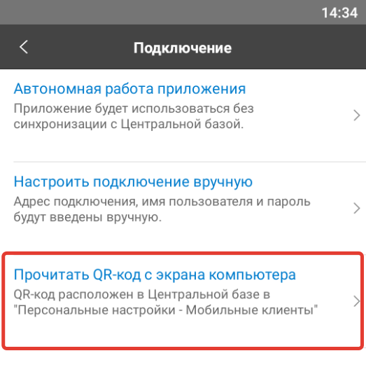
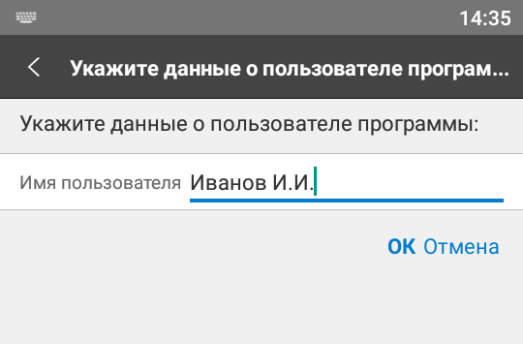
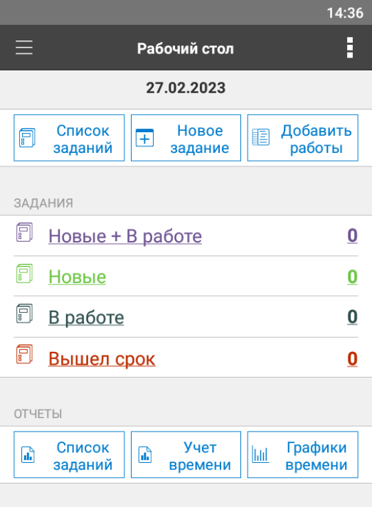
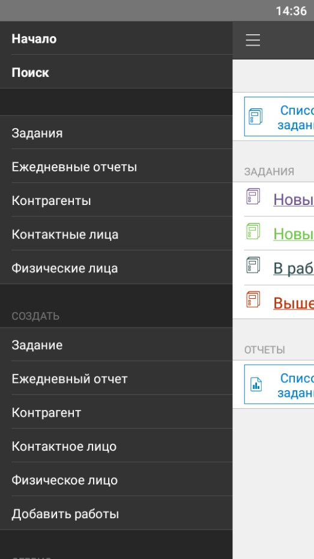
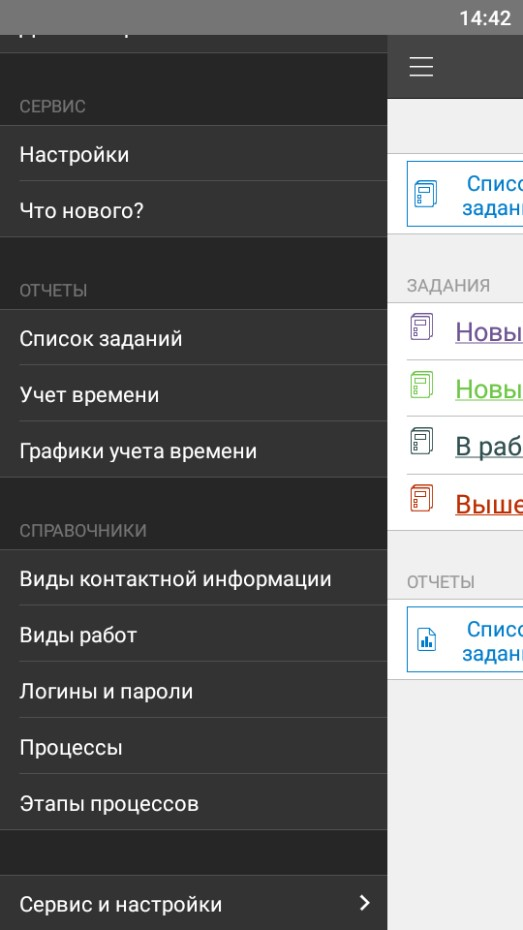
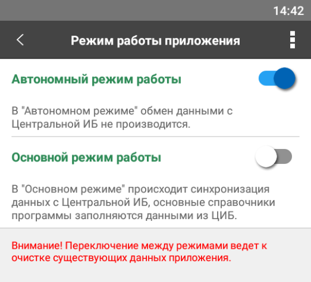

# Мобильное приложение "Управление IT-отделом 8" в автономном режиме

Мобильное приложение можно использовать в автономном режиме, для этого нужно выбрать соответствующий пункт меню. В этом режиме работы, приложение не будет синхронизироваться с центральной базой.

Для начала работы в этом режиме нужно создать нового пользователя.

После того, как пользователь создан, мобильное приложение перезапустится и можно приступать к работе.

В данном режиме работы можно создавать как новые задания, так и новые элементы справочников.

Возможен переход из автономного режима работы, в режим работы при котором будет выполняться синхронизация с центральной базой. При этом вся информация будет удалена.

