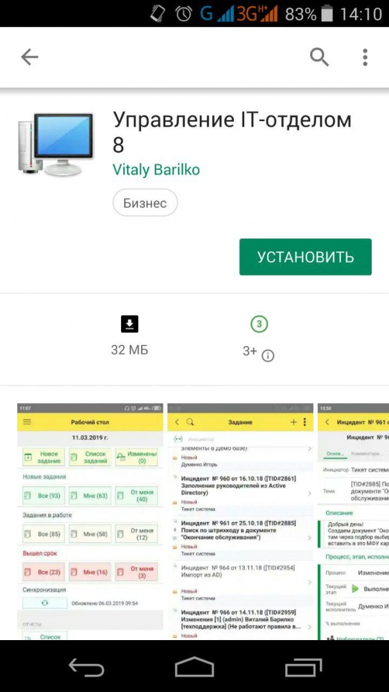
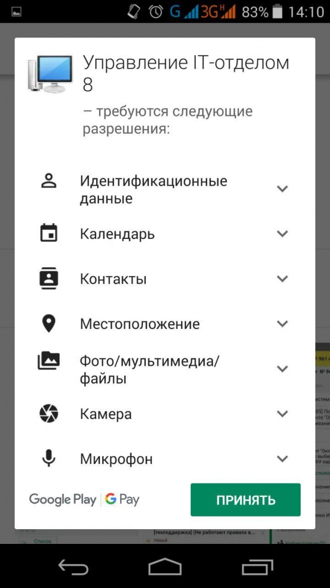
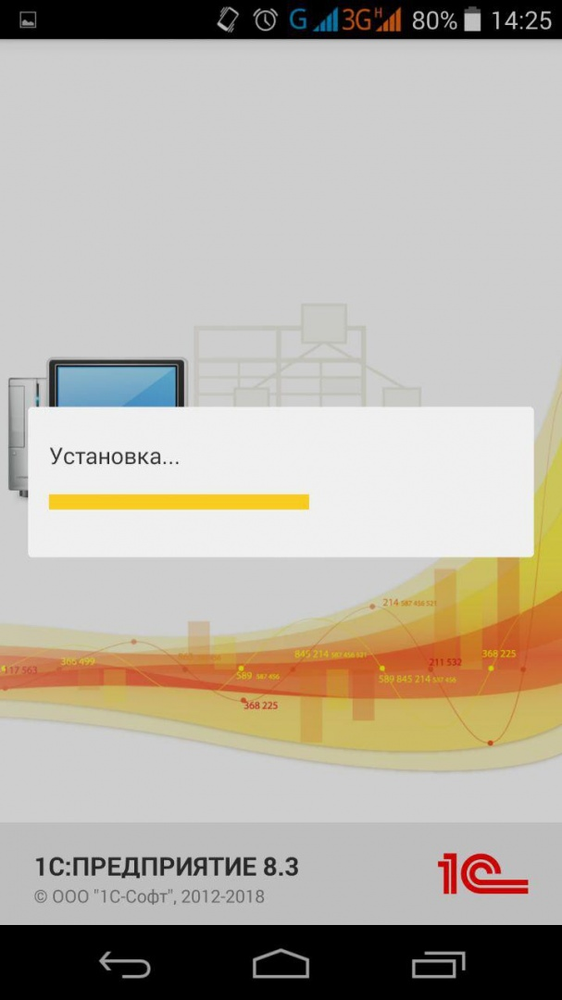

# Установка мобильного приложения "Управление IT-отделом 8" Google Play

Установка мобильного приложения осуществляется либо по ссылке из [Google Play](https://play.google.com/store/apps/details?id=ru.softonit.uitmobile), либо в строке поиска Google Play найти приложение Управление IT-отделом 8 и установить на мобильный телефон.

[Работа мобильного приложения "Управление IT-отделом 8" в автономном режиме](https://softonit.ru/FAQ/courses/?COURSE_ID=1&LESSON_ID=501)
[Работа мобильного приложения "Управление IT-отделом 8" совместно с конфигурацией](https://softonit.ru/FAQ/courses/?COURSE_ID=1&LESSON_ID=502)