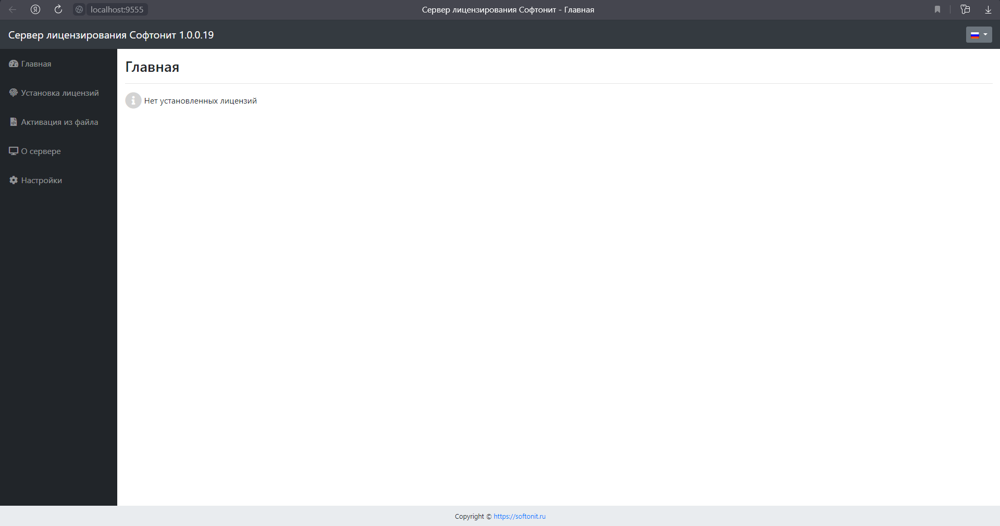

Сервер лицензирования имеет свой веб-интерфейс. Для того, чтобы его открыть необходимо запустить любой браузер и в адресной строке браузера набрать:
[http://localhost:9555](http://localhost:9555/)

Так же его можно открыть из меню «Пуск» в ОС Windows.
Пуск > Softonit > Консоль сервера лицензирования

Вот как выглядит открытый веб-интерфейс:

