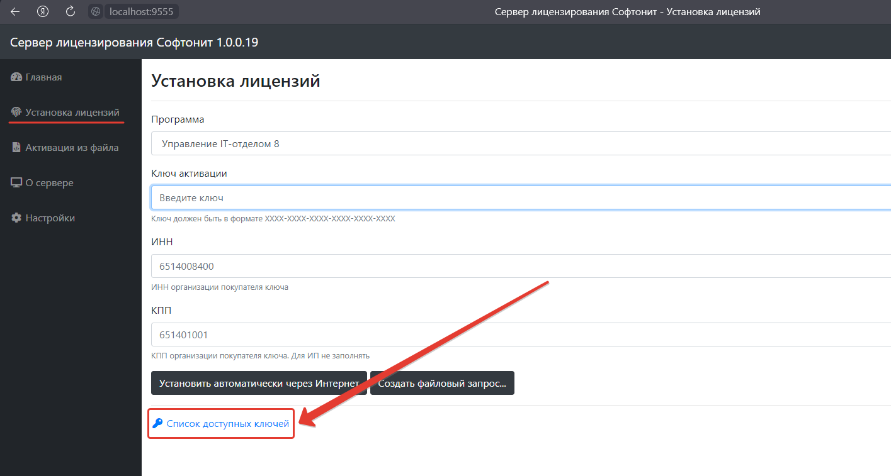
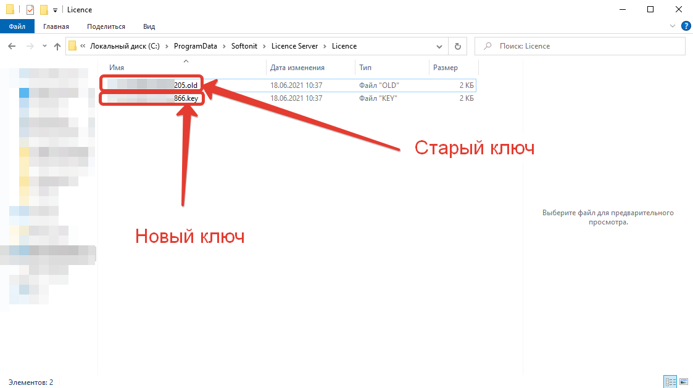

# Общие определения и понятия
Ранее в способе лицензирования нашего решения применялось три разновидности ключа, которые предназначались для разных действий и каждый из них содержал свой набор информации о лицензиате. 

Ключи были нескольких видов:
* Основные.  
* Дополнительные.  
* Для обновлений.  

В зависимости от типа, ключ содержал информацию о:
* Наименовании организации-владельце;
* ИНН/КПП;
* Сроке действия и вида поддержки;
* Продукте;
* Количестве одновременных подключений к информационным базам;

Данный подход накладывал ряд неудобств, которые испытывали пользователи нашей конфигурации и был призван уйти в историю. Мы упростили и улучшили подход к лицензированию, путем сокращения количества ключей. Если быть точнее, то все ранее упомянутые типы ключей, теперь используются как один единственный. При этом, данный подход позволяет упростить процедуру получения нового ключа, при различных ситуациях, которые мы разберем ниже. Больше не нужно писать запрос в техническую поддержку с просьбой генерации нового ключа, теперь Вы самостоятельно можете создать новый ключ. 

## Генерация и активация ключа на сервере лицензирования 1.0.0.19

**Первичная активация:** При первичной активации программы необходимо, перейти в веб-интерфейс сервера лицензирования 19, который расположен по адресу: localhost:9555. В основном меню выбрать раздел "Установка лицензии" и нажать на гиперссылку "Список доступных ключей". После нажатия Вы сразу попадете на наш сайт в раздел "Техподдержка" - "Личный кабинет" - "Ключи активации", где будут отображаться все, имеющиеся ключи. Далее необходимо сгенерировать новый ключ и перейти к [активации](https://softonit.ru/FAQ/courses/?COURSE_ID=1&LESSON_ID=588).

## Замена ранее активированного ключа на новый

Для этого Вам необходимо перейти на наш сайт в раздел "Техподдержка" - "Личный кабинет" - "Ключи активации", сгенерировать новый ключ, а после установить новый ключ в веб-интерфейсе сервера лицензирования 1.0.0.19. Замена осуществляется аналогично первичной активации, за исключением того, что старый ключ активации, который находится в каталоге *C:\ProgramData\Softonit\Licence Server\Licence* автоматически изменит свое расширение на `*.OLD`. Такой подход к замене ключей позволяет не думать о том, чтобы удалить старый ключ активации и перезапускать службу сервера лицензирования как это было в прошлых версиях. 

  

> **Ситуации, когда необходимо заменить ключ:** 
> * **Первая** и самая распространенная ситуация, это продление получения обновлений и технической поддержки. После оплаты данной услуги перейдите на наш сайт в раздел "Техподдержка" - "Личный кабинет" - "Ключи активации" и нажмите кнопку "Создать новый основной ключ". Новый сгенерированный ключ уже будет хранить информацию о продлении услуги, все что останется сделать, это удалить все старые ключи (инструкция ниже) и активировать новый ключ в веб-интерфейсе сервера лицензирования;  
> * **Вторая** ситуация, это замена комплектующих компьютера или переезд сервера лицензирования на другую машину. Так как ключ активации хранит в себе данные о железе компьютера, на котором была осуществлена первичная активация, то в таком случае необходимо сгенерировать новый ключ в разделе "Техподдержка" - "Личный кабинет" - "Ключ активации". После чего удалить все старые ключи (инструкция ниже) и активировать новый в веб-интерфейсе сервера лицензирования;  
> * **Третья** ситуация, это покупка дополнительных одновременных подключений к конфигурации. Алгоритм действий, которые необходимо произвести в этой ситуации полностью идентичен первым двум описанным ситуациям.  

**Инструкция по удалению старых ключей:**
1. Удалить из папки c:\ProgramData\Softonit\Licence Server\Licence\ все файлы-ключи;  
2. Перезапустить службу Softonit Licence Server (slserver) или перезагрузить компьютер;  
3. По новой активировать ключ.  

## Ответы на возникшие вопросы
***Принципы подсчета лицензий.***  
Контроль лицензий осуществляется на стороне сервера. Особенностью подхода является то, что при работе каждый сеанс любой информационной базы (рабочей базы, или ее копии – не важно) будет занимать отдельную лицензию, причем не имеет значения в какой информационной базе работает клиент. Все подключения суммируются и, если не хватает лицензий, программа об этом сообщит.
!!! Важно!
 Каждый код активации может быть использован только один раз. В случае изменения конфигурации компьютера необходимо заново генерировать ключ в разделе "Техподдержка" - "Личный кабинет" - "Ключи активации". Если конфигурация компьютера не была изменена (например, была переустановлена ОС), то код активации можно использовать повторно.
!!!  
**Обратите внимание**, что количество генераций новых ключей (замен) не может быть больше 3 (трех) в месяц. Если замен будет больше, то возможность самостоятельной регистрации нового ключа будет заблокирована и доступна только через подачу обращения в техническую поддержку.

