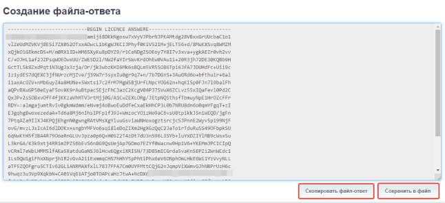

# Режим активации ключом

Сервер лицензирования позволяет активировать продукты несколькими способами. При этом, любой способ активации осуществляется круглосуточно без выходных дней.
Активация может быть выполнена как из программы, так и через веб-интерфейс. Внешний вид при этом будет одинаков, что в 1С, что через веб-интерфейс.
Рассмотрим, как активировать конфигурацию и/или продлить поддержку ключом, который вы получили после покупки на примере активации в конфигурации 1С.

## Автоматическая активация

В этом варианте обработка запросов выполняется автоматически и требует от пользователя минимум действий. Запускаем конфигурацию и после входа будет отображено модальное диалоговое окно:

Если вы не задали адрес сервера и порт, то вам будет предложено сначала ввести эти данные, а потом уже появится окно для установки лицензий.
В веб-интерфейсе необходимо в браузере щелкнуть по пункту «Установка лицензий», получим аналогичное окно:

На этом этапе вводим ключ (должен быть в формате `XXXX-XXXX-XXXX-XXXX-XXXX-XXXX`, например, `DB49-A88A-D2D6-50D4-81F1-7B67`) и ИНН/КПП (КПП пустое у ИП, у зарубежных компаний информацию о том, как заполнять поле ИНН/КПП мы отсылаем в письме) организации, которая приобрела лицензию и при наличии интернета нажимаем «Установить автоматически через Интернет». Если в процессе активации произошла ошибка будет отображено соответствующее сообщение.
При неверном заполнении, например, не верно введен ИНН/КПП будет отображено следующее:

Возвращаемся назад и исправляем не верно введенные данные. Если все введено правильно, то в 1С увидим следующее сообщение:

Нажимаем на кнопку «перезапустите программу» и после перезапуска конфигурация активирована, можно приступить к работе. После загрузки в заголовке программы вы увидите наименование продукта, организации-владельца и типа редакции. В веб-интерфейсе все активируется аналогично. После ввода ключа, ИНН и КПП, нажимаем кнопку «Установить автоматически через Интернет» и после подтверждения можем приступить к работе.

### Активация через запрос файл-ответ
Этот случай следует использовать, когда на сервере лицензирования по какой-то причине отсутствует интернет. В этом случае необходимо заполнить данные таким образом (рассмотрим на примере работы с веб-интерфейсом, для работы в 1С все аналогично):

В результате нажатия на кнопку «Создать файловый запрос…» нам будет отображено следующее окно:

**При этом необходимо:**  
     1. Скопировать текст-запрос  
     2. Сохранить текст-запрос в файл  
     3. На компьютере где есть интернет перейдите на сайт https://softonit.ru и авторизуйтесь под своей учетной записью  
     4. Перейдите на страницу по адресу https://softonit.ru/personal/lk/ в личный кабинет  
     5. В личном кабинете щелкните на гиперссылку «Активация программы или обновлений»

6. Скачайте программу [«Сервер лицензирования Софтонит»](https://softonit.ru/sls/) и вставьте скопированный текстзапрос в центре лицензирования и нажмите на кнопку "Получить файл-ответ"

7. Установите скачанную программу на компьютер, который будет доступен для всех компьютеров в сети для файлового варианта и для сервера 1С для серверного варианта.
8. После нажатия «Получить файл-ответ» сайт вернет Вам файл с текстом-ответом, который необходимо будет скопировать, сохранить в файл, перенести на сервер лицензирования и ввести на вашем сервере лицензирования в разделе "Активация из файла".

И нажимаем кнопку **«Установить»**.
Если все сделано правильно, сервер лицензирования даст положительный ответ об успешной активации.

