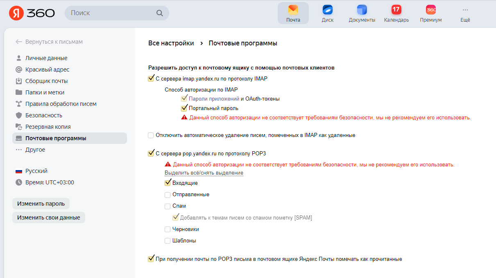
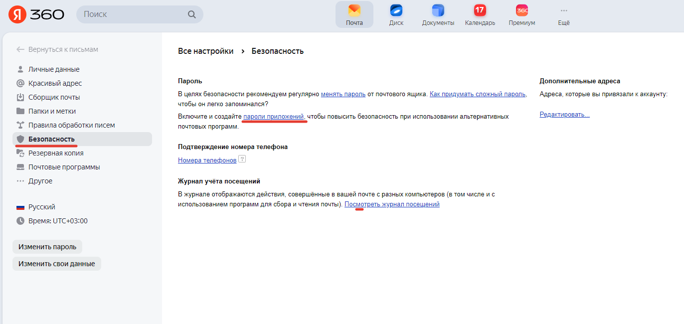
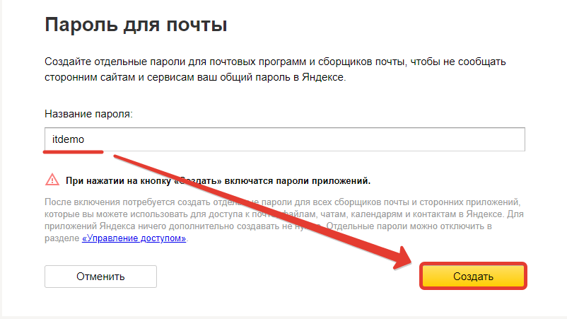
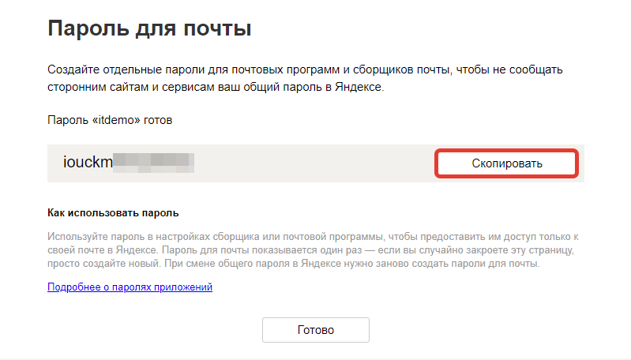
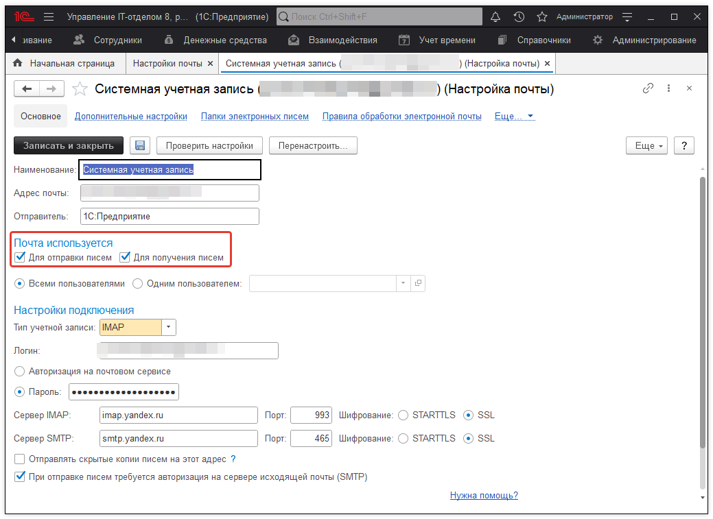
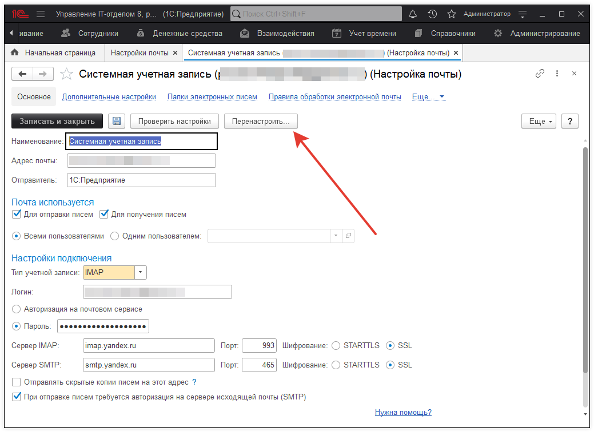

# Яндекс почта
Для того, чтобы была возможность отправлять и получать письма в конфигурации, в том числе и при загрузке писем службы поддержки, необходим настроенный почтовый ящик для работы с почтой. Для того, чтобы это сделать, необходимо зайти в **"Администрирование > Настройки почты"**. Откройте системную учетную запись, или, если Вы хотите создать новую - создайте новую запись.

Далее, необходимо настроить учетную запись. Сделаем это на примере настройки почты от Яндекса.

Сначала подготовим Яндекс почту, чтобы можно было принимать и отправлять письма из сторонних программ по протоколам IMAP, POP3, SMTP. Зайдем в настройки и поставим галочки:

!!!
Внимание! 28 апреля 2023 года, Яндекс закрыла возможность использовать пароль от аккаунта Яндекса в сторонних почтовых приложениях. Поэтому нужно добавить отдельный пароль приложений, который мы будем использовать в 1С при добавлении почты.
!!!

Переходим на вкладку **"Безопасность > Пароли приложений"**:

Вводим название пароля и создаем его:

Обязательно сохраняем сгенерированный пароль, так как больше не будет возможности получить его на странице яндекса, придется создавать новый:

Теперь, в 1С в "Администрирование > Настройки почты" добавляем почту и используем ранее сгенерированный пароль приложения:

Кнопка "Проверить настройки" позволит отправить тестовое письмо на указанный ящик и получить это тестовое письмо с ящика. Настройте получение и отправку почты в соответствии с Вашими настройками. Можно выбрать как протокол POP, так и IMAP.

При успешной настройке должно появится сообщение: "Проверка параметров учетной записи завершилась успешно".

