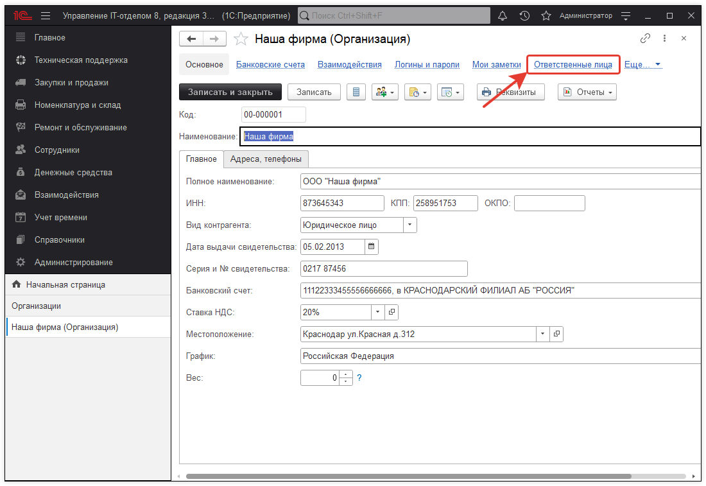
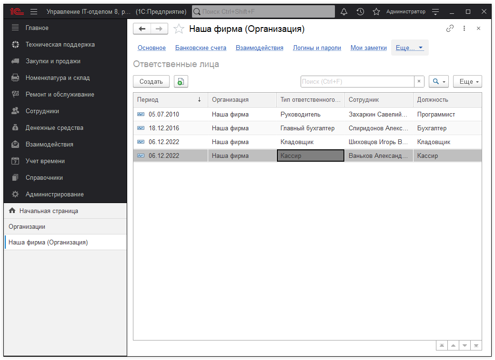
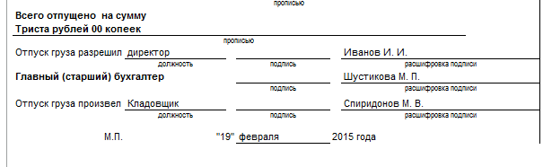

# Заполнение ответственных лиц  
В оформляемых документах организации необходимы подписи ответственных за эти документы лиц. В унифицированных печатных формах специально предусмотрены реквизиты для указания должностей ответственных лиц и места для их подписей. Кроме того, большинство унифицированных форм содержат реквизит «Расшифровка подписи». Для автоматического заполнения этих реквизитов в печатных формах необходимо в справочнике «Организации» перейти в раздел «Ответственные лица» и заполнить соответствующий список.

Данные об ответственных лицах вводятся в регистр сведений «Ответственные лица» на определенную дату и хранятся в нем в хронологическом порядке. Это означает, что при формировании печатной формы документа за конкретную дату из регистра сведений будут выбраны записи, актуальные именно на эту дату. Например, если в организации изменился главный бухгалтер, достаточно внести новую запись в регистр на дату приказа о зачислении на должность и программа будет автоматически подставлять нужную фамилию в печатные формы.

В программе предусмотрено несколько типов ответственных лиц:

1. **Руководитель** - используется в печатных формах, требующих подписи руководителя организации;
2. **Главный бухгалтер** - применяется в печатных формах, требующих подписи главного бухгалтера организации;
3. **Кассир** - используется при формировании печатных форм кассовых документов;
4. **Кладовщик** - используется в печатных формах, требующих подписи кладовщика;

Для каждого типа ответственных лиц нужно указать соответствующего ему в данной организации сотрудника и должность. Набор ответственных лиц задается отдельно для каждой организации, учет которых ведется в программе. При формировании печатных формах автоматически заполняются соответствующие реквизиты данными ответственных лиц.

