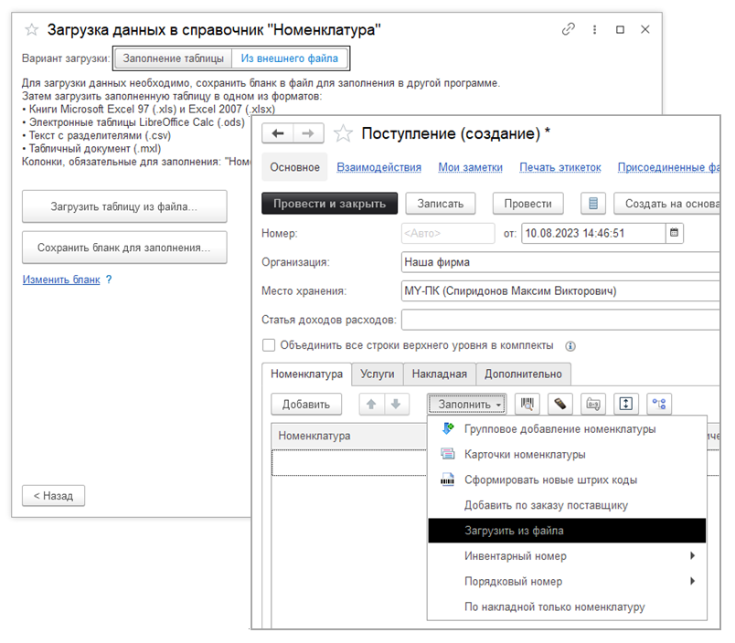
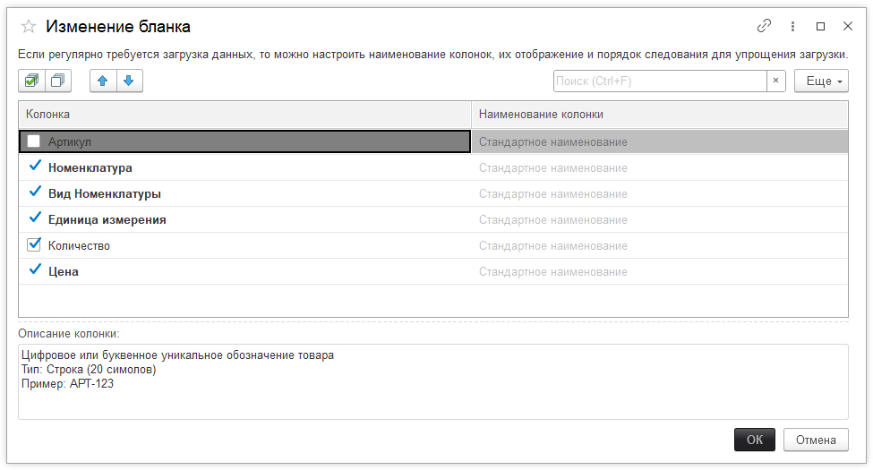
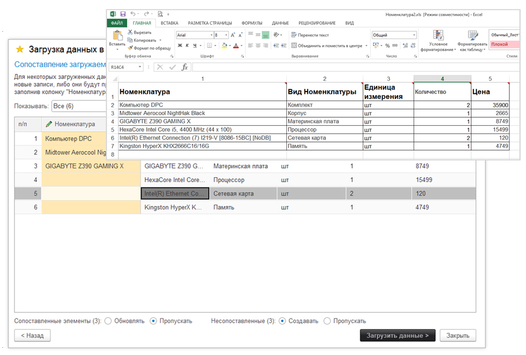
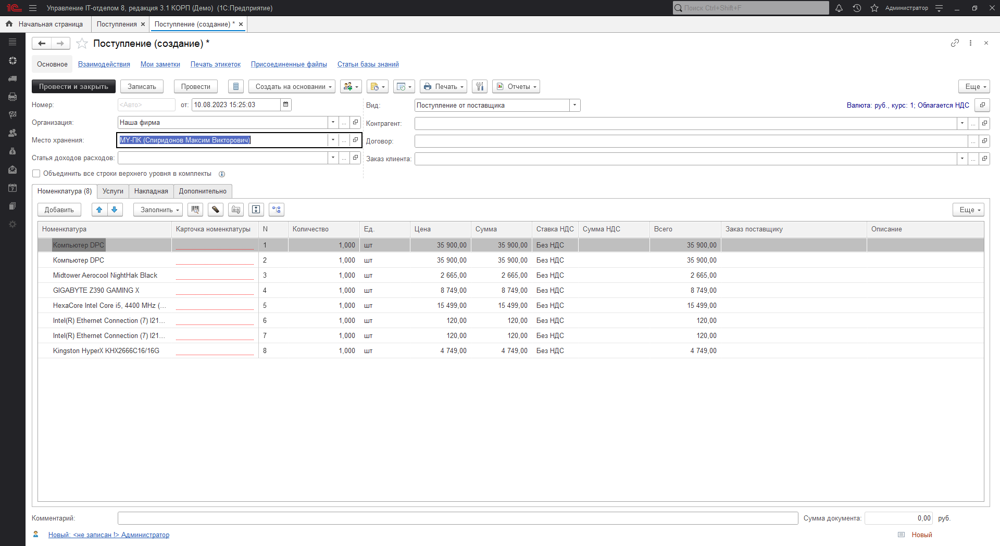

# Загрузка номенклатуры в документ "Поступление" из файла

**Функционал "Загрузка данных из файла" предоставляет удобную возможность импортировать табличные данные из внешних файлов непосредственно в табличную часть документов "Поступление" или "Заказ поставщику".**

**Основные преимущества загрузки данных из файла:**

* Использование возможностей других программ: Вы можете вводить данные в удобной для вас программе, такой как Microsoft Excel, а затем легко и быстро загрузить их в программу.

* Также можно выгрузить данные из другой программы в табличный документ, скопировать их в подготовленный бланк и загрузить.

> *Для загрузки данных из файла не требуется особых прав, достаточно прав на изменение списков или документов программы.*

Чтобы загрузить номенклатуру в табличную часть документа «Поступление», в пункте загрузить выбираем команду «Загрузить из файла». И в появившемся окне нажимает кнопку «Из внешнего файла».

На следующем этапе подготавливаем бланк для заполнения списка номенклатур. С помощью ссылки Изменить бланк можно открыть список полей таблицы для ввода и с помощью флажков изменить ее структуру. Необходимо учитывать, что поля, выделенные жирным шрифтом (***например, на рисунке – Номенклатура, Вид номенклатуры, Единицы измерения, Цена***) являются обязательными для заполнения и их нельзя отключить.

Теперь сохраняем бланк для заполнения данными (руками или копированием из других табличных документов).
Для загрузки данных из внешнего файла в окне Загрузка списка товаров из файла нажмите кнопку Загрузить таблицу из файла, укажите файл на компьютере, нажмите кнопку Открыть.

После загрузки программа производит автоматическое сопоставление данных. Если автоматическое сопоставление не состоялось, то данные можно сопоставить вручную или  создать автоматически указав переключатель «Создавать» или пропустить и не переносить в табличную часть документа.

!!!
Внимание!: Не сопоставленная номенклатура будет создана, при этом если вид номенклатуры и единицы измерения не будут найдены, они также будут созданы с минимальным набором данных. В дальнейшем необходимо вручную до заполнить или изменить набор данных для созданных объектов.
!!!

На заключительном этапе загрузки нажимает кнопку «Загрузить данные» и получаем заполненную данными табличную часть документа.

