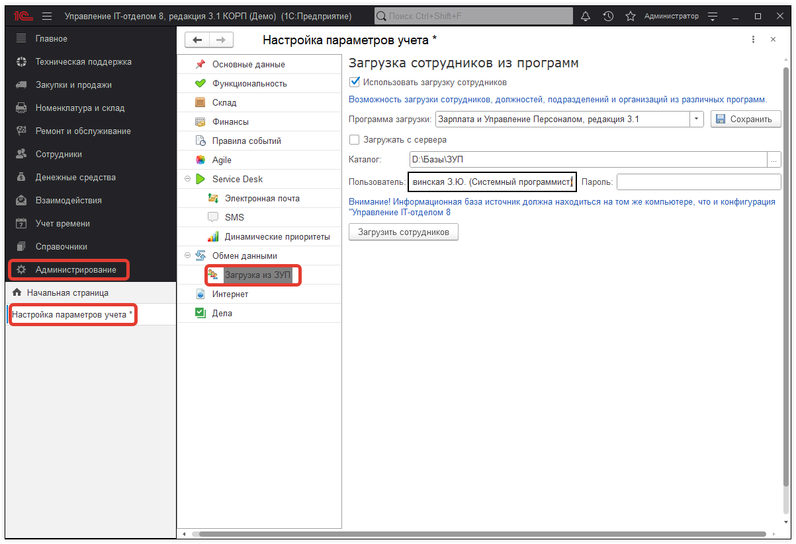
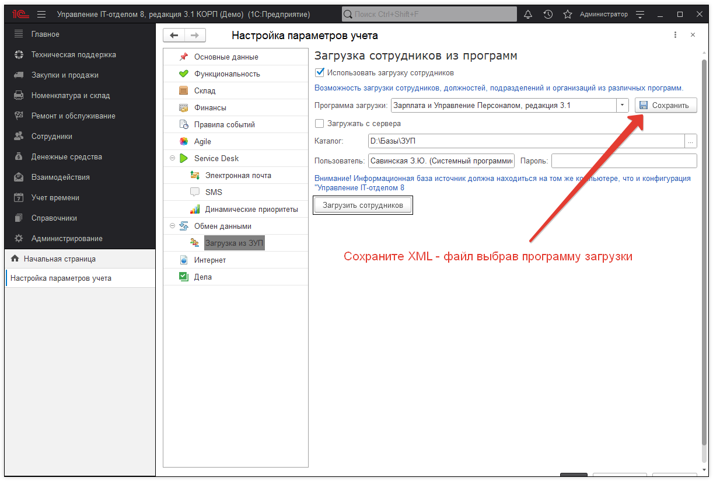
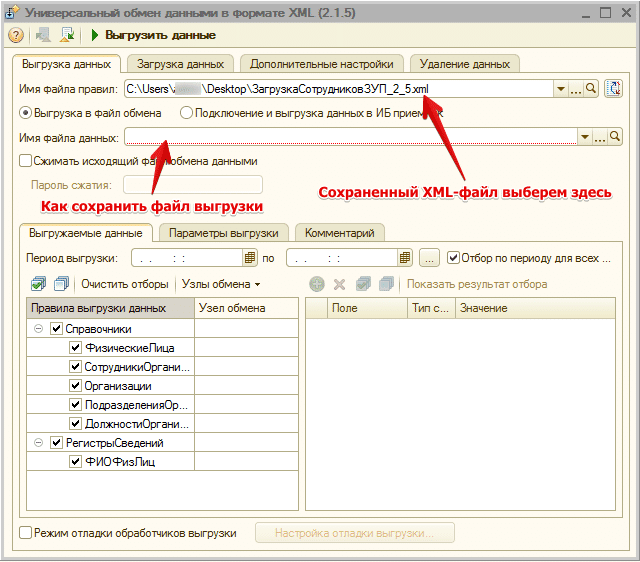
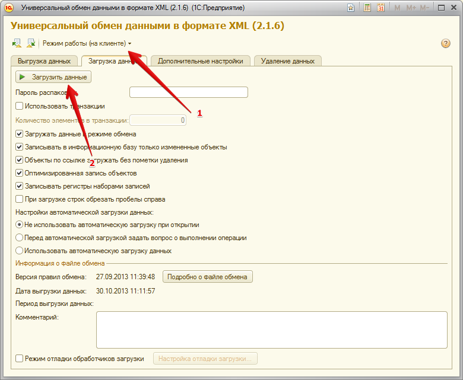
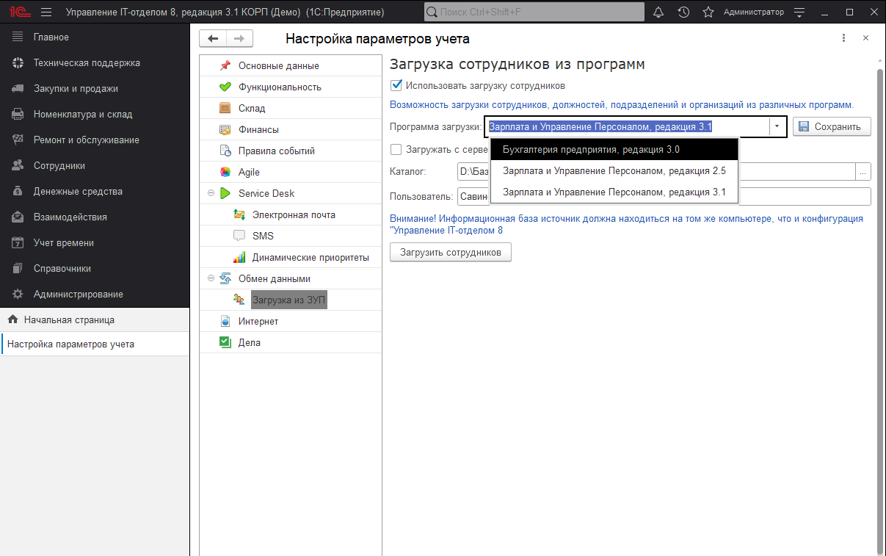
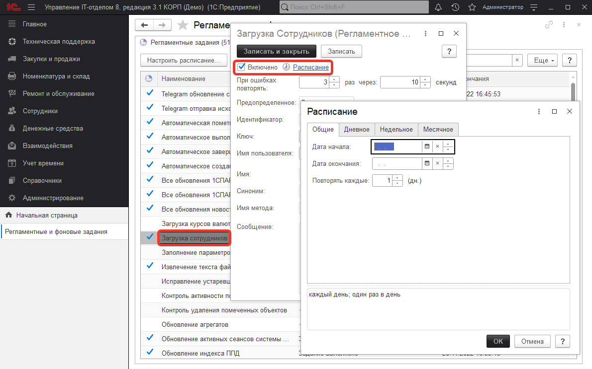

# Загрузка сотрудников и физических лиц из других конфигураций

!!!
Внимание!!! Перед использованием в рабочей базе данных, рекомендуем предварительно настроить и выполнить обмен в тестовых базах.
!!!

В конфигурацию возможен импорт данных по сотрудникам и физическим лицам (доступно для редакции "КОРП"). Администрирование > Настройка параметров учета > Загрузка сотрудников.

**Важно знать!** В конфигурации есть предопределенный элемент справочника "Организации" - "Наша фирма". Начинается ведение учета и планируется загрузка сотрудников из "Зарплаты и управление персоналом" или "Бухгалтерии предприятия", но так как наименование организации, а также ИНН и КПП отличается, тогда при переносе сотрудников будет созданавторая организация и предопределённый элемент "Наша фирма" уже нельзя будет удалить. Чтобы избежать этого, нужно сделать следующее:  

1) В конфигурации Управление IT-отделом нужно переименовать предопределенный элемент справочника "Организации" "Наша фирма", как и в Зарплате и управление персоналом (Бухгалтерия предприятия), а также заполнить ИНН и КПП;
2) Выполнить синхронизацию.

Загрузка может быть как регламентной (выполняться с использованием регламентного задания), так и разовой.

!!!
Внимание! Если при нажатии на кнопку "Загрузить сотрудников" ничего не происходит, проверьте журнал регистрации конфигурации (Поддержка и обслуживание > Журнал регистрации). Там будет отображена ошибка, почему данные не загружаются. Может понадобиться ручная регистрация comcntr.dll. Т.е., если обмен не работает, необходимо выполнить команду:
`«regsvr32 "C:\Program Files (x86)\1cv82\8.2.19.68\bin\comcntr.dll" » либо « "C:\Program Files\1cv8\8.3.xx.xxxx\bin\1cv8.exe" /regserver regsvr32 comcntr.dll»`
Где путь указан до библиотеки используемой версии 1С. Если по каким то причинам обмен не работает или Вы хотите вручную сделать его, это так же возможно.
Для этого:
!!!

1) Сохраните XML-файл конвертации данных

2) Откройте ЗУП в режиме "Предприятия" и в меню укажите **"Сервис > Обмен данными > Универсальный обмен данными"**

3) В открывшейся обработке выбираем выгрузку, как на рисунке:

4) Нажимаем "Выгрузить данные" и ждем, когда все данные по сотрудникам будут выгружены. Все это будет в файле **"Имя файла данных"**.

5) После выгрузки идем в конфигурацию "Управление IT-отделом 8". *(Настройка и администрирование > Универсальный обмен данными в формате XML)*

6) Выбираем режим работы "на клиенте" и нажимаем кнопку "Загрузить данные", после чего выбираем файл данных, сохраненный на шаге 4

В конфигурации есть возможность загрузить сотрудников из программ Зарплата и управление персоналом 3.1 (актуально для релиза 3.1.6.6) и Бухгалтерия предприятия 3.0 (актуально для релиза 3.0.60.59).

Для настройкиавтоматической загрузки, нужно перейти на вкладку "Администрирование" => "Регламентные и фоновые задания", найти в списке "Загрузка сотрудников" и настроить расписание.

