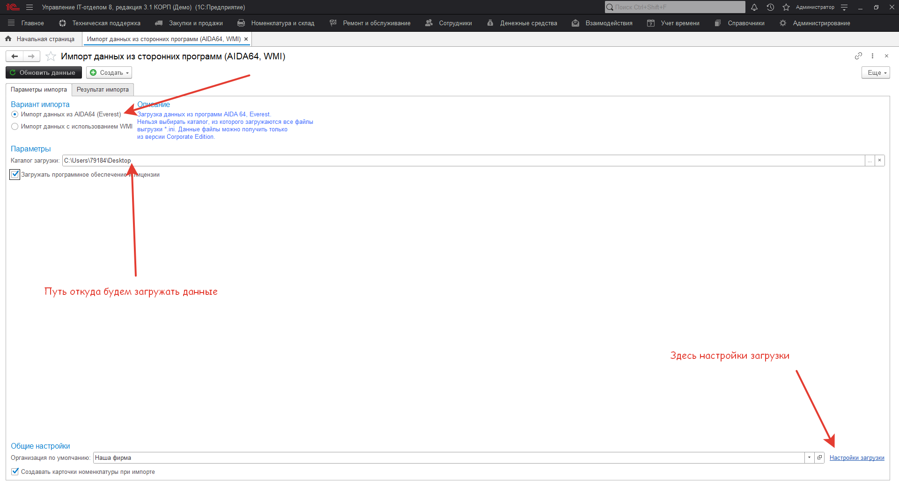

# Импорт данных из сторонних программ

Для облегчения работы с программой в части введения данных по составу компьютерного оборудования в конфигурации, есть специальный механизм, который позволяет импортировать в конфигурацию данные о составе оборудования из Aida64(Everest), а также используя WMI.

!!!
Внимание! Поддерживается работа только с программой AIDA64 Business, которая позволяет выгрузить данные в INI-формате (для Everest версия Business)
!!!

Импорт данных об оборудовании и его характеристиках из файлов AIDA64 в формате INI. Инструкция по настройкам загрузки из INI-файла

Обработка выглядит вот так:

При нажатии вверху "Обновить данные":

Часто бывает так, что нам не хватает данных при загрузке, ну например:

Как видим, операционной системы нет в подгружаемых данных. Кому-то это не нужно, и он ОСы оприходовал раньше отдельным документом, а кому-то нужно грузить именно отсюда.
Добавим возможность загрузки данных ОС, для этого необходимо поработать с характеристиками.
При загрузке с использованием WMI настройки, следующие:

В самом низу есть общие настройки, которые отображаются вне зависимости от способа загрузки данных.

После того, как выбран вариант импортаи установлены все настройки, можно приступить к следующему шагу - загрузке данных. Нажимаем кнопку "Обновить данные".
Будет показан прогресс загрузки, после чего отображена форма:

Пока ничего не загружено в информационную базу. Просто конфигурация отобразила данные, которые были найдены при поиске для каждого компьютера.
Далее необходимо заполнить "Место хранения" в табличной части. Если места хранения уже созданы выбираем их, если нет, мы можем их создать, нажав на кнопку "Создать места хранения". После нажатия на "Создать места хранения"будут созданы места хранения имена, которых будут дублировать наименования из загружаемых данных, при этом тип такого места хранения будет "Рабочее место".  

В правой части результата импорта отображены данные о составе компьютера, при щелчке на строку с комплектующей, будет отображена информация о характеристиках комплектующей. На данном этапе необходимо убрать из загрузки данные, которые не нужно загружать (снимите сне нужных галочки).  

Далее, можно создать по загружаемым данным либо документ "Поступление", либо "Инвентаризацию".  
Создадим для примера "Поступление". Нажмем (Создать> Поступление). При этом будут созданы документы только по тем местам хранения, которые отмечены в табличной части "Результата импорта" и только по той номенклатуре, которая отмечена. После создания "Поступления", будет предложено открыть созданные документы для просмотра.

Открываем документы и устанавливаем реквизиты. Если компьютер пришел от контрагента, то проставляем его, если нет и это первоначальные остатки, то реквизит контрагент оставляем пустым.

Перетаскиваем мышкой комплекты в комплектующие, добавляем при необходимости комплект, в который перемещаем комплектующие. Должно получиться примерно следующее:

Для инвентаризации действия аналогичны и будут рассмотрены отдельно.

