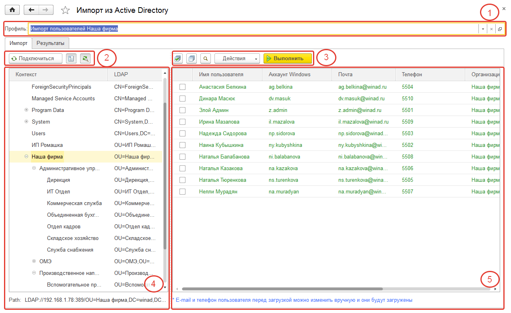
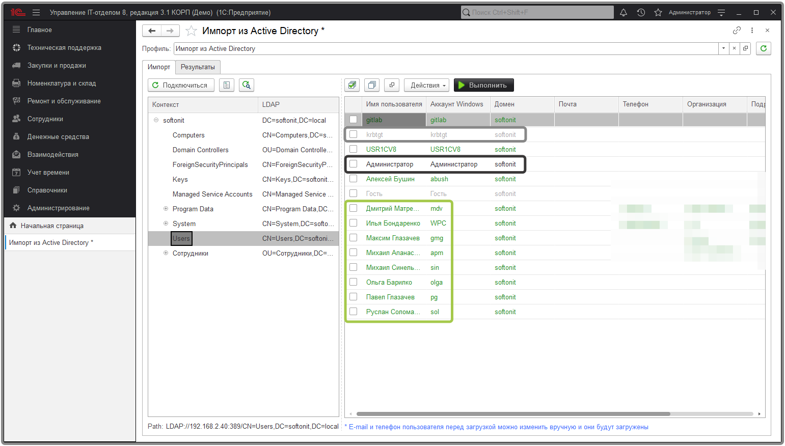
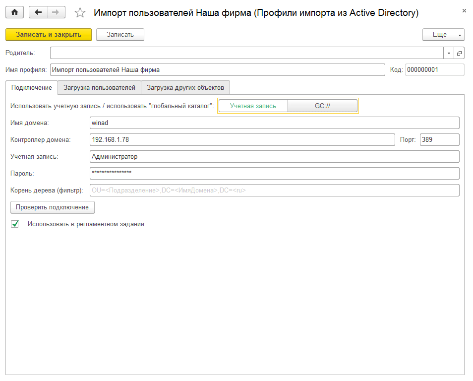
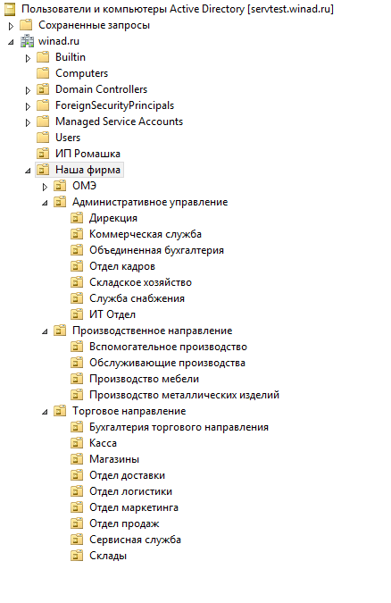
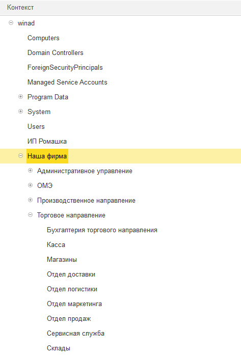
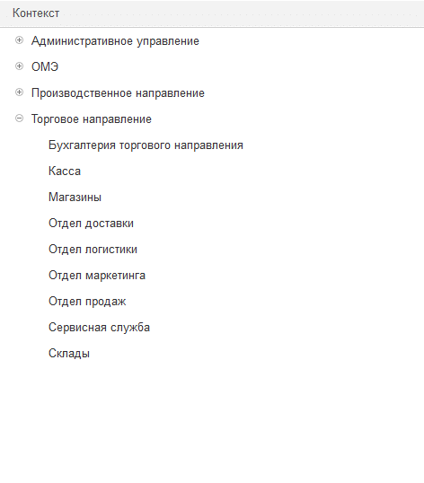
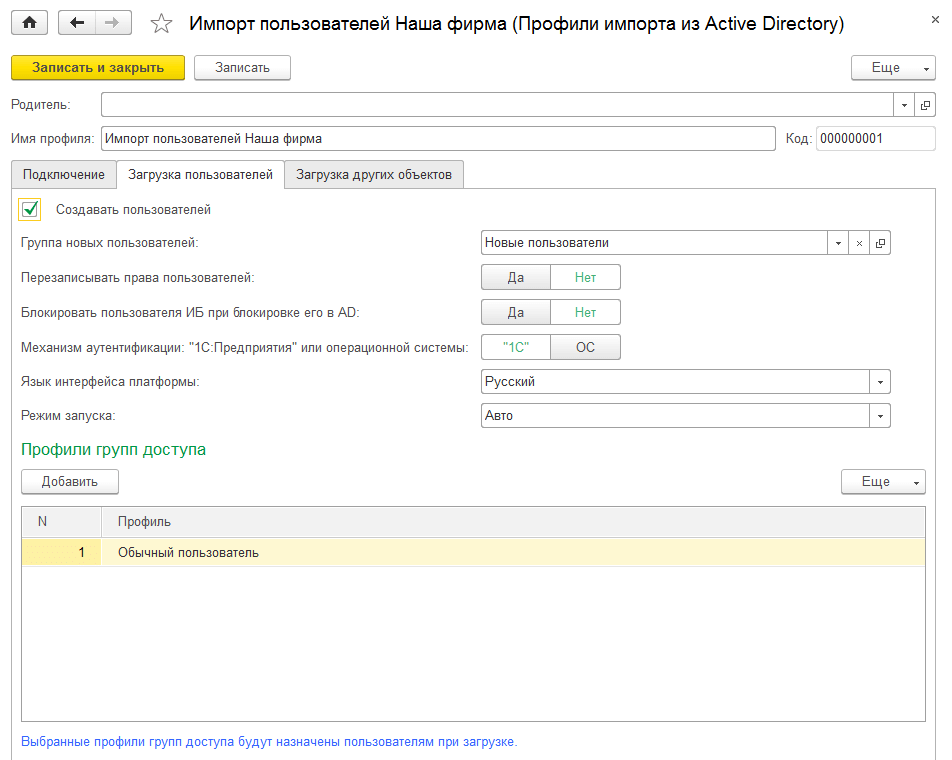
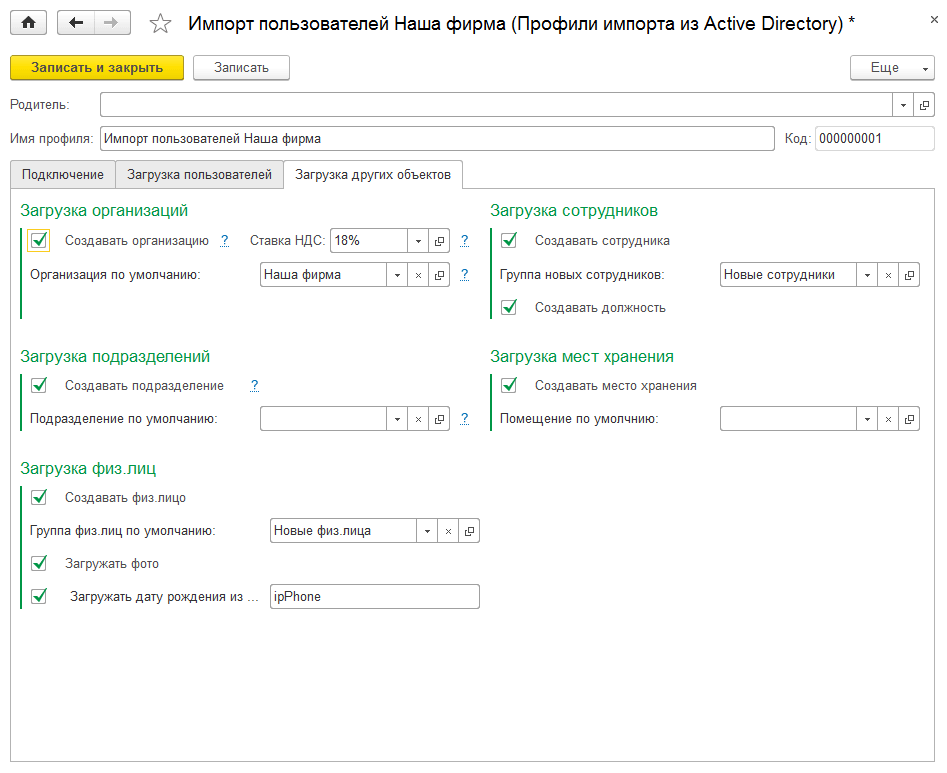

# Импорт из Active Directory пользователей и рабочих мест

Конфигурация предоставляет механизм импорта данных из Active Directory как "вручную", с помощью обработки, так и автоматически, с помощью регламентного задания. Существует возможность сохранить различные настройки подключения к AD и загрузки объектов при импорте в виде профилей импорта для дальнейшего использования в различных режимах.

Рассмотрим обработку "Импорт из Active Directory" (*Администрирование - Сервис - "Импорт из Active Directory"*):

Основные элементы формы обработки:

1. Текущий профиль импорта (содержит настройки подключения и объектов, которые будут созданы/изменены в результате работы обработки);
2. Кнопки управления отображением списка пользователей AD;
3. Кнопки настройки списка пользователей AD и запуска процедуры импорта;
4. Дерево контекстов (соответствует дереву AD и может быть ограничено фильтром в настройках подключения в профиле);
5. Список пользователей AD (e-mail, телефон, подразделение в строках таблицы перед загрузкой, можно изменить как вручную для каждого пользователя, так и для всех отмеченных пользователей через команду "Действия - Заполнить электронную почту" или **"Действия - Заполнить подразделение"**).
6. С помощью кнопки **"Действия"** можно выполнить несколько быстрых манипуляций с предварительным списком выгруженных учетных записей AD. Так, например, можно сначала выделить все учетные записи для загрузки, а после снять отметку только с отключенных учетных записей Active Directory. Для этого нужно нажать **"Действия"-"Снять отметку с заблокированных пользователей AD"**.  

Предварительный список найденных учетных записей, который отображается в основной таблице формы имеет визуальное выделение. С помощью этого достаточно легко определить, какая учетная запись уже есть в 1С, а какая отключена в Active Directory. 

**Зеленый цвет** - Показывает, что по текущей учетной записи в информационной базе еще не заведен пользователь.

**Черный цвет** - Указывает на то, что по текущей учетной записи в информационной базе уже был ранее заведен пользователь и при этом он не является заблокированным в 1С.

**Серый цвет** - Показывает учетные записи, которые отключены в Active Directory. При первой загрузке пользователей в ИБ, по текущим учетным записям будут созданы новые пользователи с признаком **"Активный"**. Однако при следующем импорте (если в профиле импорта указаны соответствующие настройки), например, регламентным заданием по расписанию, этим пользователям будет установлен флаг **"Недействителен"**, так как они отключены в Active Directory. Если учетные записи этих же пользователей будут снова включены в AD, то при загрузке и у пользователей будет снят флаг **"Недействителен"**. 

Теперь рассмотрим сам профиль импорта из AD (*Администрирование - Профили импорта из Active Directory*).

## Закладка "Подключение".

* **Использовать учетную запись / использовать "глобальный каталог"** - если компьютер, на котором производится импорт, не входит в домен, то необходимо использовать учетную запись пользователя AD. Если компьютер принадлежит домену, можно использовать "глобальный каталог" GC://, поля ввода для учетной записи станут недоступными, а также будет невозможно использовать фильтр.   
* **Имя домена, контроллер домена, порт, учетная запись и пароль** указываются в случае использования учетной записи при подключении к домену.  
* **Корень дерева (фильтр)** строка (например, OU=Наша фирма,DC=winad,DC=ru), ограничивающая чтение пользователей в пределах указанного контекста. Например, если фильтр не задан, то дерево практически полностью соответствует дереву в AD:  

При установленном фильтре `"OU=Наша фирма,DC=winad,DC=ru"` видим только подразделения:

**Использовать в регламентном задании** - при установленном "флажке" профиль импорта, будет обрабатываться соответствующим регламентным заданием **"Создание объектов Active Directory"** *(Администрирование - Поддержка и обслуживание - Регламентные операции - Регламентные и фоновые задания)*.

!!!
Внимание! Перед включением флага **"Использовать в регламентном задании"**, необходимо убедиться, что данные в ИБ соответствуют данным в AD (в части наименований и т.д.), в противном случае они могут быть изменены согласно данным AD. Будьте внимательны!
!!!

## Закладка "Загрузка пользователей".

* **Флаг "Создавать пользователей"** - при установленном флаге выбранным пользователям AD, для которых в информационной базе не найдены соответствующие учетные записи, будут созданы пользователи с настройками, указанными ниже (поиск ведется по логину, указанному в AD). При снятом флаге пользователи в ИБ не изменяются.  
* **Группа новых пользователей** - если настройка установлена, то все вновь созданные пользователи будут помещены в эту группу.  
* **Перезаписывать права пользователей** - при включении этой настройки для найденных пользователей, будут сброшены ранее установленные права и установлены новые права в соответствии с указанными профилями в таблице "Профили групп доступа".  
* **Блокировать пользователя ИБ при блокировке его в AD** - при включении этой настройки найденным пользователям, будет установлен признак "Недействителен", если в AD у пользователя заблокирована учетная запись.  
* **Механизм аутентификации:** "1C:Предприятие" или операционной системы - в соответствии с этой настройкой для новых и найденных пользователей, будет указан механизм аутентификации в ИБ.  
* **Язык интерфейса платформы** - в соответствии с этой настройкой для новых и найденных пользователей, будет установлен язык интерфейса.
* **Режим запуска** - в соответствии с этой настройкой для новых и найденных пользователей, будет установлен режим запуска.
* **Профили групп доступа** - в соответствии с указанными в таблице профилями при включенной настройке "Перезаписывать права пользователей" новым и найденным пользователям, будут установлены соответствующие права.

## Закладка "Загрузка других объектов".

* **Создавать организацию** - при установленном флаге для загружаемых объектов (вновь создаваемых или созданных ранее и загружаемых повторно), будет определена организация следующим образом: если у объекта AD реквизит "Организация" заполнен, то будет выполнен поиск в ИБ организации по наименованию, и если такой организации в ИБ нет, то она будет создана (реквизит *"Ставка НДС"* для новой организации, будет заполнен согласно настройке "Ставка НДС") и установлена объекту. Если у загружаемого объекта реквизит "Организация" не заполнен, то ему будет установлена организация из настройки *"Организация по умолчанию"*.
* **Создавать подразделение** - при установленном флаге для загружаемых объектов, будет определено подразделение, аналогично определению организации.
* **Создавать физ.лицо** - при установленном флаге для загружаемого объекта, будет произведен поиск физ.лица в ИБ по ФИО пользователя AD (реквизиту ) и, если такого физ.лица не найдено, оно будет создано. Новые физ.лица могут быть добавлены в группу физ.лиц, указанную в настройке *"Группа физ.лиц по умолчанию"*. Если для пользователя в AD установлено изображение, то при установленном флаге "Загружать фото" это изображение, будет установлено физ.лицу. Если в AD для хранения даты рождения используется свой реквизит (на скриншоте в качестве примера используется реквизит "ipPhone"), то при установленном флаге *"Загружать дату рождения из реквизита"* информация о дате рождения, будет заполнена для загружаемого физ.лица из указанного реквизита AD. При загрузке у физ.лица заполнятся e-mail и телефон, если такая информация содержится в AD.
* **Создавать сотрудника** - при установленном флаге для загружаемого объекта, будет произведен поиск сотрудника по наименованию в ИБ (реквизиту "DisplayName" в AD) и если такого сотрудника не найдено, то он будет добавлен. Новые сотрудники могут быть добавлены в группу сотрудников, указанную в настройке *"Группа новых сотрудников"*. При установленном флаге *"Создавать должность"* если у загружаемого объекта заполнен реквизит "Должность" и такая должность есть в ИБ, то она будет установлена сотруднику; если указанная у загружаемого объекта должность в ИБ не найдена, то она будет создана и установлена сотруднику.
* **Создавать место хранения** - при установленном флаге при загрузке объекта, будут проверяться места хранения в ИБ по наименованию (в качестве наименования будет выступать реквизит "DisplayName" в AD) и если такого места хранения не найдено, то оно будет создано. Для загружаемых мест хранения можно указать местоположение в настройке *"Местоположение по умолчанию"*. Если включены флаги "Создавать организацию" и "Создавать подразделение", то у загружаемого места хранения будут заполнены соответственно реквизиты "Организация", "Подразделение". Также у места хранения заполняются реквизиты "Сетевое имя" и "Сетевой пользователь", соответствующие "Логину пользователя AD" и "Домен\Логин пользователя AD".

!!!
Внимание! Данный функционал добавлен в версии **3.0.30**.
!!!