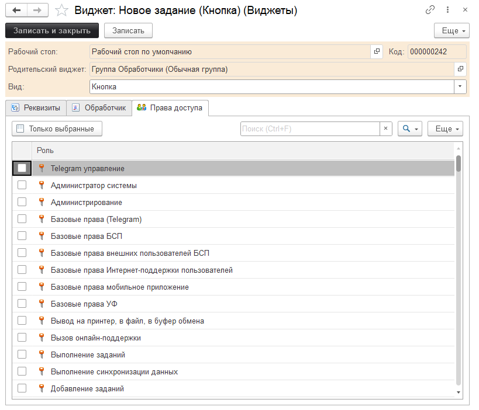

# Настраиваемый рабочий стол

**Требования:**

* [x] версия программы 3.1.3.1 и выше.

При запуске программы с настройками по умолчанию, на "Начальной странице" программы, в центральной её части, расположена форма "рабочего стола". Для пользователя с ролью "Полные права" рабочий стол выглядит следующим образом:


Форма представляет собой две страницы ("Навигация" и "Метрики") с наборами элементов из картинок, гиперссылок, кнопок, графиков, предоставляющих пользователю быстрый переход к созданию новых документов, требуемым формам списков документов, справочников, регистров, а также открытию форм других обработок.  
Главной особенностью подсистемы "Рабочий стол", к которой относится данная форма, является то, что существует возможность создания своих собственных рабочих столов с произвольными наборами элементов (далее "виджетов"), под нужды любого пользователя с учетом его прав (наборов ролей) на объекты программы.

Рассмотрим более детально настройки рабочего стола.

Каждый рабочий стол является элементом справочника **"Рабочие столы"** с собственным набором виджетов. Для перехода к списку рабочих столов необходимо в меню **"Главное"** выбрать пункт **"Рабочие столы"**:


В открывшейся форме списка необходимо выбрать элемент "Рабочий стол по умолчанию" и открыть его:


Список виджетов в карточке рабочего стола представлен в виде дерева, а порядок виджета в дереве соответствует его местоположению (относительно других виджетов) на форме рабочего стола, при этом, работа с самими виджетами практически полностью повторяет работу с элементами формы в конфигураторе.

Рассмотрим карточку виджета кнопки формы "Новое задание", для этого необходимо **"развернуть"** группу элементов "Группа Обработчики (Обычная группа)":


и открыть карточку виджета "Новое задание (Кнопка)":


Набор реквизитов виджета зависит от вида виджета, и в большей своей части соответствует свойствам соответствующего элемента формы в конфигураторе.

Перечислим возможные виды виджетов:

* декорация (может быть как надпись, так и картинка);
* кнопка;
* метрика;
* обычная группа;
* страница;
* страницы.

Виджеты c видом "кнопка", "декорация" и "метрика" (при включенном свойстве "гиперссылка") могут содержать обработчики нажатия.


Обработчики могут быть двух видов: **"Открыть форму"** и **"Произвольный алгоритм"**.

Для вида обработчика "Открыть форму" необходимо указать объект, чью форму необходимо открыть (это может быть справочник, документ, журнал документов, регистр сведений, общая форма, обработка или отчет) и указать вид формы: форма объекта или форма списка. Также, для вида обработчика "Открытие формы" возможно указание произвольного алгоритма, в котором, например, могут быть описаны параметры открываемой формы *на встроенном языке 1С*.

Для вида обработчика "Произвольный алгоритм" можно указать только произвольный код на встроенном языке 1С.

Важно понимать, что произвольный алгоритм будет выполнен *&НаСервере*, поэтому, во избежании ошибок со стороны платформы, автор произвольного алгоритма должен обладать достаточными компетенциями в написании кода на встроенном языке 1С.

На закладке "Права доступа" для ограничения доступности виджета можно указать роли пользователей, которым данный виджет будет доступен.



Если у текущего пользователя программы есть роль "Полные права", то данная проверка для текущего пользователя не осуществляется. Для вида обработчика "Открыть форму" список ролей может быть пустым, т.к. при выводе виджета на форму рабочего стола, в любом случае, проверяется право "Просмотр" у текущего пользователя на объект открываемой формы.

Закладка рабочего стола **"Метрики"**


Закладка "Метрики" доступна только для редакции программы ["КОРП"](https://softonit.ru/blog/news/updateit/uit-stanstart-prof-corp/) и включенной функциональной опции "Использовать метрики". Подробнее о подсистеме можно посмотреть тут.

Рассмотрим группу виджетов, формирующих отображение информации о просроченных заданиях.


* "Группа Просроченные" - виджет с видом "Обычная группа";
* "Надпись с картинкой" - виджет с видом "Декорация";
* "Просроченные задания" - виджет с видом "Метрика";
* "Надпись" - виджет с видом "Декорация".

Карточка виджета "Группа просроченные":


Состав реквизитов виджета соответствует реквизитам элемента формы "Обычная группа", если бы форму разрабатывали в конфигураторе.

Карточка виджета "Надпись с картинкой":


По составу реквизитов виджет также практически соответствует элементу формы **"Декорация - Надпись"** из конфигуратора.

Карточка виджета "Просроченные задания":


Рассмотрим виджет с видом "Метрика" подробнее.

В общем случае, виджеты с видом «Метрика» могут отображать результаты произвольных алгоритмов, написанных на встроенном языке 1С. В нашем случае, в качестве произвольных алгоритмов используются запросы к информационной базе, в частности, к оборотному регистру накопления «Значения метрик», хранящего значения рассчитанных метрик.

Виджеты с видом "Метрика" по виду отображения могут быть:

* "Надпись";
* "Диаграмма";
* "Надпись с условным оформлением".
Виджеты с видом отображения "Надпись" отображают результат произвольного алгоритма с фиксированной настройкой оформления вне зависимости от результата. Настройка оформления производится на закладке "Реквизиты".

## Закладка "Настройки метрики":


На закладке расположены реквизиты *"Период автообновления"*, *"Код обработчика"* и для виджетов с видом отображения *"Надпись с условным оформлением"* настройки "Условного оформления". Период автообновления указывается в минутах, и важно понимать, что, если в коде обработчика указан запрос к БД, не следует указывать слишком малое его значение.

Произвольный алгоритм в реквизите "Код обработчика" может быть написан только на встроенном языке 1С. Для виджета с видом отображения "Надпись" произвольный алгоритм в переменной "Результат" должен возвращать таблицу значений с одной колонкой (с произвольным именем колонки в рамках требований к именам колонок таблиц значений) и одной строкой, содержащей произвольное значение (с типом "Строка" или "Число"). Для проверки корректности написанного обработчика можно воспользоваться кнопкой "Проверка". Для удобства разработки запроса к БД присутствует кнопка "Конструктор запроса" (в конструкторе запроса также возможно открыть ранее написанный запрос из кода обработчика, для этого необходимо выделить текст запроса, находящийся между "кавычками" и нажать на кнопку "Конструктор запроса").

## Карточка виджета "Надпись":


Для виджета установлен вид "Декорация", с *видом декорации* "Надпись", и установлен флаг "Гиперссылка", т.е. виджет отображается в виде гиперссылки "Просроченные", при нажатии на которую будет выполнен обработчик гиперссылки. Рассмотрим закладку "Обработчик":


Вид обработчика "Открыть форму" означает, что при нажатии на гиперссылку виджета будет открыта некоторая форма, а именно, форма списка документа "Задание". В произвольном алгоритме перечислены параметры, которые будут переданы в открываемую форму. Важно отметить, что перед указанием параметров для открытия форм, необходимо в конфигураторе проверить, какие параметры в открываемой форме могут быть обработаны. Для формы списка документа "Задание" указанные в произвольном алгоритме параметры обрабатываются, поэтому, при нажатии на гиперссылку виджета будет открыта форма с установленным отбором "Просроченные (Новые + В работе).

Рассмотрим карточку виджета отображающего диаграмму. В списке виджетов рабочего стола это "Метрика (Диаграмма)":


Карточка виджета:


Среди реквизитов виджета стоит отметить реквизит "Тип диаграммы", т.к. именно он отвечает за то, какая диаграмма будет отображена на рабочем столе. На закладке "Настройки метрики" в реквизите "Код обработчика" также размещен произвольный алгоритм:


Отличительным требованием к возвращаемому результату выполнения произвольного алгоритма для вывода диаграмм является то, что в возвращаемой переменной "Результат" должна быть таблица значений с тремя колонками: "Значение", "Точка" и "Серия", количество строк таблицы значений не ограничено.

В коде обработчика виджета присутствуют строки:

```
Запрос.УстановитьПараметр("ДатаНачала", 	ДатаНачала);
Запрос.УстановитьПараметр("ДатаОкончания", 	ДатаОкончания);
```

при этом, сами переменные "ДатаНачала" и "ДатаОкончания" нигде в коде обработчика не инициализируются. Сделано это для того, чтобы управлять данным периодом можно было непосредственно с рабочего стола. На форме рабочего стола присутствуют кнопки управления формой:


Кнопка с картинкой "шестиренки" открывает форму **"Персональные настройки"**, в которой можно указать период, который и будет подставлен в обработчик при выполнении.

Рассмотрим карточку виджета с видом "Метрика" и видом отображения "Надпись с условным оформлением":


Отличительной особенностью такого виджета является то, что виджет изначально является группой из нескольких элементов формы, а оформление (цвета текста и фона, картинка) отображаемого значения виджета на рабочем столе может быть настраиваемым в зависимости от самого значения возвращаемого произвольным кодом результата. Рассмотрим закладку "Настройки метрики":


Код обработчика для данного виджета в переменной "Результат" должен возвращать таблицу значений состоящей из одной колонки и одной строки (как и в случае с виджетом с видом отображения "Надпись"), однако тип значения должно быть числом.

Условия для оформления настраиваются в табличной части на соответствующей закладке "Условное оформление". Пользователь заполняет диапазон "От" и "До" для возвращаемого значения, может указать картинку для этого диапазона (она будет выведена слева от возвращаемого значения), указать цвета текста и фона для диапазона. Результат:


**Список ролей для работы с подсистемой "Настраиваемый рабочий стол"**
* [x] Полные права;
* [x] Администрирование.