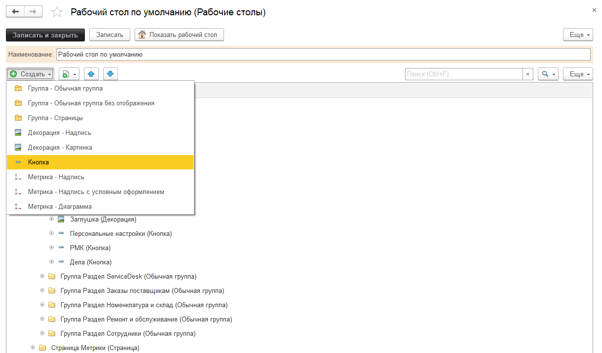
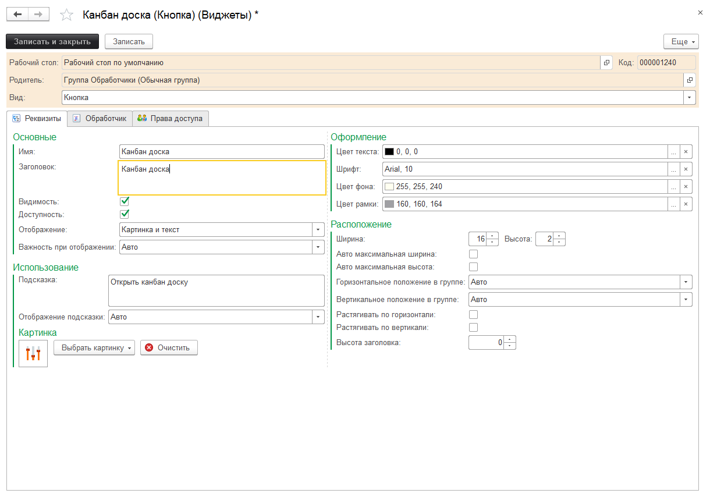
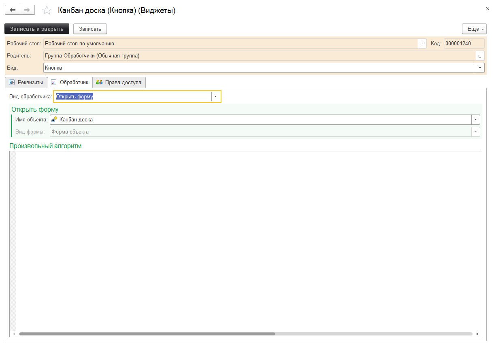
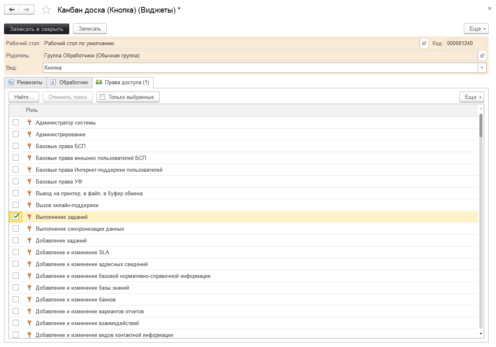
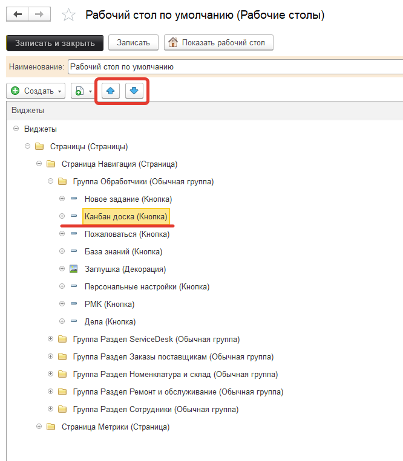
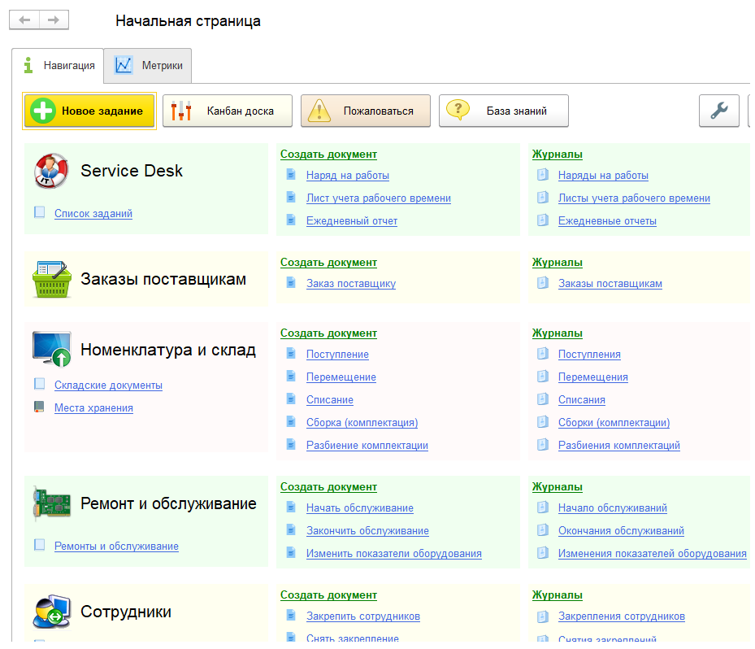

# Пример 1 - Добавление собственной кнопки

Рассмотрим добавление собственной кнопки на рабочий стол.

Добавим кнопку "Канбан доска" для открытия формы канбан доски.

Для этого в списке виджетов рабочего стола в группе "Группа Обработчики (Обычная группа)" добавим новый элемент: кнопка *"Создать" - "Кнопка"*:

Будет открыта карточка нового виджета, заполним реквизиты и выберем картинку кнопки:

На закладке "Обработчик" укажем вид обработчика "Открыть форму", имя объекта - выберем из списка обработку "Канбан доска" (возможен также и набор текста в реквизите "Имя объекта" без открытия формы выбора):

На закладке "Права доступа" укажем роль "Выполнение заданий":

Кнопками "Переместить вверх" и "Переместить вниз" расположим добавленный элемент в требуемом месте:

Результат:

