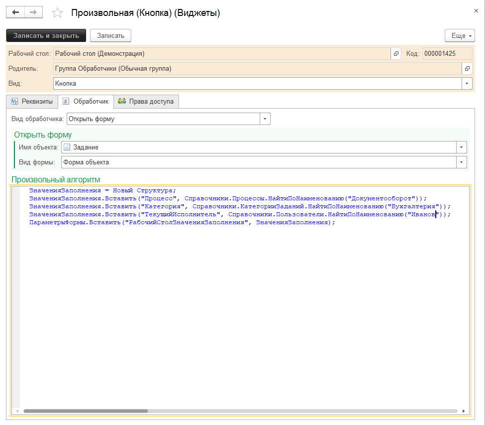
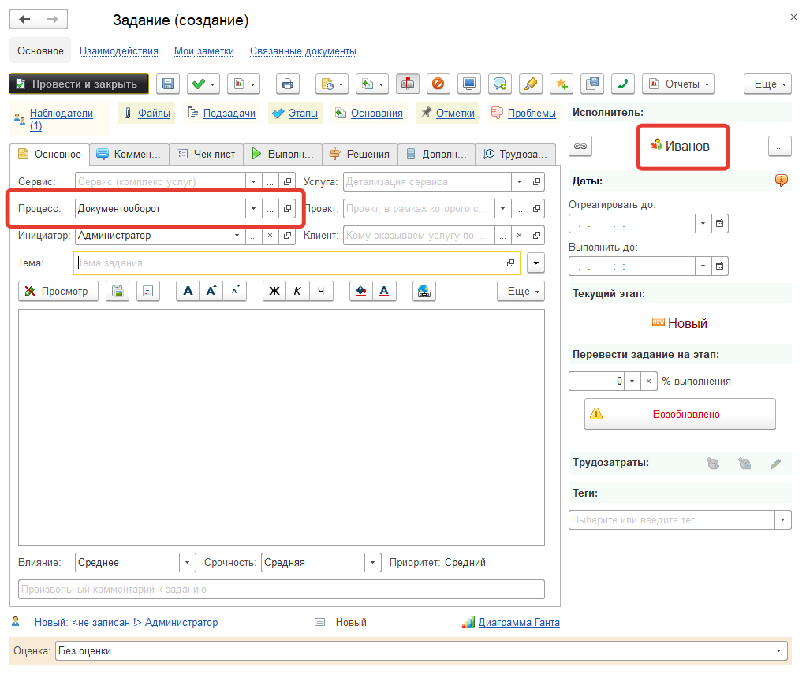

**Требования:**

* версия программы 3.1.3.5 и выше.

Добавим кнопку, при нажатии на которую будет создано новое задание, при этом в задании будут сразу заполнены некоторые реквизиты:

* Процесс - "Документооборот";
* Категория - "Бухгалтерия";
* Исполнитель - "Иванов".

Сам процесс добавления новой кнопки уже описан в предыдущем [примере](https://softonit.ru/FAQ/courses/?COURSE_ID=1&INDEX=Y), разница лишь будет в обработчике виджета. Рассмотрим его:



```
ЗначенияЗаполнения = Новый Структура;
ЗначенияЗаполнения.Вставить("Процесс", Справочники.Процессы.НайтиПоНаименованию("Документооборот"));
ЗначенияЗаполнения.Вставить("Категория", Справочники.КатегорииЗаданий.НайтиПоНаименованию("Бухгалтерия"));
ЗначенияЗаполнения.Вставить("ТекущийИсполнитель", Справочники.Пользователи.НайтиПоНаименованию("Иванов"));
ПараметрыФормы.Вставить("РабочийСтолЗначенияЗаполнения", ЗначенияЗаполнения);
```

В форме документа *"Задание"* в процедуре *"ПриСозданииНаСервере"* указана обработка параметра *"РабочийСтолЗначенияЗаполнения"*, поэтому, при нажатии на добавленную на рабочий стол кнопку с данным обработчиком, будет открыта форма с заполненными реквизитами:

