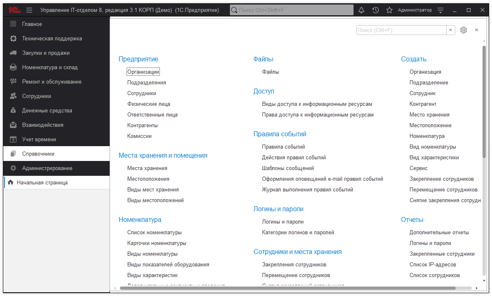

# Заполнение основных справочников

Перечислим основные справочники, которые в дальнейшем мы будем использовать при работе в программе:

* Организации - это наши юридические лица, от лица которых ведется учет. Т.е., если наша организация называется от ООО "Ромашка", то данные о ней необходимо заполнить здесь. По умолчанию, есть предопределенный элемент "Наша фирма" измените его на нужный Вам. См. ссылку.
* Подразделения - структурные подразделения организаций. См. ссылку.
* Сотрудники - сотрудники организаций. См. ссылку.
* Физические лица - используются в сотрудниках и содержат дополнительные данные. Важно, что физические лица - могут быть не только сотрудниками.
* Места хранения - места хранения, по которым будет вестись учет. См.ссылку
* Номенклатура и карточки номенклатуры - то, чем будем оперировать: оборудование, услуги. Смссылку

Все остальные справочники являются вспомогательными.

**Список ролей для работы с подсистемой "Справочники".**
* Базовые права УФ;
* Добавление и изменение базовой нормативно-справочной информации;
* Добавление и изменение общей базовой нормативно-справочной информации;
* Чтение базовой нормативно-справочной информации;
* Чтение общей базовой нормативно-справочной информации.

