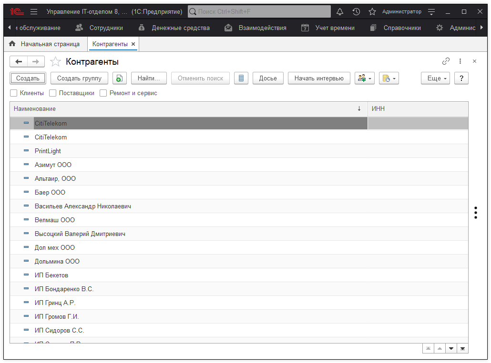
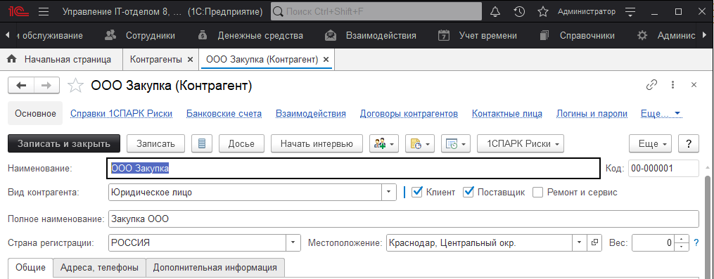
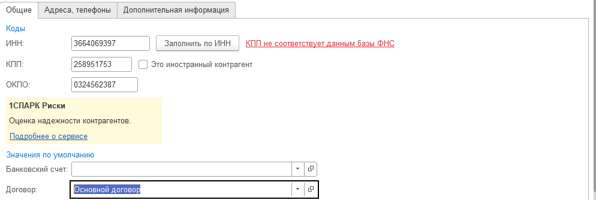
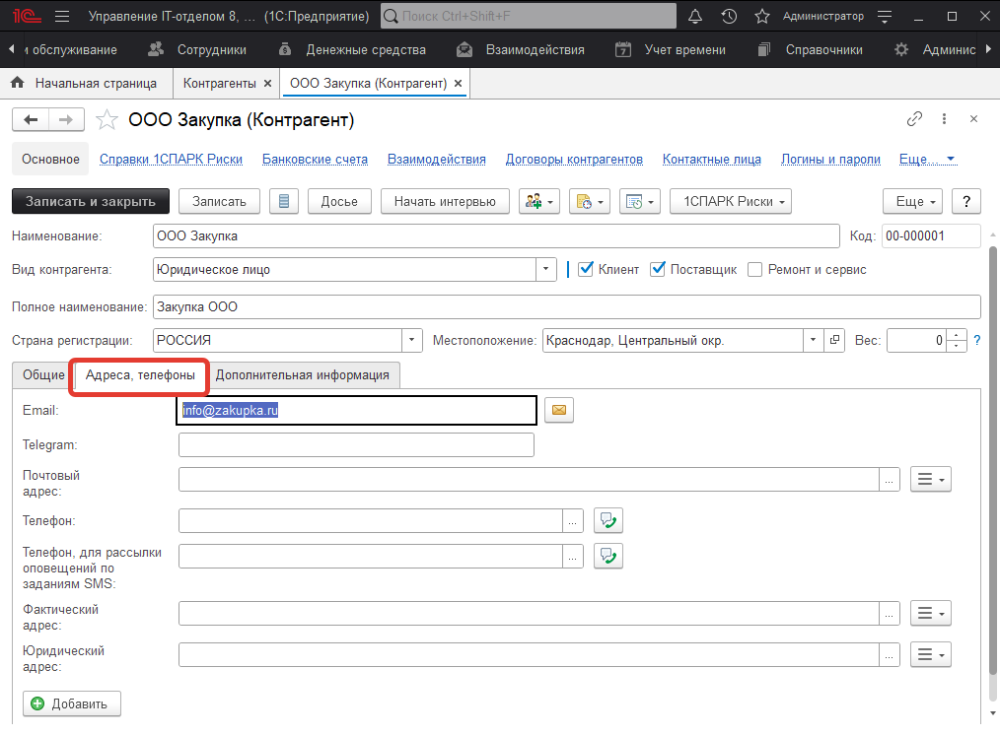
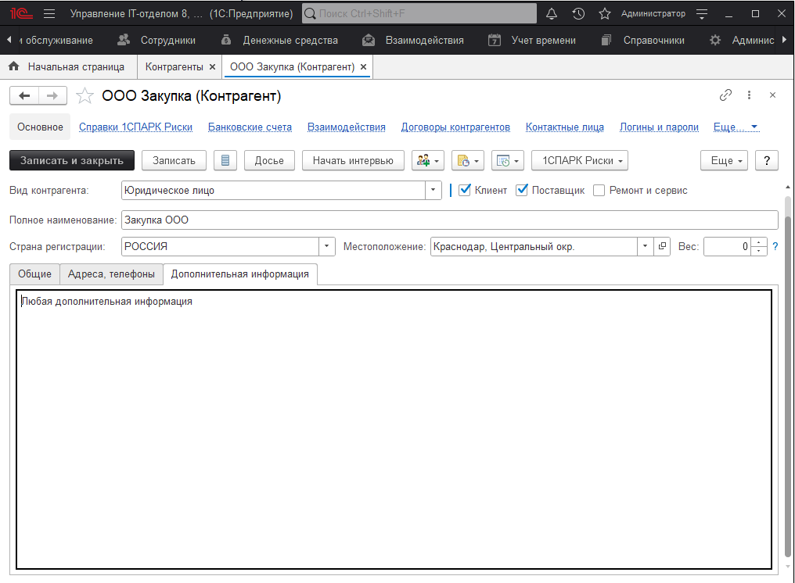

# Контрагенты

Справочник "Контрагенты" содержит список контрагентов созданных в конфигурации.

В форме элемента справочника "Контрагенты" перечислены следующие реквизиты:  

> * Наименование;
> * Вид контрагента (юридическое или физическое лицо, а также кем является контрагент: "Клиент", "Поставщик" и т.д.);
> * Полное наименование;
> * Страна регистрации;
> * Местоположение;

На закладке"Общие" перечислены следующие реквизиты:

> * ИНН/КПП/ОКПО (можно заполнить данные реквизиты автоматически по данным единых государственных реестров);
> * Банковский счет;
> * Договор;
> * Контактное лицо;

На закладке "Адреса, телефоны" может быть отражена контактная информация контрагента.

На закладке "Дополнительная информация" может содержатся произвольная информация.

