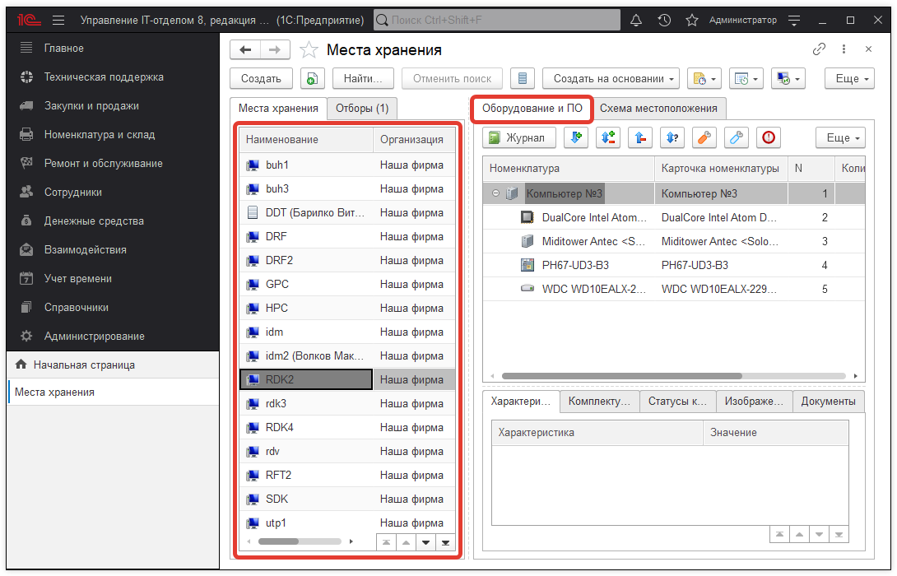
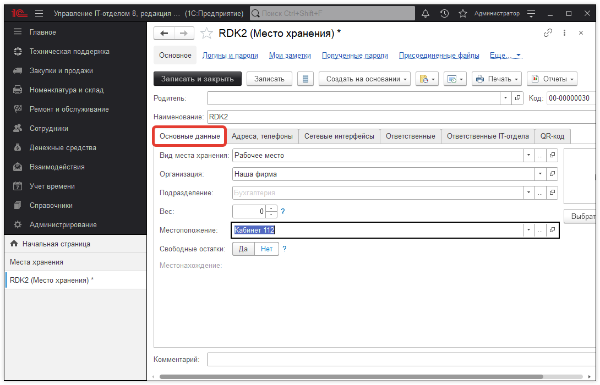
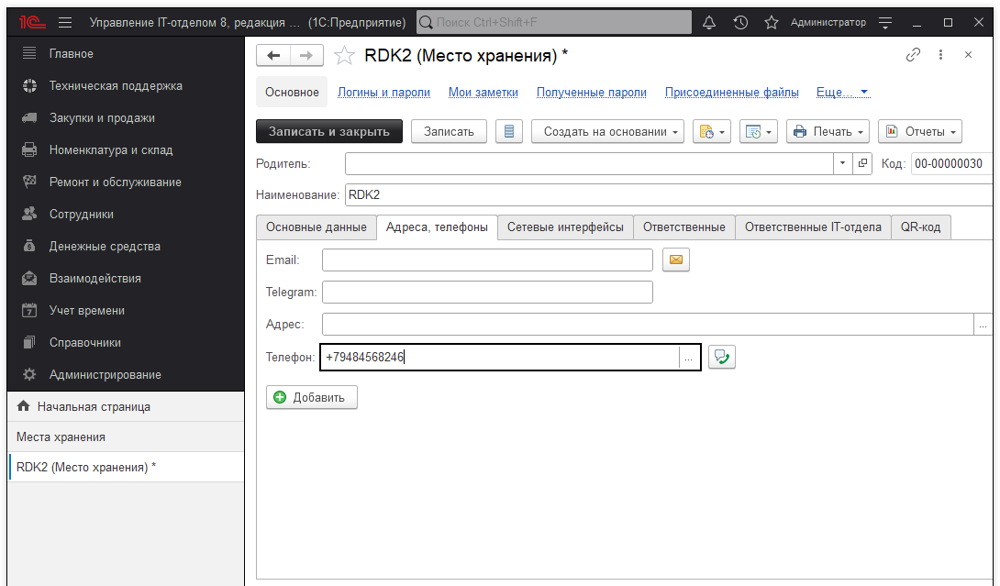
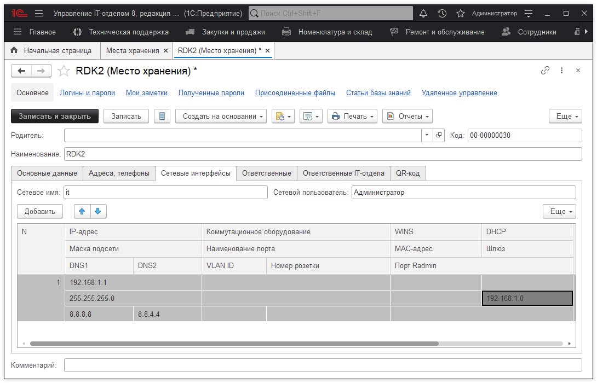
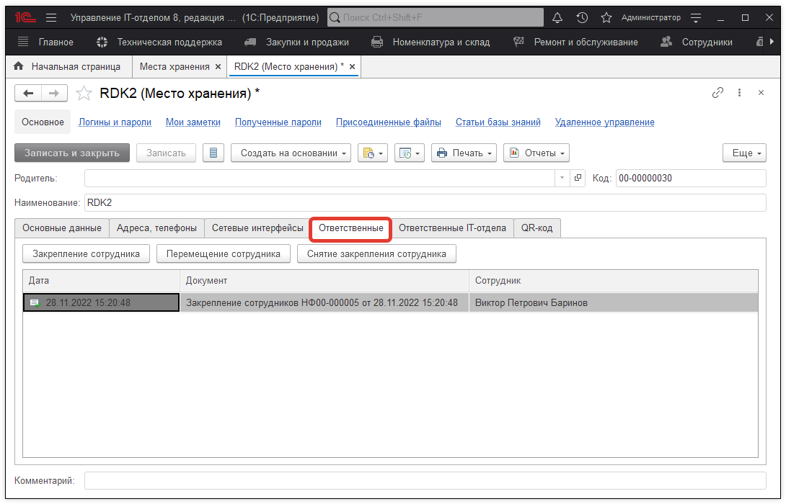
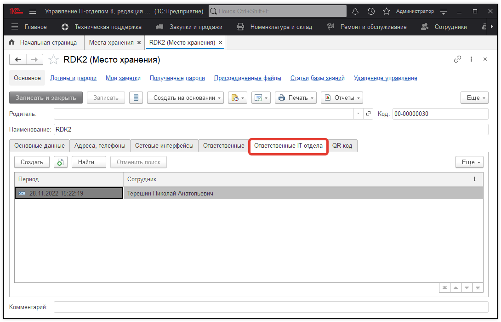

# Места хранения

Справочник "Места хранения" содержит список мест хранения. В списке мест хранения также можно посмотреть закрепленную за местом храненияноменклатуру.

В карточкесправочника "Места хранения" на закладке "Основные данные" перечислены следующие реквизиты:

> * Вид места хранения (рабоче место, склад, шкаф, полка и т.д);
> * Организация;
> * Подразделение;
> * Местоположение.

На закладке "Адреса,телефоны" может быть отражена контактная информация.

На закладке "Сетевые интерфейсы" может быть отражена информация о сетевых интерфейсах места хранения.

На закладке "Ответственные" отражен сотрудник, который является ответственным за данное место хранение.

На закладке"Ответственный IT" указывается сотрудник IT-отдела, который ответственный за обслуживание данного места хранения.

