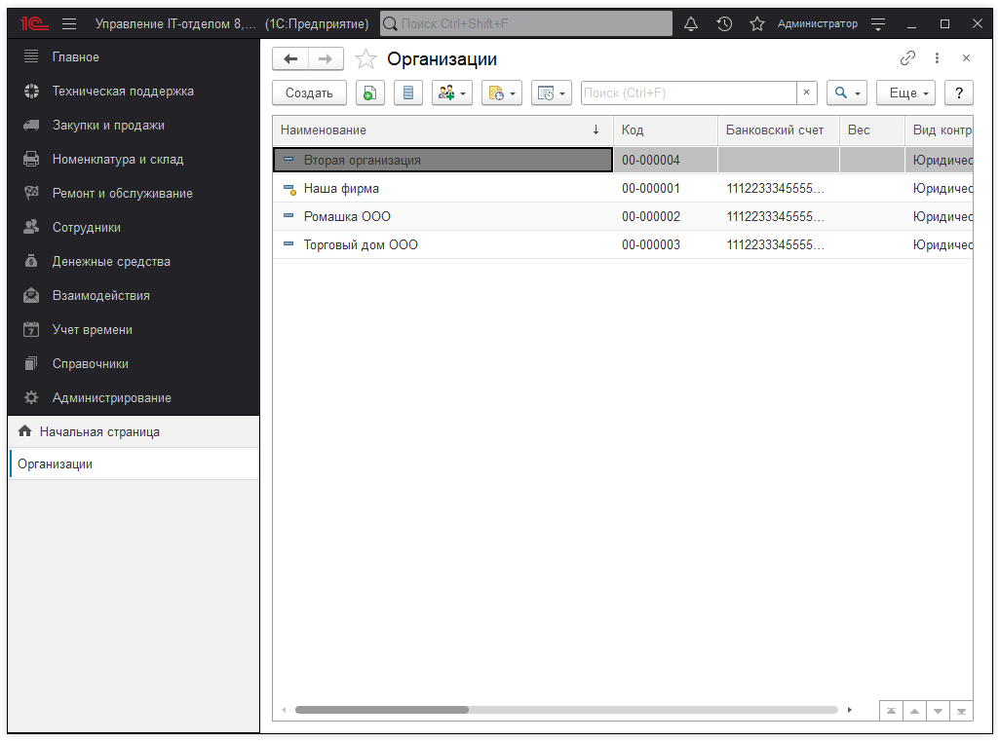
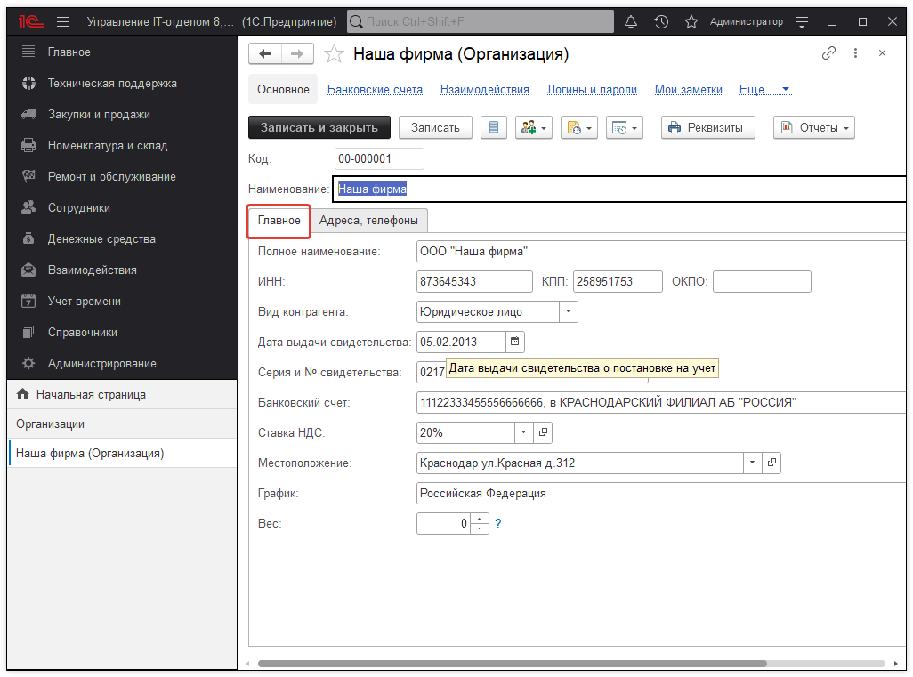
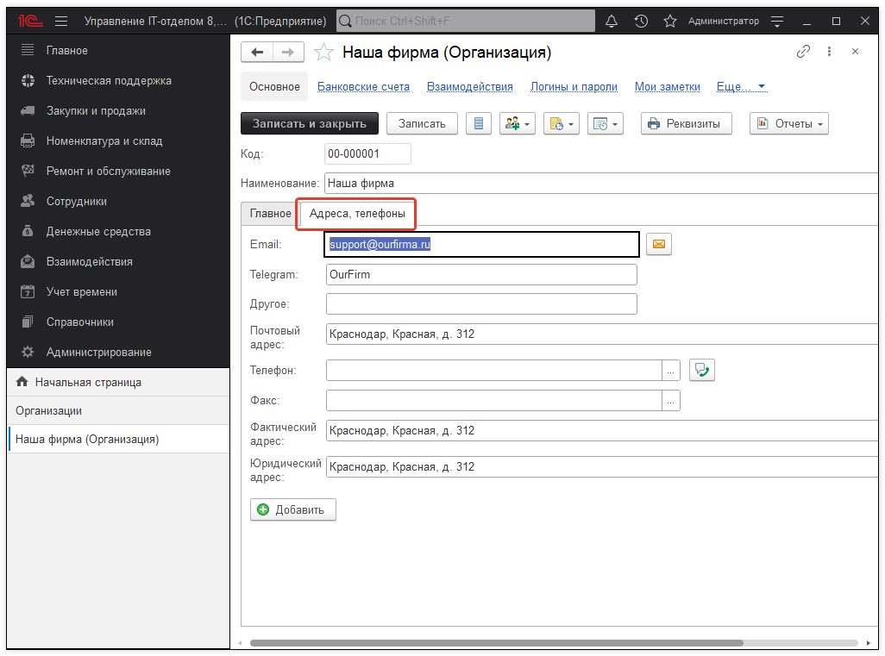

# Организации

Справочник "Организации" содержит список добавленных в конфигурацию организаций.

В форме элемента справочника "Организации" на закладке "Главное" перечислены следующие реквизиты: 

* [x] Полное наименование;
* [x] ИНН/КПП/ОКПО;
* [x] Вид контрагента (юридическое или физическое лицо);
* [x] Дата выдачи свидетельства;
* [x] Серия и № свидетельства;
* [x] Банковский счет;
* [x] Ставка НДС;
* [x] Местоположение;
* [x] График;

На закладке "Адреса, телефоны" может быть отражена контактная информация организации.

