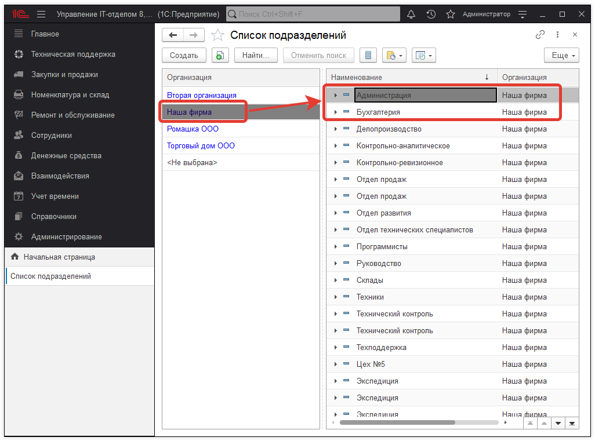
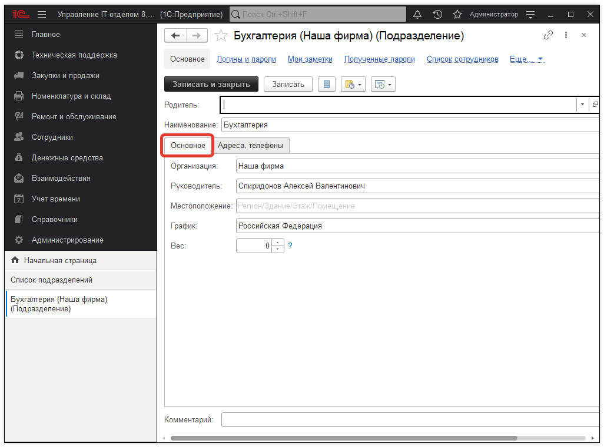
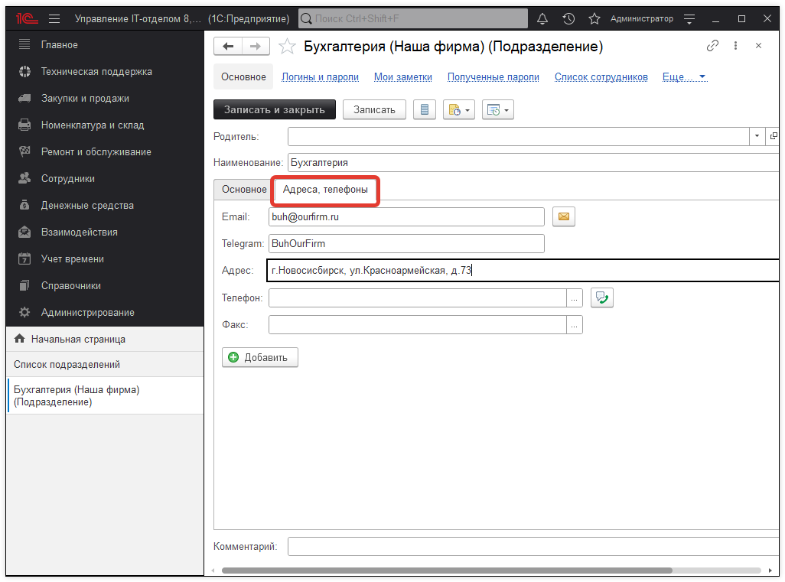

# Подразделения

Справочник "Подразделения" содержит список подразделений организаций.

В форме элемента справочника "Подразделения" на закладке "Основное" перечислены следующие реквизиты:  

* [x] Организация;
* [x] Руководитель;
* [x] Местоположение;
* [x] График работы.

На закладке "Адреса, телефоны" может быть отражена контактная информация подразделения.

