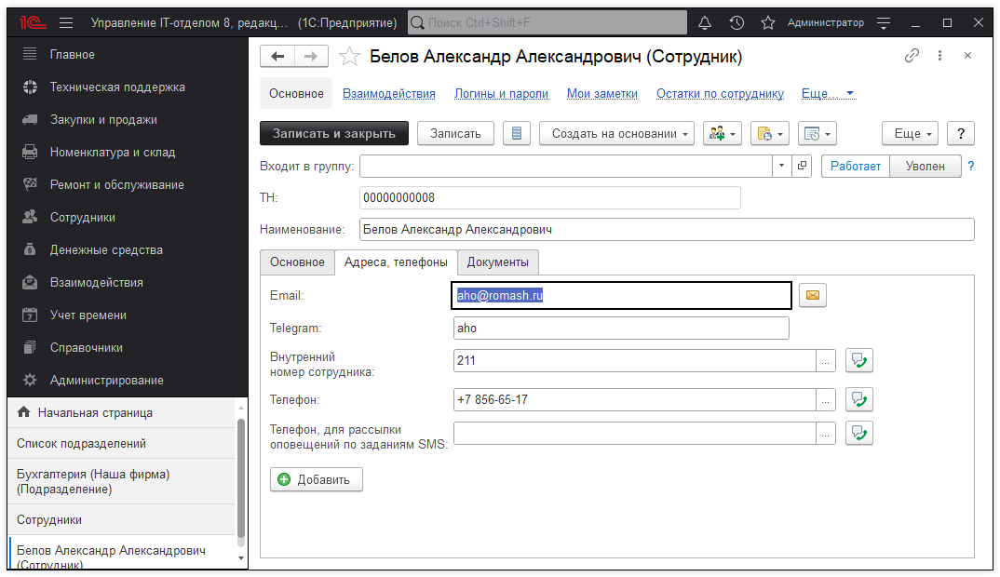

Сотрудники

Справочник "Сотрудники" содержит список сотрудников организации.

В форме элемента справочника "Сотрудники" на закладке"Основное" перечислены следующие реквизиты:

> * Физ. лицо;
> * Дата приема;
> * Организация;
> * Подразделение;
> * Должность;
> * Место хранения;
> * Местоположение;
> * Внутренний номер;

На закладке "Адреса, телефоны" может быть отражена контактная информация сотрудника.

Если в отношении сотрудника созданы документы: закрепления, перемещения или снятие закрепления, тогда эти документы будут отражены на закладке "Документы".

