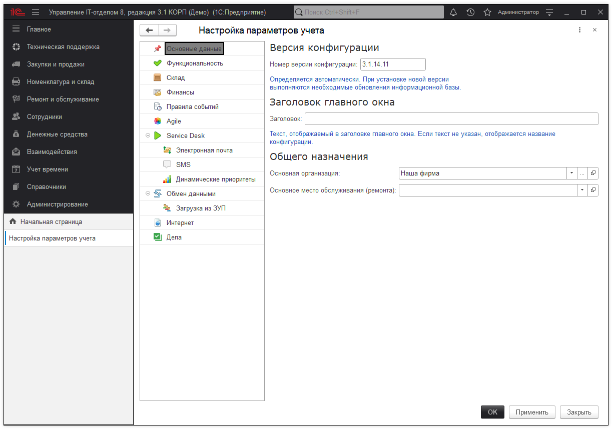
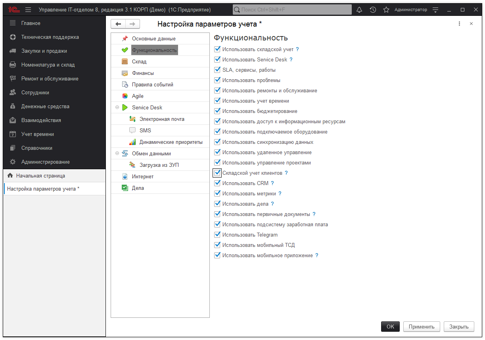

# Настройка параметров учета

Здесь хранятся все основные настройки конфигурации, которые влияют на ее поведение.

Настройки сгруппированы по разделам и, по умолчанию, заполнены при установке системы. Можете изменить их по Вашим потребносятям. Интуитивно понятно, зачем нужна каждая из настроек