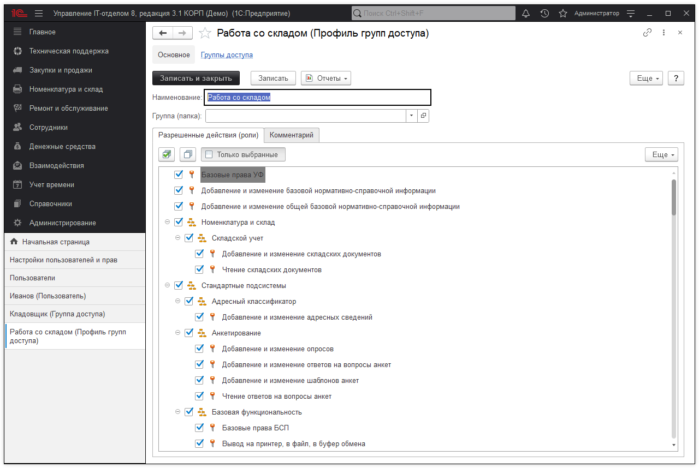
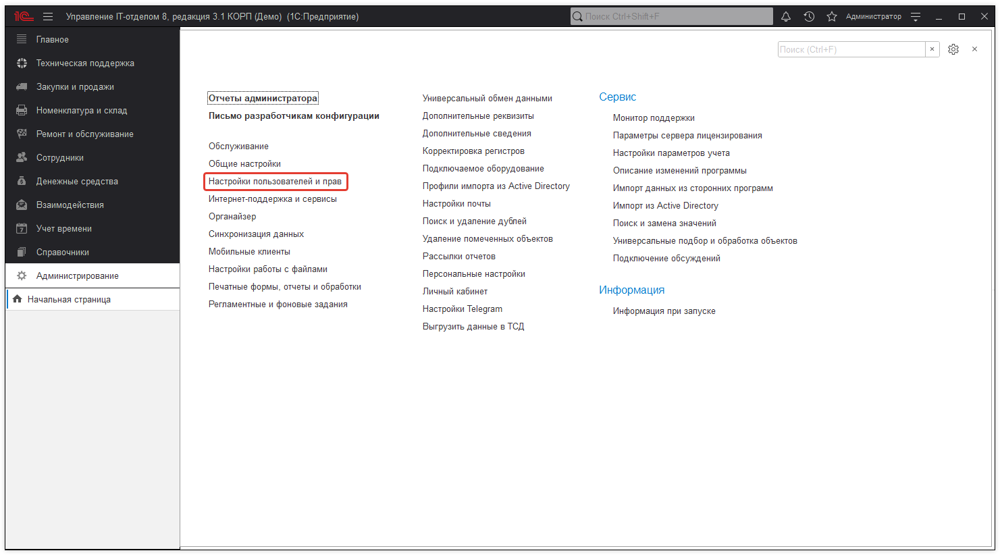
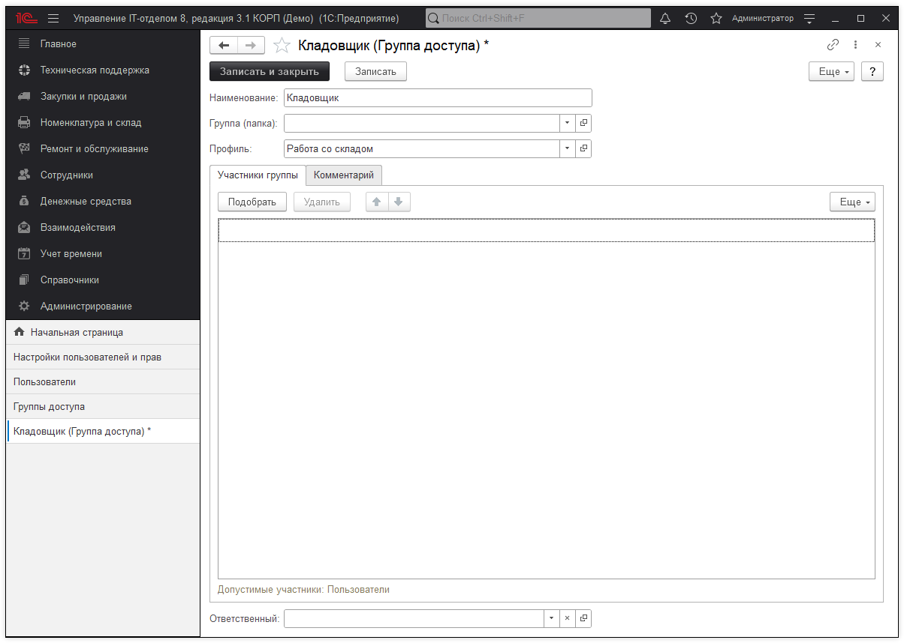
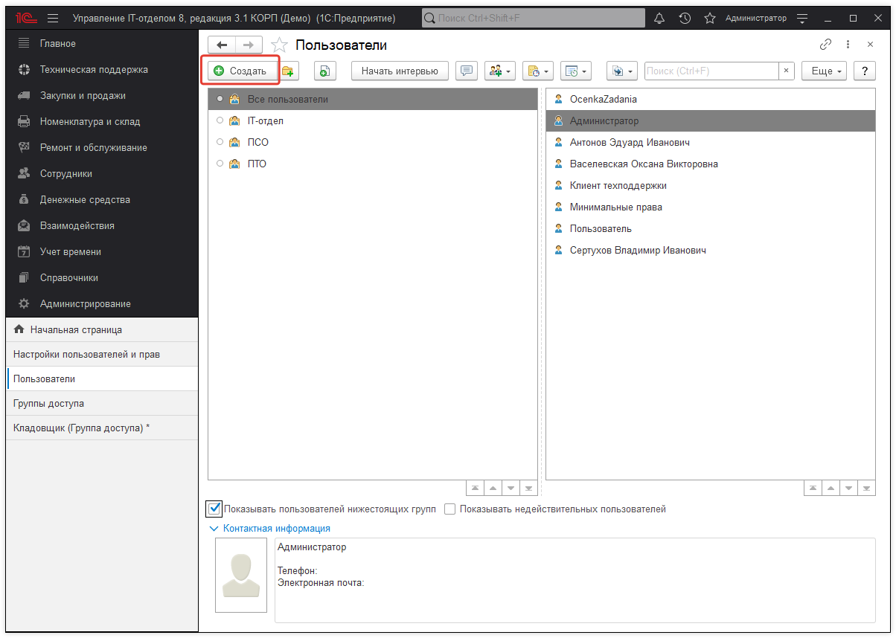
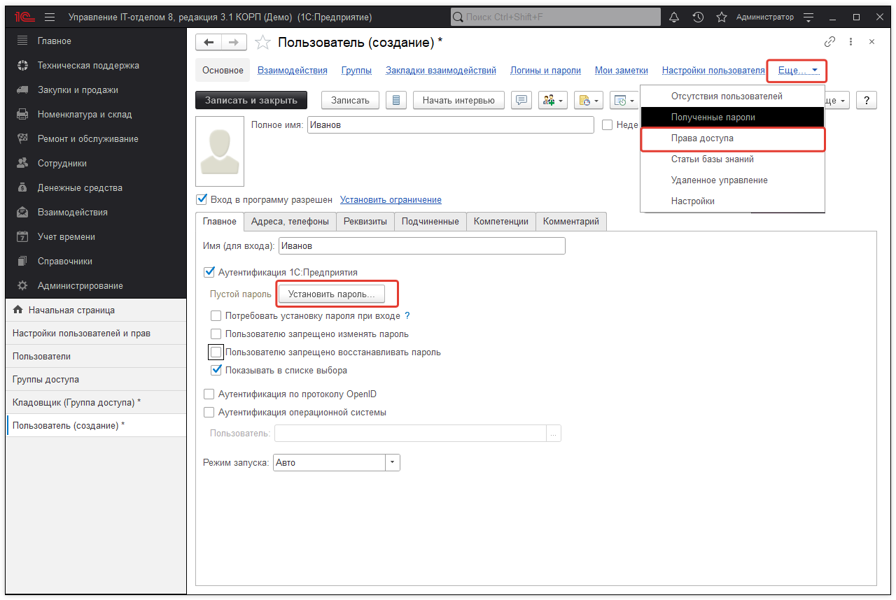
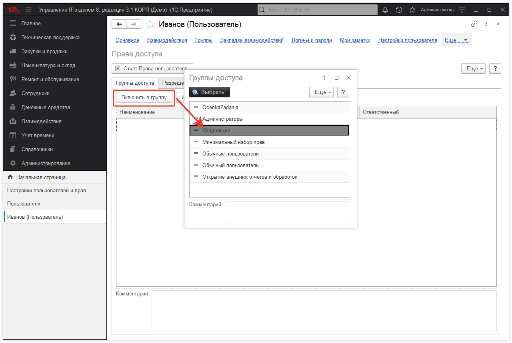
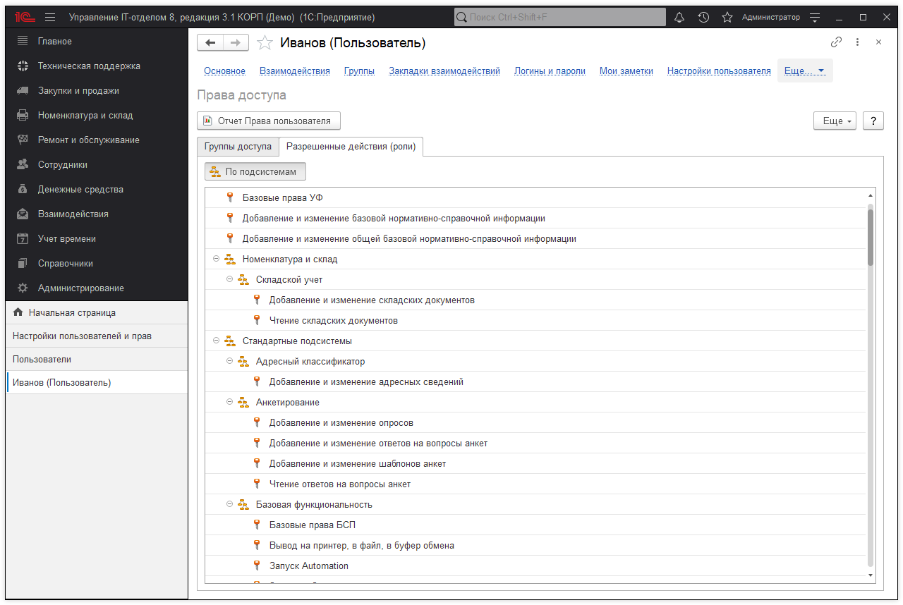
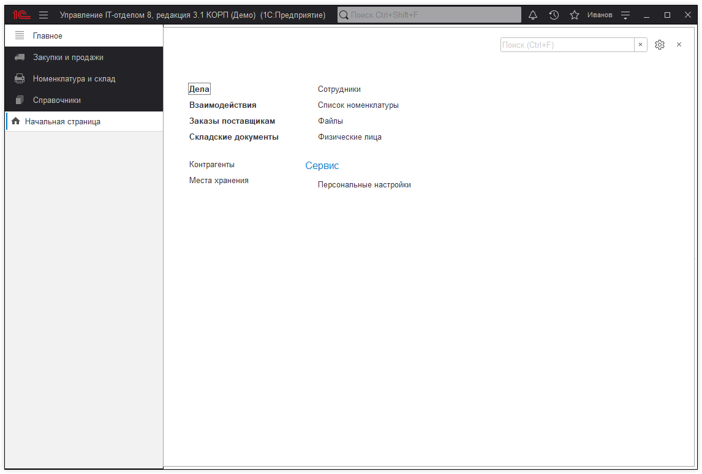

# Создание групп и профилей доступа

Если пользоваться конфигурацией будете не только Вы, необходимо добавить дополнительных пользователей в конфигурацию. [Конфигурация поддерживает импорт пользователей из Active Directory.](https://softonit.ru/FAQ/courses/?COURSE_ID=1&INDEX=Y)

1. Допустим, нам необходимо добавить пользователя "Иванов" с правами, которые позволяли бы ему работать только со складскими документами. Приступим:

Создадим профили групп пользователей. Профили - это различные права, объединенные в своеобразные шаблоны доступа. Т.е. то, что будет назначаться пользователям. Например, для склада будет достаточно прав:

Базовые права и запуск толстого, тонкого и веб-клиентов обязательны.

2. Создадим группу доступа "Кладовщики" и сохраним ее:

3. Перейдем к добавлению пользователями. Откроем справочник "Пользователи" и добавим нового:

4. Будет открыт диалог создания нового пользователя. Назовем пользователя так как нам надо, установим ему пароль, и перейдем в "Права доступа", на этой же форме:

5. Включим пользователя в группу "Кладовщики".

6. Теперь, если закрыть пользователя и открыть его заново, мы получим:

7. Зайдем под пользователем, которого мы только что создали, и проверим, что получилось. Закроем текущий сеанс, запустим 1С:Предприятие, и в окне авторизации выберем Иванова, введя его пароль. Откроется форма:

Как видим, ничего лишнего. При этом, некоторые справочники, которые имеют важное значение, могут быть открыты, но не могут быть изменены. Например, справочник "Организации".
