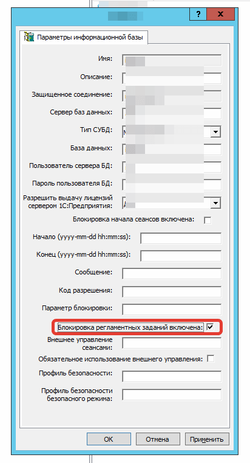
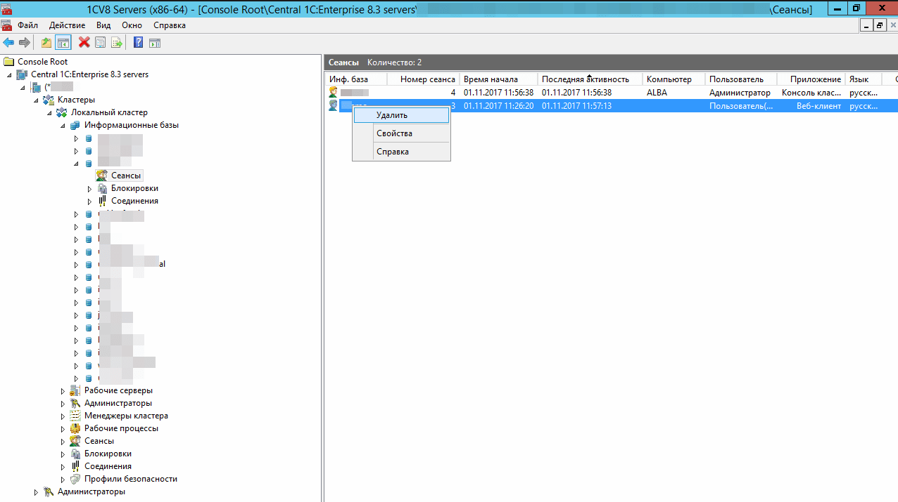
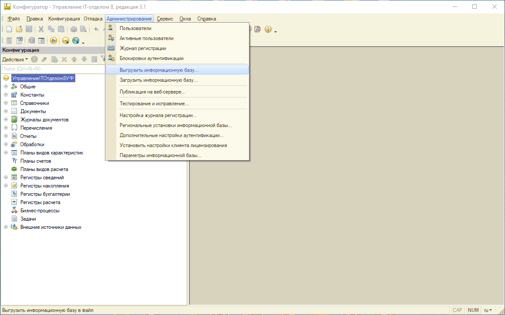
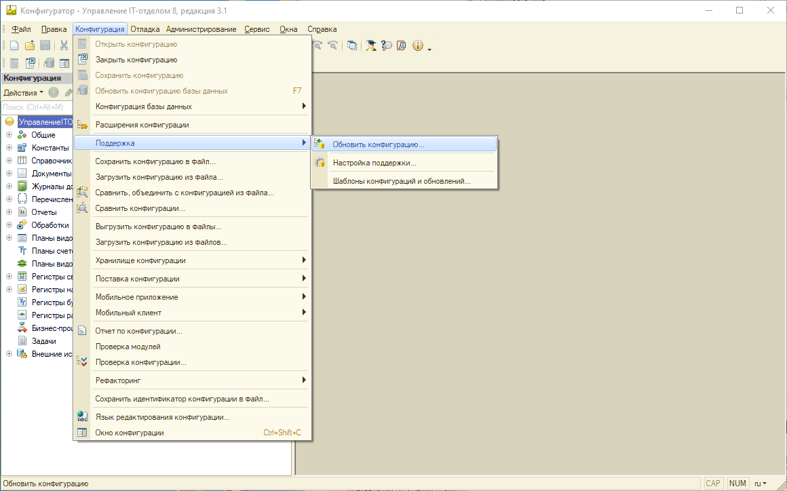

# Обновление конфигурации
!!!
Важно! Информация об обновлении конфигурации "Управление IT-отделом 8" рассылается в день выхода или на следующий день после официального выхода обновления конфигурации.
!!!

> Конфигурация обновляется, как и любое другое типовое решение на платформе 1С.

## Порядок обновления клиент-серверной базы:
Прежде всего, **если у Вас серверная ИБ** запретите выполнение регламентных заданий открыв консоль кластера 1С, выберите нужную ИБ, щелкните правой кнопкой по ней и выберите в выпадающем меню "Свойства": 

Нажмите в окне галочку **"Блокировка регламентных заданий включена"**.
Далее, завершите все сеансы, которые есть на данный момент. Лучше, если пользователи сами корректно завершат их, но если такой возможности нет, Вы можете завершить их принудительно: 

1. Запустите конфигурацию "Управление IT-отделом 8" в режиме "Конфигуратор".  

!!!
2. **Обязательно** сделайте архивную копию вашей информационной базы! Для этого надо перейти в раздел "Администрирование" выбрать пункт "Выгрузить информационную базу" и ввести имя файла выгрузки. Этот файл надо сохранить в надёжном месте.  
!!!

3. В режиме *"Конфигуратор"* выберите пункт "Открыть конфигурацию".
4. Выберите режим "Обновление конфигураций", для этого в меню "Конфигурация", подменю "Поддержка", выберите пункт "Обновить конфигурацию".
5. В диалоге выбора обновления в качестве источника обновления укажите "Доступные обновления", после чего выберите нужное обновление в соответствующем списке.
6. Если в списке обновлений необходимое обновление отсутствует, то в диалоге выбора обновления в качестве источника обновления укажите "Файл обновления", после чего выберите нужный файл.
7. В окне "Обновление конфигураций" нажмите кнопку "OK" для продолжения обновления конфигурации.
8. На вопрос об обновлении конфигурации базы данных ответьте "ДА".
9. После завершения обязательно запустите программу в режиме "Предприятие" - для совершения конвертации. Некоторые пользователи, не выходя из конфигуратора последовательно обновляют версии - это НЕДОПУСТИМО и повлечет за собой невозможность дальнейшей работы.
10. После завершения всех работ с обновлением запустите снова консоль кластера и снимите галочку "Блокировка регламентных заданий включена".

## Порядок обновления файловой базы:
Процесс обновления конфигурации, работающей в файловом режиме аналогичен, за исключением того, что не нужно отключать работу регламентных заданий.

1. Перед началом обновления необходимо, чтобы в базе никто не работал. Поэтому необходимо, чтобы все активные пользователи завершили свой сеанс.
2. Открываем конфигурацию в режиме "Конфигуратор" и создаем резервную копию базы.
3. Далее переходим в раздел "Конфигурация" - "Поддержка" - "Обновить конфигурацию"

4. В открывшемся окне "Обновление конфигурации" выбираем пункт "Поиск доступных обновлений" и жмем кнопку "Далее".
5. На следующем этапе необходимо установить галочку "Искать в текущих каталогах шаблонов и обновлений" и нажать кнопку "Далее".
6. После успешного поиска перед нами отобразится окно, в котором жирным будет выделено подходящее обновление для текущей версии конфигурации.
7. Устанавливаем на него курсор и жмем кнопку "Готово".
8. Далее появится еще одно новое окно, в котором необходимо нажать кнопку "Продолжить обновление". Начнется процесс обновления.
9. После успешного обновления необходимо применить изменения и запустить конфигурацию в режиме 1С:Предприятие.
!!!
Важно! После каждого обновления, надо хотя бы 1 раз запускать 1С в режиме 1С:Предприятие. Это нужно, для того, чтобы все обработчики обновления завершили свою работу. Так же, следует учитывать, что на определенную версию можно обновиться только с определенных версий, которые указаны в обновлении.
!!!