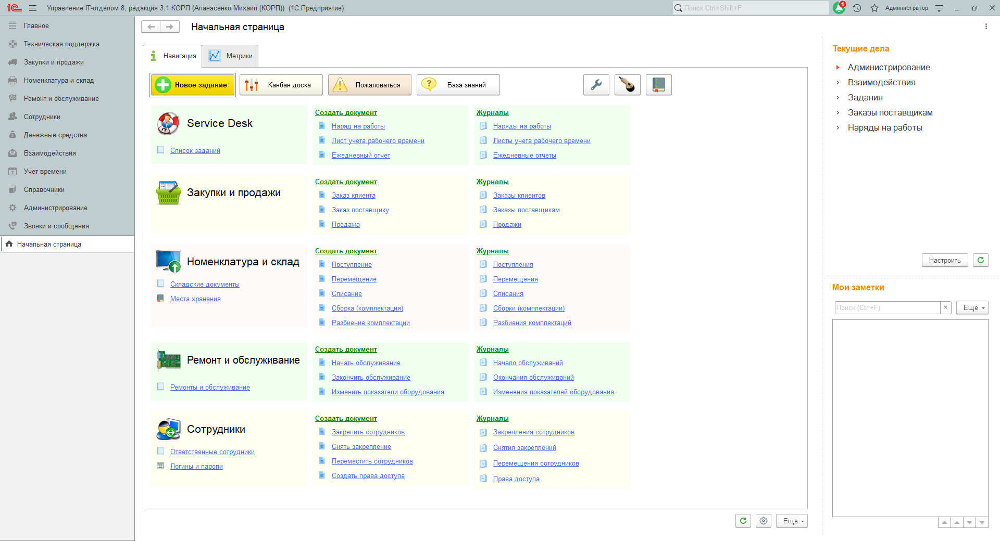

# Изменение стиля оформления конфигурации пользователя

Цветовое оформление типовых конфигураций от фирмы 1С, да и конфигураций, которые были разработаны сторонними разработчиками не изменялось из поколения в поколение. В число таких программ входит и наша конфигурация. Утвержденная цветовая гамма 1С в желтых тонах успела приесться и сопровождала пользователей очень долгое время. За этот интервал времени кто-то из пользователей привык к желтому цвету, а кто-то не против поменять оформление на нечто другое. Учитывая данные пожелания, мы разработали механизм, который позволит изменить оформление конфигурации. При этом мы понимаем, что одна часть пользователи все же не хотели бы изменять стандартный стиль 1С на другой, поэтому привычные желтые тона никуда не исчезли. Данный механизм включает в себя следующий набор стилей:

## 1. Стандартный

## 2. Темный

## 3. Светлый

## 4. Серый

Каждый пользователь может индивидуально подобрать для себя понравившейся стиль оформления. Для этого необходимо перейти в персональные настройки пользователя **"Начальная страница" - "Персональные настройки"** (кнопка в виде гаечного ключа).

Далее в настройках пользователя необходимо раскрыть настройку **"Стиль оформления"** и в качестве основного стиля указать одно из четырех представленных оформлений.

[Видео по данной теме на ютуб](https://www.youtube.com/watch?v=_-oM85ABMjo)