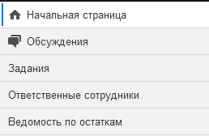

# Интерфейс конфигурации

## Основные элементы интерфейса

* **Интерфейс конфигурации** - это основной способ взаимодействия пользователя с конфигурацией на интерактивном уровне. Интерфейс содержит множество различных элементов, которые отвечают за определенное действие или событие. Так, например, по нажатию той или иной кнопки осуществляется определенное действие, выполняемое программой, открываются дополнительные формы (окна) и т.д. В конфигурации есть определенный набор интерфейсных элементов, которые присутствуют во всех механизмах программы:
* **Панель набора кнопок** - содержит в себе кнопки, которые выполняют то или иной действие над объектом конфигурации. Панель выглядит следующим образом:

* **Реквизиты** - поля, в которых указываются определенные значения, относящиеся к объекту конфигурации. Реквизиты бывают полем ввода строки, полем выбора значений, а также выпадающим списком. 

* **Чек-бокс** - это реквизит, который имеет значение включено или выключено, обычно включение подобного чек-бокса активирует работу определенной настройки. 

* **Закладка** - это элемент формы объекта конфигурации, на котором могут располагаться любые другие элементы интерфейса программы. Например, на закладке могут располагаться реквизиты, табличные части, кнопки и т.д.

* **Табличная часть** - это элемент, которых хранит в себе информацию в виде таблицы. У табличных частей обязательно присутствуют столбцы и строки, где располагаются определенные значения, поэтому их не стоит путать со списками. 

* **Гиперссылки** - это ссылки, которые располагаются в верхней части формы элемента конфигурации и открывают дополнительные функции взаимодействия с объектом базы. 

Интерфейс конфигурации также оснащен глобальными элементами оформления, которые распространяются на весь функционал. Такими элементами называются панели, которые окружают рабочее пространство программы. Они делятся на пять панелей каждая, из которых отвечает за вывод собственной информации:   

* **Панель разделов** - это панель, которая выводит основные доступные разделы конфигурации. Другими словами, это главное меню программы с помощью, которого осуществляется навигация по функционалу. 

* **Панель открытых** - предназначение данной панели интуитивно понятно из его названия. На этой панели располагаются открытые объекты конфигурации: документы, справочники, отчеты и т.д. Обращаем Ваше внимание на то, что на данной панели всегда будет отображаться функционал, который открыт постоянно. К подобному относится, например, начальная страница, которая открыта регулярно. 

* **Панель истории** - данная панель предназначена для отображения истории по последним открытым объектами конфигурации.

* **Панель избранного** - предназначение панели заключается в выводе объектов конфигурации, которые отмечены как избранные. Данная панель позволяет быстро обратиться к объекту,который используется Вами достаточно часто. 

* **Панель функций текущего раздела** - данная панель выводит функции и объекты раздела, который открыт на текущий момент.

Возможности интерфейса конфигурации позволяют изменить расположение описанных выше панелей в том порядке, который необходим. Ненужные панели можно убрать из визуального отображения и т.д. Для перехода к редактированию панелей необходимо в верхнем правом углу, возле имени текущего пользователя вызвать сервисные настойки и перейти в раздел **"Настройки"-"Настройки панелей"**.

Откроется окно **"Редактор панелей"**, которое отображает установленный на текущий момент макет расположения панелей. В центральной части выделена рабочая область, в которой будут выводиться объекты конфигурации, а также вокруг пунктиром выделены области, где можно расположить панели. Выделенная серым цветом полоса внизу редактора хранит в себе скрытые для визуального отображения панели. Изменение расположения осуществляется простым перетаскиванием панелей по макету редактора.

## Настройка навигации и действий навигации

Как говорилось ранее панель функций текущего раздела отображает предопределенный набор доступных для пользователя функций и объектов. Набор подобных включенных функций для каждого раздела программы отличается, так для раздела **"Техническая поддержка"** выводятся объекты, которые напрямую взаимосвязаны с этой подсистемой.  
С помощью настроек навигации и действий можно изменить состав выводимых функций. Открыв любую "Панель функций текущего раздела", можно перейти к настройкам с помощью кнопки, расположенной в правом верхнем углу и изображенной в виде шестеренки. 

### Настройки навигации

Под навигацией понимаются объекты конфигурации, которые напрямую относятся к области данного раздела. К навигации относятся документы подраздела, связанные справочники или журналы документов. Если необходимо скрыть какой-либо неиспользуемый документ раздела, необходимо открыть "Настройка навигации". Откроется новое окно "Настройка панели навигации", в котором нужно убрать или добавить элемент раздела. Все выполняемые действия в данном окне осуществляются с помощью командных кнопок предназначение, которые интуитивно понятно.

### Настройки действий

К действиям панели функций текущего раздела относятся команды, которые могут выполняться напрямую без перехода в форму объекта конфигурации, отчеты или сервисные обработки. Например, это подраздел **"Создать"**, который сразу же (без перехода в документ) позволяет создать поступление, перемещение или любой другой документ программы. Состав выполняемых действий также как и навигация настраивается. Для этого нужно перейти в "Настройка действий". Откроется новое окно "Настройка панели действий", где аналогично настройкам навигации осуществляется распределение состава отображаемых действий, отчетов и сервисов.

!!! Внимание! 
Применяемые настройки интерфейса являются персональными и не имеют глобального характера. Таким образом каждый пользователь может конкретно для своего удобства создать подходящее оформление программы.
!!!

