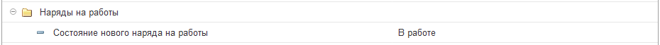

# Настройка индивидуальных параметров для каждого пользователя

**Индивидуальные настройки параметров пользователя** предназначены для автоматической установки значений в реквизиты имеющихся документов или справочников. Также в данных настройках задаются параметры, которые будут использоваться механизмами программы по умолчанию для текущего пользователя. Это может понадобиться, например, когда один сотрудник отвечает за один склад и выбирает его во всех документах, а другой сотрудник за другой и тоже выбирает его везде. Для этих целей есть механизм индивидуализации конфигурации. Т.е. есть настройки у каждого пользователя, которые позволяют выбрать личные значения для подстановки.

Настройка доступна в разделе *Администрирование > Настройки пользователей и прав>Пользователи.* Открываем нужного пользователя и переходим по гиперссылке *"Настройки пользователя"*.

Открыв гиперссылку, откроется сгруппированный по подсистемам конфигурации список индивидуальных параметров пользователя:

## Группа "Service Desk"  

Данная группа предназначена для указания параметров, которые относятся к разделу конфигурации "Техническая поддержка". В состав группы входят следующие параметры:

* **Добавлять себя в наблюдатели для всех новых заданий (только если есть роль "Просмотр чужих заданий")** - осуществляет автоматическое добавление данного пользователя в наблюдатели новых заданий (находящихся на этапе "Новый"), при условии, что у пользователя установлена соответствующая роль. Имеет значения: **"Да", "Нет"**.  
* **Интервал проверки изменений заданий для всплывающих оповещений** - в данном параметре задается интервал времени в секундах, который запускает всплывающее в трее уведомление об изменениях в заданиях. Чтобы отключить данный параметр необходимо указать значение -1. По умолчанию задан 5-и минутный интервал, то есть 300 секунд.
* **Основная группа доступа категории базы знаний** - параметр, который будет устанавливать заданную по умолчанию группу доступа для статьи базы знаний, при включенном функционале RLS (разграничение групп доступа).
* **Основной инициатор** - указывается инициатор, который будет автоматически устанавливаться в создаваемом под данным пользователем документе "Задание". Значения может выбираться из всех доступных в конфигурации справочников.
* **Основной процесс** - указывается процесс, который будет автоматически устанавливаться по умолчанию в создаваемом под данным пользователем документе "Задание". Значения выбираются из справочника "Процессы".
* **Основной процесс для создаваемых дочерних заданий** - принцип применения аналогичен вышеописанному параметру, за исключением того, что значение данного параметра будет указываться в создаваемых подзадачах. Значения выбираются из справочника "Процессы".
* **Основной тип инициатора** - указывается тип, который будет автоматически устанавливаться в создаваемом под данным пользователем документе "Задание". Например, будет устанавливаться тип "Контрагент" или "Сотрудник" и т.п. в зависимости от установленной настройки.
* **Открывать задание на закладке "Комментарии", если есть комментарии** - параметр при включении, которого задания с комментариями будут автоматически открываться на соответствующей закладке. Имеет значения: "Да", "Нет".
* **При добавлении комментария по умолчанию не уведомлять инициатора** - при включении данного параметра у пользователя, уведомления по добавленным в задании комментариям не будут уходить инициатору задания. Имеет значения "Да", "Нет".
* **Рабочий стол по умолчанию** - указывается рабочий стол, который по умолчанию будет формировать начальную страницу конфигурации для данного пользователя. Значения выбираются из справочника "Рабочие столы".
* **Упорядочивание комментариев в задании** - параметр, задающий сортировку добавленных в задании комментариев. Имеет значения: "Новые вверху", "Новые внизу".

## Группа "Изменение показателей оборудования"

* **Вид значения** - параметр, который автоматически будет устанавливать значение в соответствующий реквизит документа "Изменение показателей оборудования". Имеет значения: "Текущее значение показателя", "Увеличение показателя на значение".
* **Положение вида значения** - задает стандартное положение реквизита "Вид значения" в документе "Изменение показателей оборудования". Имеет значения: "В шапке", "В табличной части".

## Группа "Календарь"

* **Начало рабочего дня** - указывается время начала рабочего дня, которое потом автоматически устанавливается при расчетах в табеле рабочего времени.
* **Окончание рабочего дня** - указывается время окончания рабочего дня, которое потом автоматически устанавливается при расчетах в табеле рабочего времени.
* **Отображать текущую дату** - устанавливает текущую дату в параметры "Начало рабочего дня" и "Окончание рабочего дня". Имеет значения: "Да", "Нет".

## Группа "Логины и пароли"

* **Основной тип пароля при создании** - указывается тип пароля, который будет автоматически устанавливаться при создании. Данный тип пароля определяет видимость объекта для других пользователей. Имеет значения: "Общий (виден всем)", "Личный (виден только автору)", "Группе пользователей (виден только для указанной группы пользователей)".

## Группа "Наряды на работы"

* **Состояние нового наряда на работы** - указывается значение, которое будет автоматически подставляться в реквизит "Состояние" документа "Наряды на работы". Имеет значения: "В работе", "Выполнен", "Заявка".

## Группа "Обслуживание"
* **Основное место хранения (на склад)** - указывается значение, которое будет подставляться автоматически в реквизит "Место хранение на склад" в документе "Начало\Окончание обслуживания"
* **Основное место хранения (со склада)** - указывается значение, подставляемое в реквизит "Место хранения (со склада)" в документе "Начало\Окончание обслуживания".

## Группа "Основные значения для подстановки в документы и справочники"
* **Основная группа доступа контрагентов** - указывается значение, подставляемое в реквизит "группа контрагента" при использовании функционала "Разграничение по группам доступа".
* **Основная группа доступа мест хранения** - указывается значение, подставляемое в реквизит "группа мест хранения" при использовании функционала "Разграничение по группам доступа".
* **Основная комиссия** - значение, которое будет указываться в документах конфигурации в качестве комиссии по умолчанию.
* **Основная организация** - значение, которое будет указываться в документах конфигурации в качестве организации.
* **Основная ставка НДС** - данный параметр будет указываться во всех объектах конфигурации как НДС по умолчанию.
> *Остальные параметры указанные в данной группе, также будут отвечать за стандартную установку значения в объектах программы.*

## Группа "Планирование бюджета"

* **Положение "Период бюджета" в документе** - устанавливается значение положение, которое будет занимать данный реквизит в соответствующем документе. Имеет значения: "Шапке", "В табличной части".

## Группа "План работ"
* **Положение реквизита "Вид работы"** - отвечает за расположение реквизита "Вид работы" в документе "Ежедневный отчет". Имеет значения: "В шапке", "В табличной части".
* **Положение реквизита "Задание"** - отвечает за расположение реквизита "Задание" в документе "Ежедневный отчет". Имеет значения: "В шапке", "В табличной части".
* **Положение реквизита "Пользователь"** - отвечает за расположение реквизита "Пользователь" в документе "Ежедневный отчет". Имеет значения: "В шапке", "В табличной части".

## Группа "Права доступа"
* **Положение реквизита "Сотрудник"** - отвечает за расположение реквизита "Сотрудник" в документе "Права доступа сотрудников к информационным ресурсам". Имеет значения: "В шапке", "В табличной части".

## Группа "Стили оформления"
* **Основной стиль** - в данном параметре указывается основной стиль оформления интерфейса конфигурации. По умолчанию установлено значение "Стандартный", которое отвечает за желто-белое оформление 1С.

## Группа "Трудозатраты"

* **Авторасчет трудозатрат в документах** - включает функционал автоматического проставления трудозатрат пользователя в документе "Задание". Имеет значения: **"Да", "Нет"**.

## Группа "Удаленное управление"

* **Локальный путь к ...** - указывается локальный путь к файлу `exe`, который отвечает за запуск программы удаленного управления.

