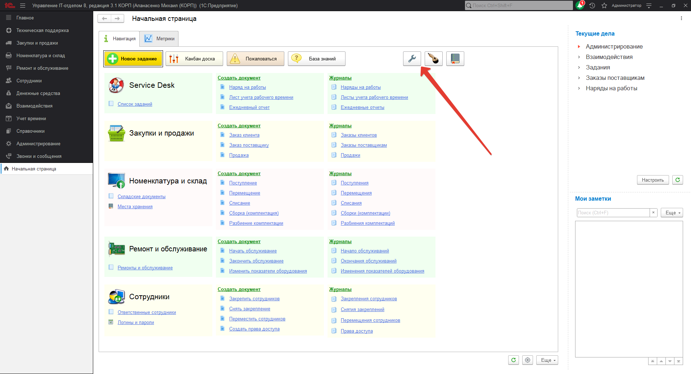
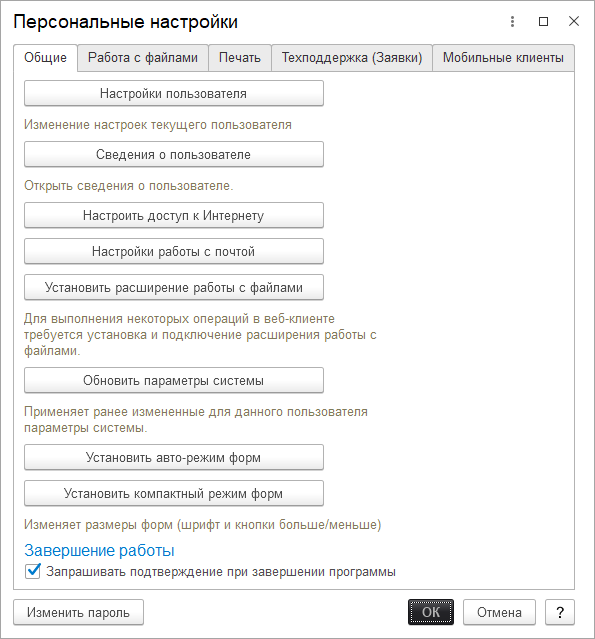
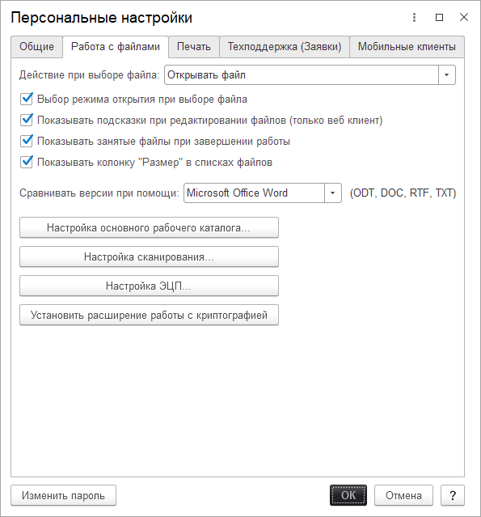
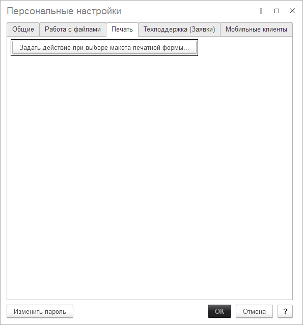
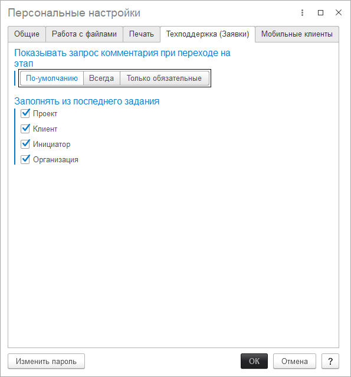
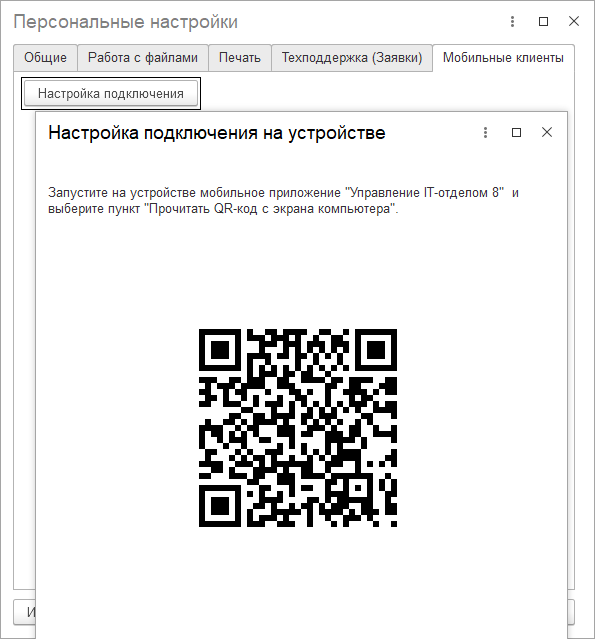

# Персональные настройки

**Персональные настройки текущего пользователя** - это набор настроек программы, применяемых к определенному пользователю и не имеющих глобального предназначения. Это позволяет варьировать тонкие настройки между пользователями и не стандартизировать их в единую составляющую. Для перехода к настройкам необходимо на начальной странице программы нажать на кнопку в виде гаечного ключа.

**Откроется окно персональных настроек, в котором располагаются следующие настройки:**

## Закладка "Общие"
* [x] **Настройки пользователя** - персональные настройки используемых параметров текущего пользователя. Данная настройка отвечает за набор стандартных параметров подставляемых в реквизиты документов при их создании. А также здесь указываются параметры по умолчанию, которые будут применяться к механизмам программы. Открыть данные настройки можно также по гиперссылке "Настройки пользователя", которая находится в форме элемента "Пользователь".
* [x] **Сведения о пользователе** - настройка, которая открывает основные настройки текущего пользователя. В состав данных настроек входит: настройка авторизации, контактная информация и т.д.
* [x] **Настроить доступ к Интернету** - настройка работы программы с помощью использования прокси-сервера.
* [x] **Настройки работы с почтой** -детализированная настройка работы с почтой.
* [x] **Установить расширение работы с файлами** - для выполнения некоторых операций в веб-клиенте требуется установка и подключение расширения работы с файлами.
* [x] **Обновить параметры системы** - применяет ранее измененные для данного пользователя параметры системы.
* [x] **Установить авто-режим форм** - применяет ранее измененные для данного пользователя параметры форм. Возвращает параметры формы к исходному виду.
* [x] **Установить компактный режим форм** - устанавливает минимализированный формат форм конфигурации.
* [x] **Запрашивать подтверждение при завершении программы** - вывод диалогового окна подтверждения при завершении работы в программе.
* [x] **Изменить пароль** - изменение текущего пароля пользователя.

## Закладка "Работа с файлами"
* [x] **Действие при выборе файла** - автоматическое действие, осуществляемое при выборе файла. Предусмотрено два варианта: открывать файл, открывать карточку файла.
* [x] **Выбор режима открытия при выборе файла** - открытие файла для просмотра или редактирования.
* [x] **Показывать подсказки при редактировании файлов (только веб клиент)** - включение отображения подсказок при редактировании.
* [x] **Показывать занятые файлы при завершении работы** -показывать файлы, занятые программой при завершении работы.
* [x] **Показывать колонку "Размер" в списках файлов** - включает отображение колонки размера файлов.
* [x] **Сравнить версии при помощи** - позволяет выбрать программу для сравнения файлов
* [x] **Настройка основного вида рабочего каталога...** -выбор временного каталога для работы с файлами из программы
* [x] **Настройка сканирования...** -настройки для сканирования изображений.
* [x] **Настройка ЭЦП** - настройка электронной цифровой подписи.
* [x] **Установить расширение работы с криптографией** - установка расширения работы с криптографией.

## Закладка "Печать"

* [x]  **Задать действие при выборе макета печатной формы - позволяет выбрать как будет открываться макет печатной формы только для просмотра или для редактирования.**

## Закладка "Техподдержка (заявки)"

* [x] **Показывать запрос комментария при переходе на этап** - запрос для ввода комментария при переходе на этап.
* [x] **Заполнять из последнего задания** - заполнение реквизитов из последнего задания. 

## Закладка "Мобильные клиенты"

* [x] **Настройка подключения** - формирует `QR-код`, который содержит все необходимые для подключения мобильного приложения данные пользователя.

